# 1. Environment Setup

## 1.1 ROS2 Setup

 I use the ROS2 Humble distributions, which is the recommended for the latest ROS2 LTS at the time this note is being written (2023.4). I installed ros2 on Ubuntu Jammy Jellyfish (22.04), and used the recommended way which is to install the debian packages. The main steps are from the link: [Ubuntu (Debian) &mdash; ROS 2 Documentation: Humble documentation](https://docs.ros.org/en/humble/Installation/Ubuntu-Install-Debians.html). I also list the steps I did as below:

### 1.1.1 Set locale

The recommended steps are:

```
locale  # check for UTF-8
sudo apt update && sudo apt install locales
sudo locale-gen en_US en_US.UTF-8
sudo update-locale LC_ALL=en_US.UTF-8 LANG=en_US.UTF-8
export LANG=en_US.UTF-8
locale  # verify settings
```

The command ‘locale’ at my ubuntu 22.04 shows “LANG=en_CA.UTF-8”, which is already UTF-8. Therefore, I didn’t follow the above steps to reconfigure the locale again.

### 1.1.2 Setup Sources

The official steps are:

```
# enable ubuntu universe repository
sudo apt install software-properties-common
sudo add-apt-repository universe


#add the ROS2 GPG key with apt
sudo apt update && sudo apt install curl -y
sudo curl -sSL https://raw.githubusercontent.com/ros/rosdistro/master/ros.key -o /usr/share/keyrings/ros-archive-keyring.gpg


# add the repository to my sources list
echo "deb [arch=$(dpkg --print-architecture) signed-by=/usr/share/keyrings/ros-archive-keyring.gpg] http://packages.ros.org/ros2/ubuntu $(. /etc/os-release && echo $UBUNTU_CODENAME) main" | sudo tee /etc/apt/sources.list.d/ros2.list > /dev/null
```

Normally there should not be an issue for this stage. However, the access to the hostname “raw.githubusercontent.com” is quite unstable at my side. Then I download the file “ros.key” and create the “/usr/share/keyrings/ros-archive-keyring.gpg” manually based on the content of file “ros.key”.

### 1.1.3 Install ROS 2 packages

The official steps are:

```
sudo apt update
sudo apt upgrade


# Desktop Install (Recommended): ROS, RViz, demos, tutorials.
sudo apt install ros-humble-desktop


# ROS-Base Install (Bare Bones): Communication libraries, message packages, command line tools. No GUI tools.
sudo apt install ros-humble-ros-base


# Development tools: compilers and other tools to build ROS
sudo apt install ros-dev-tools
```

For me, I run the first three “apt install” commands, as I need the GUI feature. This step will cost several minutes depending on the network speed.

### 1.1.4 Try simple examples

If everything goes well, now we should have ROS2 humble set up. Now we can run simple examples to verify this. First, we open two terminals, and run below for each terminal:

```
source /opt/ros/humble/setup.bash
ros2 run demo_nodes_cpp talker
```

```
source /opt/ros/humble/setup.bash
ros2 run demo_nodes_py listener
```

Now we can see the talker publishing “Hello World” message with index, and the listener printing “I heard” messages.

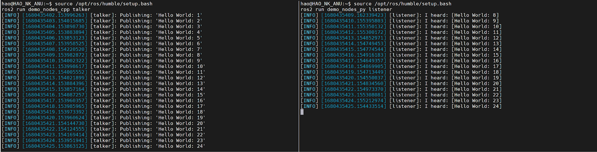

Note: I verified that the above steps for ROS2 humble installation also apply to Windows WSL 2 for Ubuntu 22.04.

## 1.2 MoveIt 2 Setup

MoveIt 2 is the robotic manipulation platform for ROS 2, and includes various motion planning, manipulation, perception and navigation algorithms. The official recommended ROS 2 distribution version is ROS 2 Humble. The official steps to install MoveIt 2 are as below:

### 1.2.1 Install ROS 2

We assume that ROS 2 Humble has already been installed, so we only need to apply the environment variables:

```
source /opt/ros/humble/setup.bash
```

### 1.2.2 Install Colcon and Rosdep

Colcon is used to compile the source code, and rosdep is used to check the dependency and install them automatically. The recommended steps to install rosdep are:

```
sudo apt install python3-rosdep
sudo rosdep init
rosdep update
sudo apt update
sudo apt dist-upgrade
```

For colcon, colcon-mixin is recommended instead of colcon as it provided nice interface for different compilation configuration. However, as I’ll indicate later, due to the network access issue, neigher rosdep or colcon-mixin can be used at my side, so I use colcon by assigning the compiler configuration manually and ignore the rosdep by fixing the compiling dependency issue manually. The official steps to install colcon-mixin are as below:

```
sudo apt install python3-colcon-common-extensions
sudo apt install python3-colcon-mixin
colcon mixin add default https://raw.githubusercontent.com/colcon/colcon-mixin-repository/master/index.yaml
colcon mixin update default
sudo apt install python3-vcstool
```

If can execute above commands successfully, I recommend to follow the official steps to avoid debugging the compiling issues.

### 1.2.3 Download MoveIt 2 source code

In this step, I first create a folder as colcon workspace, and then download the source code of MoveIt 2 and tutorials into this folder.

```
mkdir -p moveit2_ws/src
cd moveit2_ws/src
git clone https://github.com/ros-planning/moveit2_tutorials -b humble --depth 1
vcs import < moveit2_tutorials/moveit2_tutorials.repos
```

The “vcs import” in last step may not work stable sometimes, you can just ctrl-c and then re-run it.

### 1.2.4 Compile the source code

To compile the source code, the official steps are first check and fix the dependencies by using rosdep, and then use colcon --mixin to compile. The commands are:

```
sudo apt update && rosdep install -r --from-paths . --ignore-src --rosdistro $ROS_DISTRO -y
cd moveit2_ws
colcon build --mixin release
```

As what I mentioned, rosdep and colcon --mixin can not work at my side due to the network access issue. Therefore, I skip the dependencies check step, and use below commands to compile the code:

```
sudo apt install ros-humble-graph-msgs ros-humble-rviz-visual-tools freeglut3-dev
colcon build --cmake-args -DCMAKE_BUILD_TYPE=Release --parallel-workers 4
```

The packages I installed are based on the compilation error I met during the compilation at my side, one may have different errors and need to install different missed packages based on the environment. For the “colcon build”, I replace the “--mixin release” with “--cmake-args -DCMAKE_BUILD_TYPE=Release” to indicate the build type manually. For “--parallel-workers 4”, this is to limit the maximum parallelling workers, the colcon tool will consume as many resources to do the compiling and the shell process would crash frequently if I don’t limit the max number of workers.

If everything goes well, we can see all the packages can be compiled, see the log at my side below:

```
hao@hao-XPS-17-9710:~/Workspace/COMP8604/ROS/workspaces/moveit2_ws$ colcon build --cmake-args -DCMAKE_BUILD_TYPE=Release --parallel-workers 4
Starting >>> moveit_common
Starting >>> srdfdom
Starting >>> moveit_resources_panda_description
Starting >>> launch_param_builder
Finished <<< moveit_common [0.30s]
Starting >>> moveit_resources_fanuc_description
Finished <<< moveit_resources_panda_description [0.30s]
Starting >>> moveit_resources_panda_moveit_config
Finished <<< srdfdom [0.40s]
Starting >>> moveit_task_constructor_msgs
Finished <<< moveit_resources_panda_moveit_config [0.10s]
Finished <<< moveit_resources_fanuc_description [0.12s]
Starting >>> rviz_marker_tools
Starting >>> moveit_resources_fanuc_moveit_config
Finished <<< moveit_resources_fanuc_moveit_config [0.12s]
Starting >>> moveit_resources_pr2_description
Finished <<< rviz_marker_tools [0.15s]
Starting >>> moveit_resources_prbt_support
Finished <<< moveit_resources_pr2_description [0.12s]
Starting >>> moveit_core
Finished <<< moveit_resources_prbt_support [0.11s]
Starting >>> rosparam_shortcuts
--- stderr: launch_param_builder
/usr/lib/python3/dist-packages/setuptools/command/install.py:34: SetuptoolsDeprecationWarning: setup.py install is deprecated. Use build and pip and other standards-based tools.
warnings.warn(
Finished <<< launch_param_builder [0.82s]
Starting >>> moveit_configs_utils
Finished <<< rosparam_shortcuts [0.49s]
Starting >>> moveit_resources
Finished <<< moveit_core [0.61s]
Starting >>> moveit_ros_occupancy_map_monitor
Finished <<< moveit_resources [0.11s]
Starting >>> moveit_simple_controller_manager
Finished <<< moveit_task_constructor_msgs [0.94s]
Starting >>> moveit_resources_prbt_ikfast_manipulator_plugin
Finished <<< moveit_simple_controller_manager [0.14s]
Starting >>> moveit_plugins
Finished <<< moveit_ros_occupancy_map_monitor [0.20s]
Starting >>> moveit_ros_planning
Finished <<< moveit_resources_prbt_ikfast_manipulator_plugin [0.15s]
Starting >>> chomp_motion_planner
Finished <<< moveit_plugins [0.13s]
Starting >>> pilz_industrial_motion_planner_testutils
Finished <<< chomp_motion_planner [0.18s]
Starting >>> moveit_chomp_optimizer_adapter
--- stderr: moveit_configs_utils
/usr/lib/python3/dist-packages/setuptools/command/install.py:34: SetuptoolsDeprecationWarning: setup.py install is deprecated. Use build and pip and other standards-based tools.
warnings.warn(
Finished <<< moveit_configs_utils [0.92s]
Starting >>> moveit_planners_chomp
Finished <<< pilz_industrial_motion_planner_testutils [0.19s]
Starting >>> moveit_ros_control_interface
Finished <<< moveit_chomp_optimizer_adapter [0.16s]
Finished <<< moveit_ros_planning [0.39s]
Starting >>> moveit_kinematics
Starting >>> moveit_ros_warehouse
Finished <<< moveit_ros_control_interface [0.18s]
Starting >>> moveit_ros_robot_interaction
Finished <<< moveit_planners_chomp [0.22s]
Starting >>> moveit_planners_ompl
Finished <<< moveit_kinematics [0.21s]
Starting >>> moveit_ros_move_group
Finished <<< moveit_ros_warehouse [0.28s]
Starting >>> moveit_ros_benchmarks
Finished <<< moveit_ros_robot_interaction [0.28s]
Starting >>> moveit_ros_perception
Finished <<< moveit_planners_ompl [0.33s]
Starting >>> moveit_visual_tools
Finished <<< moveit_ros_benchmarks [0.23s]
Finished <<< moveit_ros_move_group [0.34s]
Starting >>> moveit_ros_planning_interface
Starting >>> moveit_resources_prbt_moveit_config
Finished <<< moveit_ros_perception [0.22s]
Finished <<< moveit_visual_tools [0.21s]
Finished <<< moveit_resources_prbt_moveit_config [0.11s]
Starting >>> moveit_resources_prbt_pg70_support
Finished <<< moveit_ros_planning_interface [0.18s]
Starting >>> moveit_ros_visualization
Starting >>> moveit_task_constructor_core
Starting >>> moveit_hybrid_planning
Finished <<< moveit_resources_prbt_pg70_support [0.11s]
Starting >>> pilz_industrial_motion_planner
Finished <<< moveit_hybrid_planning [0.40s]
Starting >>> moveit_servo
Finished <<< moveit_task_constructor_core [0.52s]
Starting >>> moveit_task_constructor_capabilities
Finished <<< pilz_industrial_motion_planner [0.53s]
Starting >>> moveit_planners
Finished <<< moveit_task_constructor_capabilities [0.17s]
Starting >>> hello_moveit
Finished <<< moveit_planners [0.14s]
Starting >>> mtc_tutorial
Finished <<< moveit_servo [0.36s]
Starting >>> moveit_task_constructor_demo
Finished <<< moveit_ros_visualization [0.78s]
Starting >>> moveit_setup_framework
Finished <<< hello_moveit [0.18s]
Starting >>> moveit_ros
Finished <<< mtc_tutorial [0.18s]
Starting >>> moveit_task_constructor_visualization
Finished <<< moveit_task_constructor_demo [0.27s]
Starting >>> moveit_runtime
Finished <<< moveit_ros [0.17s]
Finished <<< moveit_setup_framework [0.29s]
Starting >>> moveit_setup_app_plugins
Starting >>> moveit_setup_controllers
Finished <<< moveit_runtime [0.15s]
Starting >>> moveit_setup_core_plugins
Finished <<< moveit_task_constructor_visualization [0.48s]
Starting >>> moveit_setup_srdf_plugins
Finished <<< moveit_setup_app_plugins [0.34s]
Finished <<< moveit_setup_core_plugins [0.29s]
Finished <<< moveit_setup_controllers [0.42s]
Finished <<< moveit_setup_srdf_plugins [0.37s]
Starting >>> moveit_setup_assistant
Finished <<< moveit_setup_assistant [0.22s]
Starting >>> moveit
Finished <<< moveit [0.12s]
Starting >>> moveit2_tutorials
Finished <<< moveit2_tutorials [0.21s]
Summary: 57 packages finished [5.19s]
2 packages had stderr output: launch_param_builder moveit_configs_utils
hao@hao-XPS-17-9710:~/Workspace/COMP8604/ROS/workspaces/moveit2_ws$
```

Note: please ignore the time showed in above log, it is quite fast as I just re-run the command again on the project which is already fully compiled, so it only print out messages without actual compiling.

### 1.2.5 Setup the workspace

Now we can source the bash script to apply the environment variables of MoveIt 2:

```
source moveit2_ws/install/setup.bash
```

According to the official website, as of Sep 26, 2022, the default ROS 2 middleware (RMW) implementation has an issue. As a workaround, switch to Cyclone DDS. (Note: this makes all nodes started using this RMW incompatible with any other nodes not using Cyclone DDS.)

```
sudo apt install ros-humble-rmw-cyclonedds-cpp
# You may want to add this to ~/.bashrc to source it automatically
export RMW_IMPLEMENTATION=rmw_cyclonedds_cpp
```

I didn’t try the default ROS 2 RMW, and followed the exactly the above commands to use the cyclone DDS. 

[Note:] Need to disable the last line to make RViz work normally.

## 1.3 OMPL Setup

### 1.3.1 OMPL Compile

This section mainly refers to OMPL [official site](https://ompl.kavrakilab.org/) and [github page]([GitHub - ompl/ompl: The Open Motion Planning Library (OMPL)](https://github.com/ompl/ompl)). The OMPL version I use is 1.6.0, which match the one used by ROS Humble in my setup. This can be checked "/opt/ros/humble/share/ompl/package.xml".  To download the OMPL source code, simply run below command:

```
git clone https://github.com/ompl/ompl.git -b 1.6.0
```

Before compile the source code, I run below commands to install the dependencies:

```
sudo apt install python3-pip
python3 -m venv ~/Workspace/pyvenv/ompl
source ~/Workspace/pyvenv/ompl/bin/activate
pip install -vU pygccxml pyplusplus castxml
```

This is because I already have boost, eigen, ode installed. Then run below commands to compile the ompl source code:

```
mkdir -p build/Release
cd build/Release
cmake --install-prefix=/home/hao/Workspace/COMP8604/OMPL/ompl/build/Release/install ../..
# next step is optional
make -j 4 update_bindings 
make -j 4
make install
```

After this, the compiled library and header files will be installed into the "install" directory, the python bindings will be installed into the path: '~/Workspace/pyvenv/ompl/lib/python3.10/site-packages/ompl'.

[Note] If you met any problem when compile the ompl source code manually, you can refer to file 'install-ompl-ubuntu.sh', this script will download the ompl source code and install all the necessary dependencies before compile, and then install the ompl library into system directory.

# 2. Simulators and Demo

## 2.1 ROS2 Tutorials

Once the ROS2 is installed successfully. The first thing I did was go through the ROS2 tutorials. The main official link for the ROS2 tutorial is: [https://docs.ros.org/en/humble/Tutorials.html](https://www.google.com/url?q=https://docs.ros.org/en/humble/Tutorials.html&sa=D&source=editors&ust=1683129835307756&usg=AOvVaw3Jrz-aX-tPesJvZq7OxbrL). We can see from the link that there are different levels of tutorials, which are beginner, intermediate and advanced. For me, I mainly go through the two beginner sessions, see below:

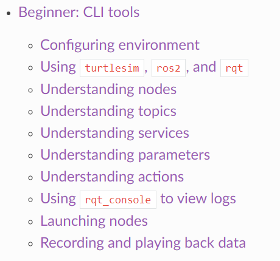       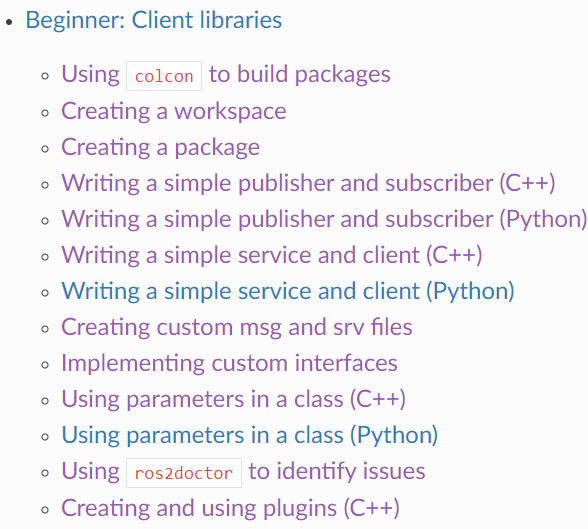

I think these two sessions are necessary for beginners to have an understanding of basic ROS2 concepts, like the nodes, topics, services, parameters and actions. In the second beginner session, we can have some hand-on coding experience to understand the ROS2 api to implement publisher and subscriber, service and client, and custom interfaces. In the meeting with Rahul in the upcoming week, he told me that having basic knowledge of ROS2 is enough, I should put more effort into how the motion planning algorithm is integrated into the demo. ROS2 is mainly a platform to provide various services.

For ROS2 runtime environment configuration, I run below commands to save them into my bash boot script so that I don’t need to set up the configuration every time I open a new shell.

```
echo “source /opt/ros/humble/setup.sh” >> ~/.bashrc
echo “export ROS_LOCALHOST_ONLY=1” >> ~/.bashrc
echo “export ROS_DOMAIN_ID=21” >> ~/.bashrc
```

The “ROS_DOMAIN_ID” is a unique integer I selected for all my ROS2 nodes so that they can communicate with each other from different shells. I also apply “ROS_LOCALHOST_ONLY” to limit the communication locally for now as I don’t need to communicate with nodes on other computers through the network currently.

## 2.2 Turtlebot3 Simulating

The first demo I intended to try was this turtlebot3 simulation demo, which is included as external resources in the ROS2 demo website: [https://docs.ros.org/en/humble/Tutorials/Demos.html](https://www.google.com/url?q=https://docs.ros.org/en/humble/Tutorials/Demos.html&sa=D&source=editors&ust=1683129835309577&usg=AOvVaw2hLtrV39v4g8tG0RgQpn-e). There are several useful links for turtlebot3:

1. Quick start guide: [TurtleBot3](https://emanual.robotis.com/docs/en/platform/turtlebot3/quick-start/)

2. Simulate the TurtleBot3: [https://ubuntu.com/blog/simulate-the-turtlebot3](https://www.google.com/url?q=https://ubuntu.com/blog/simulate-the-turtlebot3&sa=D&source=editors&ust=1683129835310572&usg=AOvVaw0T0bkqfGq13ShTk3vKmyu0)

3. Navigating in simulation:[https://github.com/cyberbotics/webots_ros2/wiki/Navigate-TurtleBot3](https://www.google.com/url?q=https://github.com/cyberbotics/webots_ros2/wiki/Navigate-TurtleBot3&sa=D&source=editors&ust=1683129835310973&usg=AOvVaw2V-Bbs-PzdBpftJoxC6ud5)

4. Learning SLAM in simulation:[https://github.com/cyberbotics/webots_ros2/wiki/SLAM-with-TurtleBot3](https://www.google.com/url?q=https://github.com/cyberbotics/webots_ros2/wiki/SLAM-with-TurtleBot3&sa=D&source=editors&ust=1683129835311413&usg=AOvVaw1vuSBUlxM-na-1R8rs3c3K)

However, the latest turtlebot3 doesn’t support ROS2 humble according to its official website at the time this document is drafted(2023.4), and the latest ROS2 version is Foxy. As I only have Ubuntu 22.04 installed on my PC, I tried two methods to try to enable turtlebot3 simulation, which are illustrated in the two sections below.

### 2.2.1 Run on Windows WSL2 for Ubuntu 20.04.

This is the first method I tried, as it is quite convenient to install different Ubuntu distribution versions for Windows WSL2. I mainly refer to the above “link 2: Simulate the TurtleBot3”, which is based on ROS2 foxy.

The **first** step is to install ROS2 Foxy, it is pretty much the same as the Section 1.1 except run below command to install ros2 foxy:

```
sudo apt install ros-foxy-desktop
source /opt/ros/foxy/setup.bash
```

The **second** step is to install the Gazebo simulator. Actually turtlebot3 supports both Gazebo simulator and visualization tool RViz. I just follow the link to install Gazebo by using below command:

```
sudo apt install gazebo11 ros-foxy-gazebo-ros-pkgs
```

The **third*** step is install turtlebot3, the steps in the link are as below:

```
sudo apt install python3-vcstool
mkdir -p ~/turtlebot3_ws/src
cd ~/turtlebot3_ws
wget https://raw.githubusercontent.com/ROBOTIS-GIT/turtlebot3/ros2/turtlebot3.repos
vcs import src < turtlebot3.repos
```

However, as the access to “raw.githubusercontent.com” is unstable at my side, I download the turtlebot3.repos and then use git to clone the repositories and branches indicated in this file. Then I use “colcon build –symlink-install” to compile the turtlebot3 source code. There are several errors during compilation but I didn’t record it, it seems they are related to some missed packages. I will try to record this in future practice. The completion log is as below:

```
hao@ANU:/mnt/h/COMP8604/ROS/workspaces_foxy/turtlebot3_ws$ colcon build --symlink-install
Starting >>> turtlebot3_msgs
Starting >>> dynamixel_sdk
Starting >>> turtlebot3_description
Starting >>> hls_lfcd_lds_driver
Starting >>> dynamixel_sdk_custom_interfaces
Starting >>> turtlebot3_cartographer
Starting >>> turtlebot3_navigation2
Starting >>> turtlebot3_teleop
Starting >>> ld08_driver
Finished <<< turtlebot3_cartographer [13.0s]
Finished <<< hls_lfcd_lds_driver [14.0s]
Finished <<< turtlebot3_navigation2 [13.9s]
Finished <<< turtlebot3_description [15.2s]
Starting >>> turtlebot3_gazebo
Finished <<< turtlebot3_teleop [17.3s]
Finished <<< dynamixel_sdk [19.9s]
Finished <<< ld08_driver [19.4s]
Finished <<< dynamixel_sdk_custom_interfaces [35.1s]
Starting >>> dynamixel_sdk_examples
Finished <<< turtlebot3_gazebo [23.6s]
Finished <<< dynamixel_sdk_examples [8.49s]
Finished <<< turtlebot3_msgs [57.9s]
Starting >>> turtlebot3_node
Starting >>> turtlebot3_example
Starting >>> turtlebot3_fake_node
Finished <<< turtlebot3_fake_node [10.1s]
Starting >>> turtlebot3_simulations
Finished <<< turtlebot3_example [10.9s]
Finished <<< turtlebot3_node [13.4s]
Starting >>> turtlebot3_bringup
Finished <<< turtlebot3_simulations [5.74s]
Finished <<< turtlebot3_bringup [7.82s]
Starting >>> turtlebot3
Finished <<< turtlebot3 [8.69s]

Summary: 17 packages finished [1min 30s]
hao@ANU:/mnt/h/COMP8604/ROS/workspaces_foxy/turtlebot3_ws$
```

After the compilation is done, run below to set up the environment of turtlebot3:

```
echo 'source /mnt/h/COMP8604/ROS/workspaces_foxy/turtlebot3_ws/install/setup.bash' >> ~/.bashrc
echo 'export GAZEBO_MODEL_PATH=$GAZEBO_MODEL_PATH:/mnt/h/COMP8604/ROS/workspaces_foxy/turtlebot3_ws/src/turtlebot3/turtlebot3_simulations/turtlebot3_gazebo/models' >> ~/.bashrc
echo 'export TURTLEBOT3_MODEL=waffle_pi' >> ~/.bashrc
source ~/.bashrc
```

The **final*** step is to launch the simulator by using below command:

```
ros2 launch turtlebot3_gazebo empty_world.launch.py
```

However, seems the gzserver meet segment fault, and the process is died. Therefore, I can’t launch the simulator successfully. See below error log:

```
hao@ANU:/mnt/h/COMP8604/ROS/workspaces_foxy/turtlebot3_ws$ source install/setup.sh
hao@ANU:/mnt/h/COMP8604/ROS/workspaces_foxy/turtlebot3_ws$ export GAZEBO_MODEL_PATH=/mnt/h/COMP8604/ROS/workspaces_foxy/turtlebot3_ws/src/turtlebot3/turtlebot3_simulations/turtlebot3_gazebo/models
hao@ANU:/mnt/h/COMP8604/ROS/workspaces_foxy/turtlebot3_ws$ export TURTLEBOT3_MODEL=waffle_pi
hao@ANU:/mnt/h/COMP8604/ROS/workspaces_foxy/turtlebot3_ws$ ros2 launch turtlebot3_gazebo empty_world.launch.py
[INFO] [launch]: All log files can be found below /home/hao/.ros/log/2023-04-02-22-39-49-494194-ANU-2034
[INFO] [launch]: Default logging verbosity is set to INFO
urdf_file_name : turtlebot3_waffle_pi.urdf
[INFO] [gzserver-1]: process started with pid [2039]
[INFO] [gzclient   -2]: process started with pid [2041]
[INFO] [ros2-3]: process started with pid [2043]
[INFO] [robot_state_publisher-4]: process started with pid [2045]
[robot_state_publisher-4] [WARN] [1680446417.404017477] [robot_state_publisher]: No robot_description parameter, but command-line argument available.  Assuming argument is name of URDF file.  This backwards compatibility fallback will be removed in the future.
[robot_state_publisher-4] Parsing robot urdf xml string.
[robot_state_publisher-4] Link base_link had 7 children
[robot_state_publisher-4] Link camera_link had 1 children
[robot_state_publisher-4] Link camera_rgb_frame had 1 children
[robot_state_publisher-4] Link camera_rgb_optical_frame had 0 children
[robot_state_publisher-4] Link caster_back_left_link had 0 children
[robot_state_publisher-4] Link caster_back_right_link had 0 children
[robot_state_publisher-4] Link imu_link had 0 children
[robot_state_publisher-4] Link base_scan had 0 children
[robot_state_publisher-4] Link wheel_left_link had 0 children
[robot_state_publisher-4] Link wheel_right_link had 0 children
[robot_state_publisher-4] [INFO] [1680446417.439517232] [robot_state_publisher]: got segment base_footprint
[robot_state_publisher-4] [INFO] [1680446417.439537262] [robot_state_publisher]: got segment base_link
[robot_state_publisher-4] [INFO] [1680446417.439539641] [robot_state_publisher]: got segment base_scan
[robot_state_publisher-4] [INFO] [1680446417.439541655] [robot_state_publisher]: got segment camera_link
[robot_state_publisher-4] [INFO] [1680446417.439543635] [robot_state_publisher]: got segment camera_rgb_frame
[robot_state_publisher-4] [INFO] [1680446417.439545515] [robot_state_publisher]: got segment camera_rgb_optical_frame
[robot_state_publisher-4] [INFO] [1680446417.439547628] [robot_state_publisher]: got segment caster_back_left_link
[robot_state_publisher-4] [INFO] [1680446417.439549604] [robot_state_publisher]: got segment caster_back_right_link
[robot_state_publisher-4] [INFO] [1680446417.439551458] [robot_state_publisher]: got segment imu_link
[robot_state_publisher-4] [INFO] [1680446417.439553418] [robot_state_publisher]: got segment wheel_left_link
[robot_state_publisher-4] [INFO] [1680446417.439555327] [robot_state_publisher]: got segment wheel_right_link
[ros2-3] Set parameter successful
[INFO] [ros2-3]: process has finished cleanly [pid 2043]
[gzserver-1] Segmentation fault
[ERROR] [gzserver-1]: process has died [pid 2039, exit code 139, cmd 'gzserver /mnt/h/COMP8604/ROS/workspaces_foxy/turtlebot3_ws/install/turtlebot3_gazebo/share/turtlebot3_gazebo/worlds/empty_worlds/waffle_pi.model                                                                      -s libgazebo_ros_init.so   -s libgazebo_ros_factory.so   -s libgazebo_ros_force_system.so       '].
[gzclient   -2] Segmentation fault
[ERROR] [gzclient   -2]: process has died [pid 2041, exit code 139, cmd 'gzclient   '].
```

I think this may be related to the limited support of Gazebo on Windows WSL2, but I don’t have another Ubuntu 20.04 for testing. Currently, I leave it here until I need to debug it on WSL2.

### 2.2.2 Run on Ubuntu 22.04 ROS2 humble.

The main reason to try turtlebot3 on ROS2 humble is I already have a workable ROS2 humble and Ubuntu 22.04 PC ready. Besides, I see from the turtlebot3 github source that most of required package already have humble-devel branch, and also marked as “passing”, see below picture which is from github link: [https://github.com/ROBOTIS-GIT/turtlebot3/tree/humble-devel](https://www.google.com/url?q=https://github.com/ROBOTIS-GIT/turtlebot3/tree/humble-devel&sa=D&source=editors&ust=1683129835321774&usg=AOvVaw24cRdp3hp7_eE89QKpHlCO).

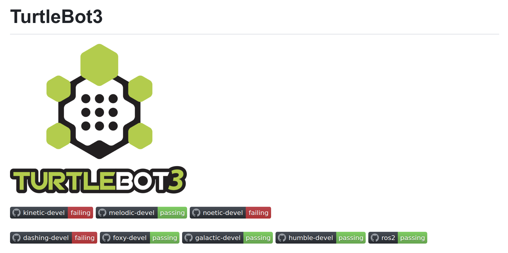

Basically I follow the similar procedure as the last section, except I use below commands to install the gazebo package for humble instead of foxy.

```
sudo apt install gazebo libgazebo-dev ros-humble-gazebo-ros-pkgs
```

For turtlebot3 repositories indicated by file “turtlebot3.repos”, I changed the git branch from “foxy-devel” to “humble-devel” for all the turtlebot3 repositories I compiled.

The compilation log is attached as below, there are several warnings. We can also see that the the compilation on my Ubuntu PC is a lot faster than Windows WSL2 (given the cpu for Windows is superior than my Ubuntu PC).

```
hao@hao-XPS-17-9710:~/Workspace/COMP8604/ROS/workspaces/turtlebot3_ws$ colcon build --symlink-install
Starting >>> turtlebot3_msgs
Starting >>> dynamixel_sdk
Starting >>> hls_lfcd_lds_driver
Starting >>> turtlebot3_description
Starting >>> dynamixel_sdk_custom_interfaces
Starting >>> turtlebot3_cartographer
Starting >>> turtlebot3_gazebo
Starting >>> turtlebot3_navigation2
Starting >>> turtlebot3_teleop
Starting >>> ld08_driver
Finished <<< turtlebot3_description [0.43s]
Finished <<< hls_lfcd_lds_driver [0.45s]
Finished <<< turtlebot3_navigation2 [0.43s]
Finished <<< turtlebot3_cartographer [0.47s]
Finished <<< dynamixel_sdk [0.57s]
Finished <<< ld08_driver [0.54s]
Finished <<< dynamixel_sdk_custom_interfaces [0.74s]
Starting >>> dynamixel_sdk_examples
Finished <<< dynamixel_sdk_examples [0.18s]
--- stderr: turtlebot3_teleop
/usr/lib/python3/dist-packages/setuptools/command/easy_install.py:158: EasyInstallDeprecationWarning: easy_install command is deprecated. Use build and pip and other standards-based tools.
warnings.warn(
/usr/lib/python3/dist-packages/setuptools/command/install.py:34: SetuptoolsDeprecationWarning: setup.py install is deprecated. Use build and pip and other standards-based tools.
warnings.warn(
/usr/lib/python3/dist-packages/pkg_resources/init.py:116: PkgResourcesDeprecationWarning: 0.1.43ubuntu1 is an invalid version and will not be supported in a future release
warnings.warn(
/usr/lib/python3/dist-packages/pkg_resources/init.py:116: PkgResourcesDeprecationWarning: 1.1build1 is an invalid version and will not be supported in a future release
warnings.warn(
Finished <<< turtlebot3_teleop [0.94s]
Finished <<< turtlebot3_msgs [1.02s]
Starting >>> turtlebot3_node
Starting >>> turtlebot3_example
Starting >>> turtlebot3_fake_node
Finished <<< turtlebot3_fake_node [0.35s]
Finished <<< turtlebot3_node [0.40s]
Starting >>> turtlebot3_bringup
Finished <<< turtlebot3_bringup [0.16s]
--- stderr: turtlebot3_example
/usr/lib/python3/dist-packages/setuptools/command/easy_install.py:158: EasyInstallDeprecationWarning: easy_install command is deprecated. Use build and pip and other standards-based tools.
warnings.warn(
/usr/lib/python3/dist-packages/setuptools/command/install.py:34: SetuptoolsDeprecationWarning: setup.py install is deprecated. Use build and pip and other standards-based tools.
warnings.warn(
/usr/lib/python3/dist-packages/pkg_resources/init.py:116: PkgResourcesDeprecationWarning: 0.1.43ubuntu1 is an invalid version and will not be supported in a future release
warnings.warn(
/usr/lib/python3/dist-packages/pkg_resources/init.py:116: PkgResourcesDeprecationWarning: 1.1build1 is an invalid version and will not be supported in a future release
warnings.warn(
Finished <<< turtlebot3_example [0.80s]
Starting >>> turtlebot3
Finished <<< turtlebot3 [0.16s]
--- stderr: turtlebot3_gazebo
CMake Warning (dev) at /usr/share/cmake-3.22/Modules/FindPackageHandleStandardArgs.cmake:438 (message):
The package name passed to find_package_handle_standard_args (PkgConfig) does not match the name of the calling package (gazebo).  This can lead to problems in calling code that expects find_package result variables (e.g., _FOUND) to follow a certain pattern.
Call Stack (most recent call first):
/usr/share/cmake-3.22/Modules/FindPkgConfig.cmake:99 (find_package_handle_standard_args)
/usr/lib/x86_64-linux-gnu/cmake/gazebo/gazebo-config.cmake:72 (include)
CMakeLists.txt:23 (find_package)
This warning is for project developers.  Use -Wno-dev to suppress it.
Finished <<< turtlebot3_gazebo [9.62s]
Starting >>> turtlebot3_simulations
Finished <<< turtlebot3_simulations [0.19s]
Summary: 17 packages finished [9.99s]
```

To launch the simulator, I run the similar commands as the last section. There are two scenes I run, which are:

1. Empty world.
   
   ```
   export GAZEBO_MODEL_PATH=~/Workspace/COMP8604/ROS/workspaces/turtlebot3_ws/src/turtlebot3/turtlebot3_simulations/turtlebot3_gazebo/models/
   export TURTLEBOT3_MODEL=waffle_pi
   ros2 launch turtlebot3_gazebo empty_world.launch.py
   ```
   
   The runtime log information is as below, we can see the gzserver run successfully.
   
   ```
   hao@hao-XPS-17-9710:~/Workspace/COMP8604/ROS/workspaces/turtlebot3_ws$ export TURTLEBOT3_MODEL=waffle_pi
   ros2 launch turtlebot3_gazebo empty_world.launch.py
   [INFO] [launch]: All log files can be found below /home/hao/.ros/log/2023-04-02-11-41-15-596824-hao-XPS-17-9710-747226
   [INFO] [launch]: Default logging verbosity is set to INFO
   urdf_file_name : turtlebot3_waffle_pi.urdf
   urdf_file_name : turtlebot3_waffle_pi.urdf
   [INFO] [gzserver-1]: process started with pid [747227]
   [INFO] [gzclient-2]: process started with pid [747229]
   [INFO] [robot_state_publisher-3]: process started with pid [747231]
   [INFO] [spawn_entity.py-4]: process started with pid [747233]
   [robot_state_publisher-3] 1680450076.829011 [20] robot_stat: selected interface "lo" is not multicast-capable: disabling multicast
   [robot_state_publisher-3] [INFO] [1680450076.857709620] [robot_state_publisher]: got segment base_footprint
   [robot_state_publisher-3] [INFO] [1680450076.857815438] [robot_state_publisher]: got segment base_link
   [robot_state_publisher-3] [INFO] [1680450076.857821139] [robot_state_publisher]: got segment base_scan
   [robot_state_publisher-3] [INFO] [1680450076.857824408] [robot_state_publisher]: got segment camera_link
   [robot_state_publisher-3] [INFO] [1680450076.857827584] [robot_state_publisher]: got segment camera_rgb_frame
   [robot_state_publisher-3] [INFO] [1680450076.857830916] [robot_state_publisher]: got segment camera_rgb_optical_frame
   [robot_state_publisher-3] [INFO] [1680450076.857834473] [robot_state_publisher]: got segment caster_back_left_link
   [robot_state_publisher-3] [INFO] [1680450076.857837752] [robot_state_publisher]: got segment caster_back_right_link
   [robot_state_publisher-3] [INFO] [1680450076.857840949] [robot_state_publisher]: got segment imu_link
   [robot_state_publisher-3] [INFO] [1680450076.857844243] [robot_state_publisher]: got segment wheel_left_link
   [robot_state_publisher-3] [INFO] [1680450076.857847639] [robot_state_publisher]: got segment wheel_right_link
   [spawn_entity.py-4] 1680450077.167278 [20]    python3: selected interface "lo" is not multicast-capable: disabling multicast
   [gzserver-1] 1680450077.187247 [20]   gzserver: selected interface "lo" is not multicast-capable: disabling multicast
   [spawn_entity.py-4] [INFO] [1680450077.197158889] [spawn_entity]: Spawn Entity started
   [spawn_entity.py-4] [INFO] [1680450077.197372354] [spawn_entity]: Loading entity XML from file /home/hao/Workspace/COMP8604/ROS/workspaces/turtlebot3_ws/install/turtlebot3_gazebo/share/turtlebot3_gazebo/models/turtlebot3_waffle_pi/model.sdf
   [spawn_entity.py-4] [INFO] [1680450077.197930563] [spawn_entity]: Waiting for service /spawn_entity
   [spawn_entity.py-4] [INFO] [1680450077.198105123] [spawn_entity]: Waiting for service /spawn_entity
   [spawn_entity.py-4] [INFO] [1680450078.202599673] [spawn_entity]: Calling service /spawn_entity
   [gzserver-1] [INFO] [1680450078.363153156] [turtlebot3_imu]: is unset, using default value of false to comply with REP 145 (world as orientation reference)
   [spawn_entity.py-4] [INFO] [1680450078.489237270] [spawn_entity]: Spawn status: SpawnEntity: Successfully spawned entity [waffle_pi]
   [gzserver-1] ../src/intel/isl/isl.c:2216: FINISHME: ../src/intel/isl/isl.c:isl_surf_supports_ccs: CCS for 3D textures is disabled, but a workaround is available.
   [gzclient-2] ../src/intel/isl/isl.c:2216: FINISHME: ../src/intel/isl/isl.c:isl_surf_supports_ccs: CCS for 3D textures is disabled, but a workaround is available.
   [gzserver-1] [INFO] [1680450078.639477413] [camera_driver]: Publishing camera info to [/camera/camera_info]
   [gzserver-1] [INFO] [1680450078.700755478] [turtlebot3_diff_drive]: Wheel pair 1 separation set to [0.287000m]
   [gzserver-1] [INFO] [1680450078.700785937] [turtlebot3_diff_drive]: Wheel pair 1 diameter set to [0.066000m]
   [gzserver-1] [INFO] [1680450078.701086317] [turtlebot3_diff_drive]: Subscribed to [/cmd_vel]
   [gzserver-1] [INFO] [1680450078.701797729] [turtlebot3_diff_drive]: Advertise odometry on [/o
   [gzserver-1] [INFO] [1680450078.702722942] [turtlebot3_diff_drive]: Publishing odom transforms between [odom] and [base_footp
   [gzserver-1] [INFO] [1680450078.707737023] [turtlebot3_joint_state]: Going to publish joint [wheel_left_joint]
   [gzserver-1] [INFO] [1680450078.707758489] [turtlebot3_joint_state]: Going to publish joint [wheel_right_joint
   [INFO] [spawn_entity.py-4]: process has finished cleanly [pid 747233]
   [INFO] [gzclient-2]: process has finished cleanly [pid 747229]
   ```
   
   The screenshot of gazebo simulator is as below:
   
   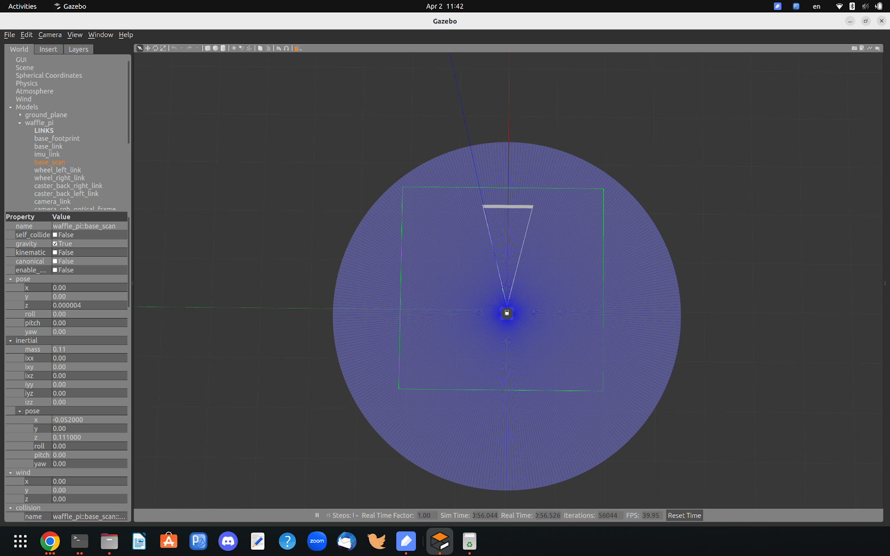

2. World
   
   The commands I use, the runtime log and screen shot are shown as below:
   
   ```
   export GAZEBO_MODEL_PATH=~/Workspace/COMP8604/ROS/workspaces/turtlebot3_ws/src/turtlebot3/turtlebot3_simulations/turtlebot3_gazebo/models/
   export TURTLEBOT3_MODEL=burger
   ros2 launch turtlebot3_gazebo turtlebot3_world.launch.py
   ```
   
   ```
   hao@hao-XPS-17-9710:~/Workspace/COMP8604/ROS/workspaces/turtlebot3_ws$ export TURTLEBOT3_MODEL=burger
   ros2 launch turtlebot3_gazebo turtlebot3_world.launch.py
   [INFO] [launch]: All log files can be found below /home/hao/.ros/log/2023-04-02-11-43-19-053515-hao-XPS-17-9710-747727
   [INFO] [launch]: Default logging verbosity is set to INFO
   urdf_file_name : turtlebot3_burger.urdf
   urdf_file_name : turtlebot3_burger.urdf
   [INFO] [gzserver-1]: process started with pid [747733]
   [INFO] [gzclient-2]: process started with pid [747735]
   [INFO] [robot_state_publisher-3]: process started with pid [747737]
   [INFO] [spawn_entity.py-4]: process started with pid [747739]
   [robot_state_publisher-3] 1680450200.291666 [20] robot_stat: selected interface "lo" is not multicast-capable: disabling multicast
   [robot_state_publisher-3] [INFO] [1680450200.319565585] [robot_state_publisher]: got segment base_footprint
   [robot_state_publisher-3] [INFO] [1680450200.319655473] [robot_state_publisher]: got segment base_link
   [robot_state_publisher-3] [INFO] [1680450200.319661356] [robot_state_publisher]: got segment base_scan
   [robot_state_publisher-3] [INFO] [1680450200.319664751] [robot_state_publisher]: got segment caster_back_link
   [robot_state_publisher-3] [INFO] [1680450200.319668006] [robot_state_publisher]: got segment imu_link
   [robot_state_publisher-3] [INFO] [1680450200.319671197] [robot_state_publisher]: got segment wheel_left_link
   [robot_state_publisher-3] [INFO] [1680450200.319674376] [robot_state_publisher]: got segment wheel_right_link
   [spawn_entity.py-4] 1680450200.632057 [20]    python3: selected interface "lo" is not multicast-capable: disabling multicast
   [gzserver-1] 1680450200.647649 [20]   gzserver: selected interface "lo" is not multicast-capable: disabling multicast
   [spawn_entity.py-4] [INFO] [1680450200.662399817] [spawn_entity]: Spawn Entity started
   [spawn_entity.py-4] [INFO] [1680450200.662745144] [spawn_entity]: Loading entity XML from file /home/hao/Workspace/COMP8604/ROS/workspaces/turtlebot3_ws/install/turtlebot3_gazebo/share/turtlebot3_gazebo/models/turtlebot3_burger/model.sdf
   [spawn_entity.py-4] [INFO] [1680450200.663434884] [spawn_entity]: Waiting for service /spawn_entity, timeout = 30
   [spawn_entity.py-4] [INFO] [1680450200.663739864] [spawn_entity]: Waiting for service /spawn_entity
   [spawn_entity.py-4] [INFO] [1680450201.668626908] [spawn_entity]: Calling service /spawn_entity
   [gzserver-1] [INFO] [1680450201.832106117] [turtlebot3_imu]: is unset, using default value of false to comply with REP 145 (world as orientation reference)
   [spawn_entity.py-4] [INFO] [1680450201.942573919] [spawn_entity]: Spawn status: SpawnEntity: Successfully spawned entity [burger]
   [gzserver-1] [INFO] [1680450202.052810555] [turtlebot3_diff_drive]: Wheel pair 1 separation set to [0.160000m]
   [gzserver-1] [INFO] [1680450202.052850165] [turtlebot3_diff_drive]: Wheel pair 1 diameter set to [0.066000m]
   [gzserver-1] [INFO] [1680450202.053247818] [turtlebot3_diff_drive]: Subscribed to [/cmd_vel]
   [gzserver-1] [INFO] [1680450202.053985031] [turtlebot3_diff_drive]: Advertise odometry on [/odom]
   [gzserver-1] [INFO] [1680450202.054857113] [turtlebot3_diff_drive]: Publishing odom transforms between [odom] and [base_footprint]
   [gzserver-1] [INFO] [1680450202.059720370] [turtlebot3_joint_state]: Going to publish joint [wheel_left_joint]
   [gzserver-1] [INFO] [1680450202.059737748] [turtlebot3_joint_state]: Going to publish joint [wheel_right_joint]
   [gzclient-2] ../src/intel/isl/isl.c:2216: FINISHME: ../src/intel/isl/isl.c:isl_surf_supports_ccs: CCS for 3D textures is disabled, but a workaround is avail
   [INFO] [spawn_entity.py-4]: process has finished cleanly [pid 747739]
   ```
   
   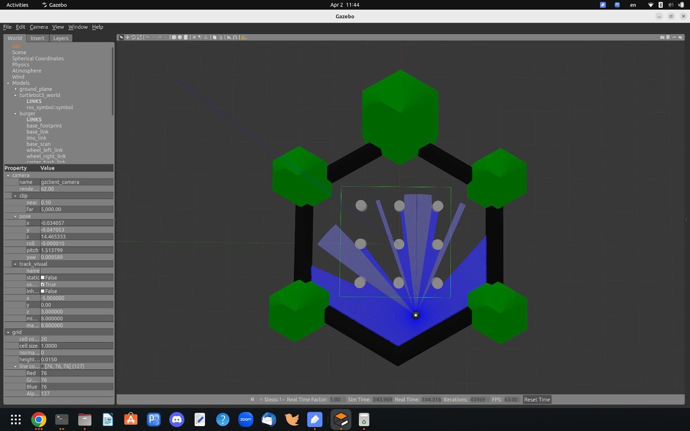
   
   It turns out that by doing the steps in this section, I manage to run the turtlebot3 simulator successfully based on ROS2 Humble on Ubuntu 22.04.
   
   Note: I also tried to run another turtlebot3_house.launch.py, but it seems the gazebo freezed. There are no error messages printed out on the console, but I notice there is below message:
   
   ```
   [gzclient-2] ../src/intel/isl/isl.c:2216: FINISHME: ../src/intel/isl/isl.c:isl_surf_supports_ccs: CCS for 3D textures is disabled, but a workaround is available.
   ```
   
   This message also occurs in the above two experiments. I guess the gazebo freezes because it performs rendering by using CPU instead of utilizing the cuda GPU driver and rendering on my Nvidia GPU card. May need more debugging in future if I plan to fix this.

## 2.3 MoveIt2 Planning Around Object Demo

This is a demo which shows how to perform simple planning which has an obstacle object in the scene. To set up the scene, we first set the target pose and then create a collision object which is between the robot arm and the target pose. Then we call the planning interface of Moveit2 to do the planning and execute the trajectory if the planning is successful.

First let’s look at the below three pictures for: a) initial state, b) planning, c) executing. We can see that the whole process is visualized, the robot arm moves to the target along the planned trajectory to avoid the collision object.

   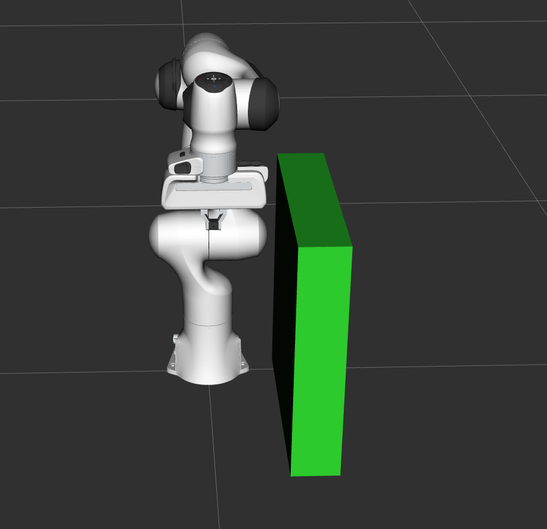   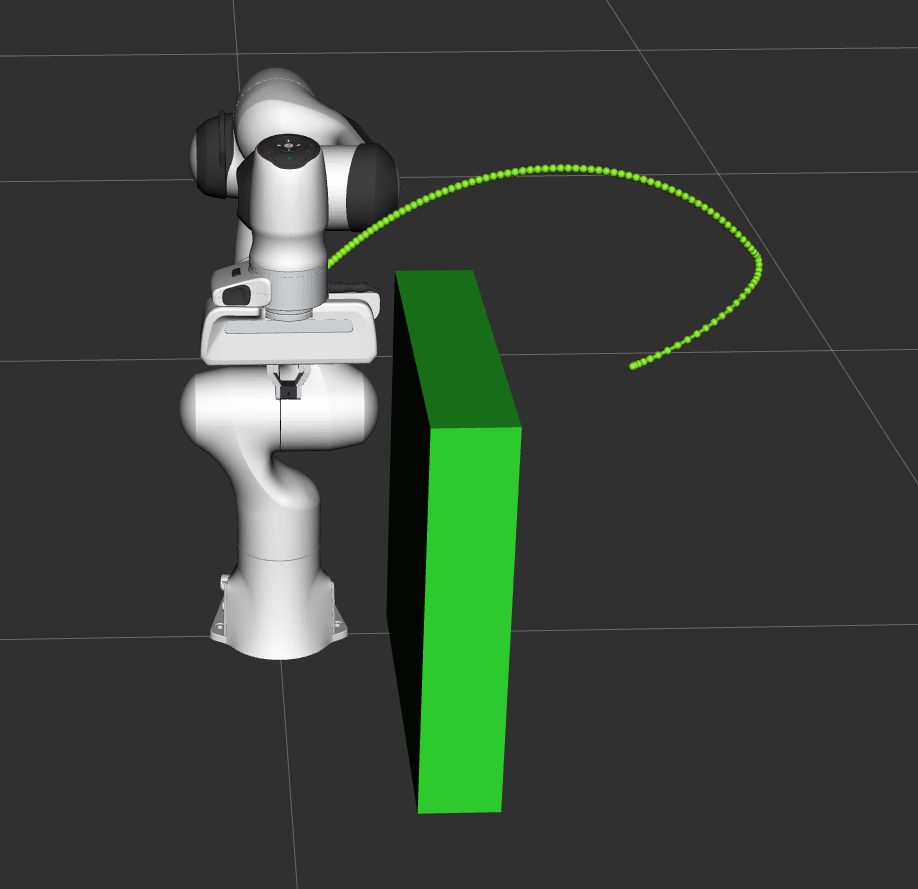

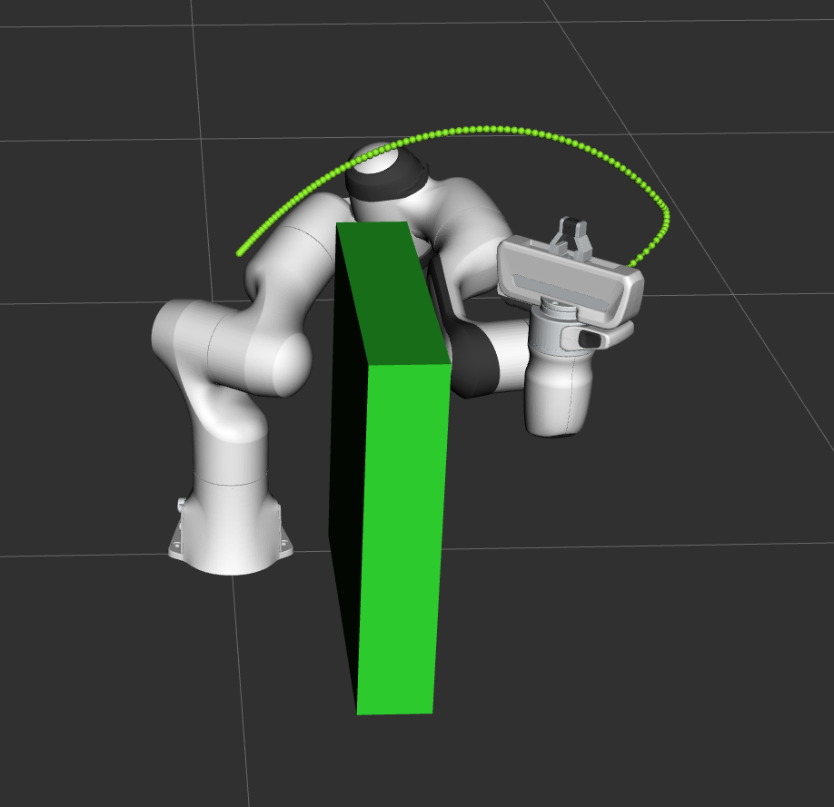

For the details of this tutorial, it can be found from: [planning around objects](https://www.google.com/url?q=https://moveit.picknik.ai/humble/doc/tutorials/planning_around_objects/planning_around_objects.html&sa=D&source=editors&ust=1683129835335930&usg=AOvVaw3GVvkjMH0Xt6Dymc9fHryH). Basically we need to follow below major steps:

1. Use “MoveGroupInterface” class to perform the planning:
   
   We can see from below code that a MoveGroupInterface object is instantiated as “move_group_interface”.
   
   ```
   using moveit::planning_interface::MoveGroupInterface;
   auto move_group_interface = MoveGroupInterface(node, "panda_arm");
   ```

2. Create the target pose and then call MoveGroupInterface function to set the target:
   
   ```
   auto const target_pose = []{
     geometry_msgs::msg::Pose msg;
     msg.orientation.w = 1.0;
     msg.position.x = 0.28;
     msg.position.y = 0.4;
     msg.position.z = 0.5;
     return msg;
   }()
   move_group_interface.setPoseTarget(target_pose);
   ```

3. The collision object is created by “CollisionOjbect” and managed by “PlanningSceneInterface”:
   
   ```
   // Create collision object for the robot to avoid
   auto const collision_object = [frame_id = move_group_interface.getPlanningFrame()] {
     moveit_msgs::msg::CollisionObject collision_object;
     collision_object.header.frame_id = frame_id;
     collision_object.id = "box1";
     shape_msgs::msg::SolidPrimitive primitive;
   
     // Define the size of the box in meters
     primitive.type = primitive.BOX;
     primitive.dimensions.resize(3);
     primitive.dimensions[primitive.BOX_X] = 0.5;
     primitive.dimensions[primitive.BOX_Y] = 0.1;
     primitive.dimensions[primitive.BOX_Z] = 0.5;
   
     // Define the pose of the box (relative to the frame_id)
     geometry_msgs::msg::Pose box_pose;
     box_pose.orientation.w = 1.0;
     box_pose.position.x = 0.2;
     box_pose.position.y = 0.2;
     box_pose.position.z = 0.25;
   
     collision_object.primitives.push_back(primitive);
     collision_object.primitive_poses.push_back(box_pose);
     collision_object.operation = collision_object.ADD;
   
     return collision_object;
   }();
   
   // Add the collision object to the scene
   moveit::planning_interface::PlanningSceneInterface planning_scene_interface;
   planning_scene_interface.applyCollisionObject(collision_object);
   ```

4. Call the method “plan” and “execute” of class “MoveGroupInterface” to perform the planning and execute the planned trajectory:
   
   ```
   // Create a plan to that target pose
   auto const [success, plan] = [&move_group_interface]{
     moveit::planning_interface::MoveGroupInterface::Plan msg;
     auto const ok = static_cast<bool>(move_group_interface.plan(msg));
     return std::make_pair(ok, msg);
   }();
   
   // Execute the plan
   if(success) {
     move_group_interface.execute(plan);
   } else {
     RCLCPP_ERROR(logger, "Planing failed!");
   }
   ```
   
   Note: The “plan” and “execute” here are actually implemented as an ROS2 action client, and we need to run the corresponding action server first so that the action requests can be appropriately handled by the server. In this demo, the server node is implemented by node “move_group” and we use below command to run the server and other services:
   
   ```
   ros2 launch moveit2_tutorials demo.launch.py
   ```
   
   The launch file can be found in the source code of Moveit2.

## 2.4 MoveIt2 Pick-and-Place Demo

I’ll leave this part for later, as it includes a combination of various different problems.

# 3. Source Code Deep Dive

## 3.1 “RobotModel” and “RobotState” class

The [RobotModel](https://www.google.com/url?q=https://github.com/ros-planning/moveit2/blob/main/moveit_core/robot_model/include/moveit/robot_model/robot_model.h&sa=D&source=editors&ust=1683129835343626&usg=AOvVaw2O01LkDZ7wnor76CvLpHgM) class contains the relationships between all links and joints including their joint limit properties as loaded from the URDF. The [RobotState](https://www.google.com/url?q=https://github.com/ros-planning/moveit2/blob/main/moveit_core/robot_state/include/moveit/robot_state/robot_state.h&sa=D&source=editors&ust=1683129835343943&usg=AOvVaw3v2x-6u7Hfw7J2wnREiTxb) contains information about the robot at a certain point in time, storing vectors of joint positions and optionally velocities and accelerations.

Before creating the “RobotModel” class, we first instantiate a [RobotModelLoader](https://www.google.com/url?q=https://github.com/ros-planning/moveit2/blob/main/moveit_ros/planning/robot_model_loader/include/moveit/robot_model_loader/robot_model_loader.h&sa=D&source=editors&ust=1683129835344310&usg=AOvVaw2G_WPTk0zKJirO4ypQPL6G) object which uses the ROS2 node as input parameter. Then we use the loader object to acquire the RobotModel object.

```
robot_model_loader::RobotModelLoader robot_model_loader(node);
const moveit::core::RobotModelPtr& model = robot_model_loader.getModel();
```

Then, we can use the “model” object to construct the RobotState object:

```
moveit::core::RobotStatePtr kinematic_state(new moveit::core::RobotState(model));
kinematic_state->setToDefaultValues();
```

### 3.1.1 Joint Groups

We can acquire the joint groups from the RobotModel object and get the values of each joint from the RobotState object:

```
const moveit::core::JointModelGroup* joint_model_group = model->getJointModelGroup("panda_arm");
const std::vector<std::string>& joint_names = joint_model_group->getVariableNames();
std::vector<double> joint_values;

//acquire the joint values
kinematic_state->copyJointGroupPositions(joint_model_group, joint_values);

//print the joint values
for (std::size_t i = 0; i < joint_names.size(); ++i) {
  RCLCPP_INFO(LOGGER, "Joint %s: %f", joint_names[i].c_str(), joint_values[i]);
}
```

If we want to apply the joint limits, we can call the function from RobotState object:

```
/* Enforce the joint limits for this state and check again*/
kinematic_state->enforceBounds();
```

### 3.1.2 Kinematics

We can compute the forward kinematics by using the method “getGlobalLinkTransform” from RobotState class. Below code compute the forward kinematics for a set of random joint values:

```
kinematic_state->setToRandomPositions(joint_model_group);
const Eigen::Isometry3d& end_effector_state = kinematic_state->getGlobalLinkTransform("panda_link8");

/* Print end-effector pose. Remember that this is in the model frame */
RCLCPP_INFO_STREAM(LOGGER, "Translation: \n" << end_effector_state.translation() << "\n");
RCLCPP_INFO_STREAM(LOGGER, "Rotation: \n" << end_effector_state.rotation() << "\n");
```

We can also solve the inverse kinematics by using the method “setFromIK” from RobotState class. Here the input parameter is the desired pose of end-effector. See below example code for the usage:

```
double timeout = 0.1;
bool found_ik = kinematic_state->setFromIK(joint_model_group, end_effector_state, timeout);
if (found_ik) {
  kinematic_state->copyJointGroupPositions(joint_model_group, joint_values);
  for (std::size_t i = 0; i < joint_names.size(); ++i) {
    RCLCPP_INFO(LOGGER, "Joint %s: %f", joint_names[i].c_str(), joint_values[i]);
  }
} Else {
  RCLCPP_INFO(LOGGER, "Did not find IK solution");
}
```

We can also get the Jacobian by using the method “getJacobian“ from RobotState class, see below:

```
Eigen::Vector3d reference_point_position(0.0, 0.0, 0.0);
Eigen::MatrixXd jacobian;
kinematic_state->getJacobian(joint_model_group,
                             kinematic_state->getLinkModel(joint_model_group->getLinkModelNames().back()),
                             reference_point_position, jacobian);
RCLCPP_INFO_STREAM(LOGGER, "Jacobian: \n" << jacobian << "\n");
```

### 3.1.3 CS223A Online Resource

For the first time to learn the concept of kinematics, there is a good online resource [here](https://www.google.com/url?q=https://see.stanford.edu/Course/CS223A&sa=D&source=editors&ust=1683129835355334&usg=AOvVaw29hOsJn9Hv9XbopNvZ0fnN), which is the course “CS223A - Introduction to Robotics” from Stanford University. The course is a bit old, which is from 2009. However, the video lectures are available for outside access and the lecture contents are presented quite clearly with high quality. Besides, I think the basic concept still applies today. There are total 16 videos (total length around 18 hours), and the syllabus is as below:

```
1/9 W Introduction (read handout)
1/14 M Spatial descriptions 1 (read LN:ch1 )
1/16 W Spatial descriptions 2 (read LN:ch1 )
1/23 W Forward Kinematics 1 (read LN:ch2 )
1/28 M Forward Kinematics 2 (read LN:ch2 )
1/30 W Jacobians: Velocities (read LN:ch4 )
2/04 M Jacobians: Explicit Form (read LN:ch4 )
2/06 W Jacobians: Static Forces (read LN:ch4 )
2/11 M Vision in Robotics (Guest Lecturer)
2/20 W Inverse Kinematics/Trajectory generation (read LN:ch3,ch6 )
2/25 M Dynamics: Acceleration and Inertia (read LN:ch5 )
2/27 W Dynamics: Explicit Form (read LN:ch5 )
3/03 M Control: PID control (read LN:ch7 )
3/05 W Control: Joint space control (read LN:ch7 )
3/10 M Control: Operational space control and Force control (read LN:ch7 )
3/12 W Advanced Topics
```

I spent several days finishing the first 5 lectures last week, and plan to finish the whole lectures in the next two weeks using my spare time.

## 3.2 MoveIT2 Motion Planning API

In MoveIt2, motion planners are used as the plugin. Such design allows the flexible use of different motion planners. To indicate which motion planner you would like to use, we can add in the launch file below statements:

```
def generate_launch_description():
    ...
    planning_plugin = {"planning_plugin": "ompl_interface/OMPLPlanner"}
    return LaunchDescription(
        [
            Node(
                package="moveit2_tutorials",
                executable="motion_planning_api_tutorial",
                name="motion_planning_api_tutorial",
                parameters=[
                    robot_description,
                        ...
                    planning_plugin,
                ],
            )
        ]
    )
```

Then we can use the “get_parameter” method to acquire the parameter from the server. Once we get the plugin name, we can use the “pluginlib::ClassLoader” to load an instance of specific planner.

```
  // We will now construct a loader to load a planner, by name.
  // Note that we are using the ROS pluginlib library here.
  std::unique_ptr<pluginlib::ClassLoader<planning_interface::PlannerManager>> planner_plugin_loader;
  planning_interface::PlannerManagerPtr planner_instance;
  std::string planner_plugin_name;

  // We will get the name of planning plugin we want to load
  // from the ROS parameter server, and then load the planner
  // making sure to catch all exceptions.
  if (!motion_planning_api_tutorial_node->get_parameter("planning_plugin", planner_plugin_name))
    RCLCPP_FATAL(LOGGER, "Could not find planner plugin name");

  try
  {
    planner_plugin_loader.reset(new pluginlib::ClassLoader<planning_interface::PlannerManager>(
        "moveit_core", "planning_interface::PlannerManager"));
  }
  catch (pluginlib::PluginlibException& ex)
  {
    RCLCPP_FATAL(LOGGER, "Exception while creating planning plugin loader %s", ex.what());
  }
  try
  {
    planner_instance.reset(planner_plugin_loader->createUnmanagedInstance(planner_plugin_name));
    if (!planner_instance->initialize(robot_model, motion_planning_api_tutorial_node, motion_planning_api_tutorial_node->get_namespace()))
      RCLCPP_FATAL(LOGGER, "Could not initialize planner instance");
    RCLCPP_INFO(LOGGER, "Using planning interface '%s'", planner_instance->getDescription().c_str());
  }
```

We can see that “planner_instance” is a pointer which points to “PlannerManager”. The instance of “PlannerManager” is created by the “createUnmanagedInstance” method. Once we have this instance of “PlannerManager” we can call the corresponding planner algorithms to perform the motion planning. After diving into the OMPL implementation of “PlannerManager”, I think the “PlannerManager” is only a wrapper class. The detailed implementation is done by the “PlanningContext” class.

We can see from below snippets from file “moveit2/moveit_planners/ompl/ompl_interface/src/ ompl_planner_manager.cpp”:

```
class OMPLPlannerManager : public planning_interface::PlannerManager
{
public:
  OMPLPlannerManager() : planning_interface::PlannerManager()
  {
     ...
  }

  bool initialize(const moveit::core::RobotModelConstPtr& model, const rclcpp::Node::SharedPtr& node,
                  const std::string& parameter_namespace) override
  {
    ompl_interface_ = std::make_unique<OMPLInterface>(model, node, parameter_namespace);
    setPlannerConfigurations(ompl_interface_->getPlannerConfigurations());
    return true;
  }

  bool canServiceRequest(const moveit_msgs::msg::MotionPlanRequest& req) const override
  {
    return req.trajectory_constraints.constraints.empty();
  }

  std::string getDescription() const override
  {
    return "OMPL";
  }

  void getPlanningAlgorithms(std::vector<std::string>& algs) const override
  {
    const planning_interface::PlannerConfigurationMap& pconfig = ompl_interface_->getPlannerConfigurations();
    algs.clear();
    algs.reserve(pconfig.size());
    for (const std::pair<const std::string, planning_interface::PlannerConfigurationSettings>& config : pconfig)
      algs.push_back(config.first);
  }

  void setPlannerConfigurations(const planning_interface::PlannerConfigurationMap& pconfig) override
  {
    // this call can add a few more configs than we pass in (adds defaults)
    ompl_interface_->setPlannerConfigurations(pconfig);
    // so we read the configs instead of just setting pconfig
    PlannerManager::setPlannerConfigurations(ompl_interface_->getPlannerConfigurations());
  }

  planning_interface::PlanningContextPtr
  getPlanningContext(const planning_scene::PlanningSceneConstPtr& planning_scene,
                     const planning_interface::MotionPlanRequest& req,
                     moveit_msgs::msg::MoveItErrorCodes& error_code) const override
  {
    return ompl_interface_->getPlanningContext(planning_scene, req, error_code);
  }
```

The most important function in the above code is the method “getPlanningContext”, which will return the context for the specific planner. The OMPL implemented the model based planning context, which is in “moveit2/moveit_planners/ompl/ompl_interface/src/model_based_planning_context.cpp”. I will spend time studying this implementation, but for now we can simply call the “solve” method implemented by the “ompl_interface::ModelBasedPlanningContext” to perform the planning. See below:

```
planning_interface::MotionPlanRequest req;
planning_interface::MotionPlanResponse res;
geometry_msgs::msg::PoseStamped pose;
pose.header.frame_id = "panda_link0";
pose.pose.position.x = 0.3;
pose.pose.position.y = 0.4;
pose.pose.position.z = 0.75;
pose.pose.orientation.w = 1.0;

std::vector<double> tolerance_pose(3, 0.01);
std::vector<double> tolerance_angle(3, 0.01);

moveit_msgs::msg::Constraints pose_goal =
    kinematic_constraints::constructGoalConstraints("panda_link8", pose, tolerance_pose, tolerance_angle);

req.group_name = PLANNING_GROUP;
req.goal_constraints.push_back(pose_goal);
planning_interface::PlanningContextPtr context =
    planner_instance->getPlanningContext(planning_scene, req, res.error_code_);
context->solve(res);
if (res.error_code_.val != res.error_code_.SUCCESS)
{
  RCLCPP_ERROR(LOGGER, "Could not compute plan successfully");
  return 0;
}
```

We can first construct a motion plan request with a pose goal, and then acquire the context by passing the request, then we can simply call the “solve” function to get the solution. Once we have the response, we can use RViz to visualize the solution trajectory. See below:

```
std::shared_ptr<rclcpp::Publisher<moveit_msgs::msg::DisplayTrajectory>> display_publisher =
    motion_planning_api_tutorial_node->create_publisher<moveit_msgs::msg::DisplayTrajectory>("/display_planned_path",
                                                                                             1);
moveit_msgs::msg::DisplayTrajectory display_trajectory;

/* Visualize the trajectory */
moveit_msgs::msg::MotionPlanResponse response;
res.getMessage(response);

display_trajectory.trajectory_start = response.trajectory_start;
display_trajectory.trajectory.push_back(response.trajectory);
visual_tools.publishTrajectoryLine(display_trajectory.trajectory.back(), joint_model_group);
visual_tools.trigger();
display_publisher->publish(display_trajectory);

/* Set the state in the planning scene to the final state of the last plan */
robot_state->setJointGroupPositions(joint_model_group, response.trajectory.joint_trajectory.points.back().positions);
planning_scene->setCurrentState(*robot_state.get());
```

## 3.3 MoveIT2 and OMPL Integration

### 3.3.1 OMPL API Overview

Below is the OMPL API diagram which shows the basic relationship between the critical base classes.

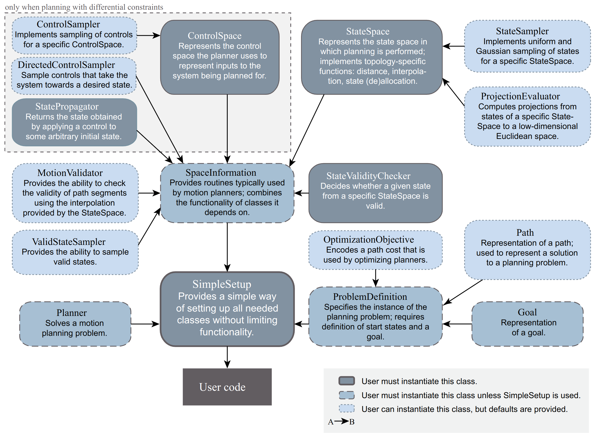

We can see from above diagram that users are recommended to use class "SimpleSetup" to manipulate all other OMPL classes. This is what MoveIT2 does.

### 3.3.2 MoveIT2 Integration

As we mentioned, MoveIT2 also use class ompl::geometric::SimpleSetup to use OMPL libraries. This is done in below function:

```
ModelBasedPlanningContextPtr
PlanningContextManager::getPlanningContext(const planning_interface::PlannerConfigurationSettings& config,
                                           const ModelBasedStateSpaceFactoryPtr& factory,
                                           const moveit_msgs::msg::MotionPlanRequest& req) const
```

The code snippet to initialize the class ompl::geometric::SimpleSetup is as below:

```
    if (factory->getType() == ConstrainedPlanningStateSpace::PARAMETERIZATION_TYPE)
    {
      RCLCPP_DEBUG_STREAM(LOGGER, "planning_context_manager: Using OMPL's constrained state space for planning.");

      // Select the correct type of constraints based on the path constraints in the planning request.
      ompl::base::ConstraintPtr ompl_constraint =
          createOMPLConstraints(robot_model_, config.group, req.path_constraints);

      // Create a constrained state space of type "projected state space".
      // Other types are available, so we probably should add another setting to ompl_planning.yaml
      // to choose between them.
      context_spec.constrained_state_space_ =
          std::make_shared<ob::ProjectedStateSpace>(context_spec.state_space_, ompl_constraint);

      // Pass the constrained state space to ompl simple setup through the creation of a
      // ConstrainedSpaceInformation object. This makes sure the state space is properly initialized.
      context_spec.ompl_simple_setup_ = std::make_shared<ompl::geometric::SimpleSetup>(
          std::make_shared<ob::ConstrainedSpaceInformation>(context_spec.constrained_state_space_));
    }
    else
    {
      // Choose the correct simple setup type to load
      context_spec.ompl_simple_setup_ = std::make_shared<ompl::geometric::SimpleSetup>(context_spec.state_space_);
    }
```

Therefore, when MoveIT2 application call "getPlanningContext" at upper lever, the entry "ompl_simepl_setup_" is initialized as class ompl::geometric::SimpleSetup. To specify which ompl planner is used, see below code snippet:

```
void ompl_interface::ModelBasedPlanningContext::useConfig()
{
  ...
  it = cfg.find("type");
  if (it == cfg.end())
  {
    if (name_ != getGroupName())
      RCLCPP_WARN(LOGGER, "%s: Attribute 'type' not specified in planner configuration", name_.c_str());
  }
  else
  {
    std::string type = it->second;
    cfg.erase(it);
    const std::string planner_name = getGroupName() + "/" + name_;
    ompl_simple_setup_->setPlannerAllocator(
        [planner_name, &spec = this->spec_, allocator = spec_.planner_selector_(type)](
            const ompl::base::SpaceInformationPtr& si) { return allocator(si, planner_name, spec); });
    RCLCPP_INFO(LOGGER,
                "Planner configuration '%s' will use planner '%s'. "
                "Additional configuration parameters will be set when the planner is constructed.",
                name_.c_str(), type.c_str());
  }
  ...
}
```

From the above code, we can see that the variable 'allocator' is a returned function which is called to create the planner allocator, and the created allocator is passed into function "SimpleSetup::setPlannerAllocator". The function "accocator" point to is showed as below:

```
context_spec.planner_selector_ = getPlannerSelector();


ConfiguredPlannerSelector PlanningContextManager::getPlannerSelector() const
{
  return [this](const std::string& planner) { return plannerSelector(planner); };
}


ConfiguredPlannerAllocator PlanningContextManager::plannerSelector(const std::string& planner) const
{
  auto it = known_planners_.find(planner);
  if (it != known_planners_.end())
  {
    return it->second;
  }
  else
  {
    RCLCPP_ERROR(LOGGER, "Unknown planner: '%s'", planner.c_str());
    return ConfiguredPlannerAllocator();
  }
}
```

We can see it will finally search from the map structure "known_planners_", which is filled by registering the allocators in advance:

```
void registerPlannerAllocator(const std::string& planner_id, const ConfiguredPlannerAllocator& pa)
{
  known_planners_[planner_id] = pa;
}

void PlanningContextManager::registerDefaultPlanners()
{   
  registerPlannerAllocatorHelper<og::AnytimePathShortening>("geometric::AnytimePathShortening");
  registerPlannerAllocatorHelper<og::BFMT>("geometric::BFMT");
  registerPlannerAllocatorHelper<og::BiEST>("geometric::BiEST");
  registerPlannerAllocatorHelper<og::BiTRRT>("geometric::BiTRRT");
  registerPlannerAllocatorHelper<og::BKPIECE1>("geometric::BKPIECE");
  registerPlannerAllocatorHelper<og::EST>("geometric::EST");
  registerPlannerAllocatorHelper<og::FMT>("geometric::FMT");
  registerPlannerAllocatorHelper<og::KPIECE1>("geometric::KPIECE");
  registerPlannerAllocatorHelper<og::LazyPRM>("geometric::LazyPRM");
  registerPlannerAllocatorHelper<og::LazyPRMstar>("geometric::LazyPRMstar");
  registerPlannerAllocatorHelper<og::LazyRRT>("geometric::LazyRRT");
  registerPlannerAllocatorHelper<og::LBKPIECE1>("geometric::LBKPIECE");
  registerPlannerAllocatorHelper<og::LBTRRT>("geometric::LBTRRT");
  registerPlannerAllocatorHelper<og::PDST>("geometric::PDST");
  registerPlannerAllocatorHelper<og::PRM>("geometric::PRM");
  registerPlannerAllocatorHelper<og::PRMstar>("geometric::PRMstar");
  registerPlannerAllocatorHelper<og::ProjEST>("geometric::ProjEST");
  registerPlannerAllocatorHelper<og::RRT>("geometric::RRT");
  registerPlannerAllocatorHelper<og::RRTConnect>("geometric::RRTConnect");
  registerPlannerAllocatorHelper<og::RRTstar>("geometric::RRTstar");
  registerPlannerAllocatorHelper<og::SBL>("geometric::SBL");
  registerPlannerAllocatorHelper<og::SPARS>("geometric::SPARS");
  registerPlannerAllocatorHelper<og::SPARStwo>("geometric::SPARStwo");
  registerPlannerAllocatorHelper<og::STRIDE>("geometric::STRIDE");
  registerPlannerAllocatorHelper<og::TRRT>("geometric::TRRT");
}
```

# 4. Customized Planner

## 4.1 Create OMPL-based algorithm

Basically, there are two ways to create OMPL-based planning algorithm: 1) add the algorithm in OMPL source code directly, and compile the algorithm into OMPL library; 2) implement separate planning algorithm in ROS2 package which depends on OMPL. In this section, we will introduce both these two methods. To simplify the implementation, we copy the PRM and RRT* algorithm to generate new MyPRM and MyRRT algorithm which did exactly the same thing but with different algorithm name.

### 4.1.1 Add in OMPL source code directly

This is the simplest way to implement a new OMPL-based planning algorithm, as we don't need to care about how to define the dependency. What I did is simply find the directory where RRT* and PRM is implemented, and create new .cpp file and .h file accordingly. Let's take the RRT for example, the .cpp file and .h header file are in directory "src/ompl/geometric/planners/rrt", and the first step is to create our new .cpp file and header file:

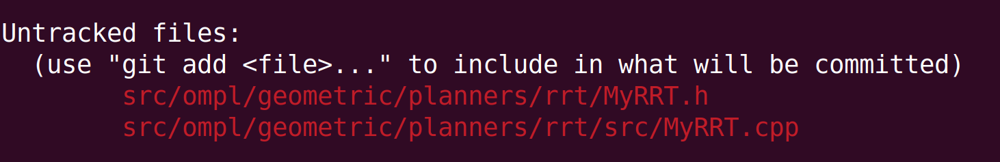

The next step is to change the class name from RRTstar to MyRRT, for example, the change of header file is:

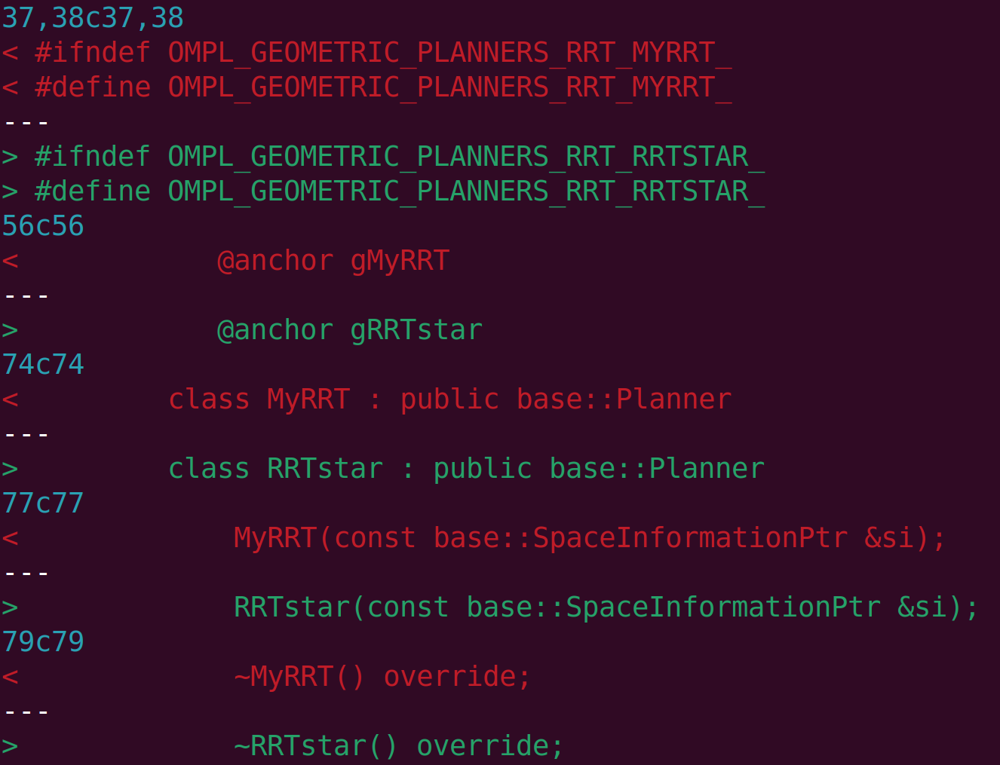

We can do similar thing to MyRRT.cpp, and don't forget to change the header file name of #include instruction.


When all the above is done, we can re-compile the OMPL and generate new .so file which include our MyRRT algorithm. Here we don't need to change the CMakeLists.txt to add our new .cpp file as the current CMakeLists.txt will emurate and compile all .cpp file in folder geometric.

### 4.1.2 Create OMPL dependent ROS2 package

The method in last section is simple, but it also means we contaminate the OMPL source tree inevitably, and everythime we modify our customized planning algorithm we need to re-compile the whole OMPL library. It's better to implement our planning algorithm outside the OMPL so that we can maintain our planning algorithm independently. This is a good engineering paratice. In this section, we implement our customized planning algorithm with ROS2 package.

First, we create the ROS2 package:

```
ros2 pkg create --build-type ament_cmake customized_planner
```

Then, we create below directory structure:

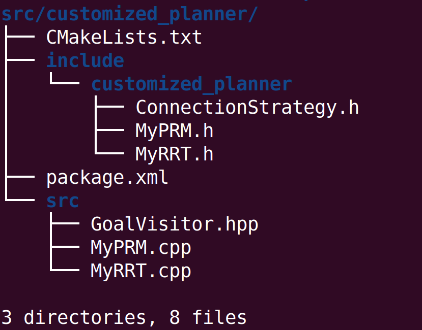

We can see from the screenshot that we create our own copy of PRM and RRT algorithm, which are both from OMPL source code. We put the .cpp files into src folder, and header files in include/customized_planner folder.

Now we begin to write our own CMakeLists.txt as we need to add dependency so that our algorithm can be correctly built by ROS2 building system. We add below line to do this:

```
set(PLANNER_LIB_NAME customized_planner)

# find dependencies
find_package(ompl REQUIRED)

include_directories(include)
include_directories(/opt/ros/humble/include/ompl-1.6)

add_library(${PLANNER_LIB_NAME} SHARED
  src/MyRRT.cpp
  src/MyPRM.cpp
)

ament_target_dependencies(${PLANNER_LIB_NAME}
  ompl
)

```

Here we use "add_library" instead of "add_executable" as we want to implement our planning algorithm as a shared library so that it can be used by other ROS2 packages. We also add dependency which is ompl, this is because our copied algorithms are based on OMPL libraries. To be able to compile successfully, we also need to indicate the include directories for both OMPL and our own .cpp files.

To be able to identified and used by other ROS2 package, we need to do extra configurations in our CMakeLists.txt, see below:

```
install(
  TARGETS ${PLANNER_LIB_NAME}
  EXPORT ${PLANNER_LIB_NAME}Targets
  LIBRARY DESTINATION lib
)

install(DIRECTORY include/${PROJECT_NAME}
  DESTINATION include
)

ament_export_include_directories(include)
ament_export_libraries(${PLANNER_LIB_NAME})

```

These lines will indicate the ROS2 buiding system to install the header files and library to the specific destination, and export the destination so that other ROS2 packages can find them.

Now we can compile our planning algorithms in ROS2 package with below command:

```
$ colcon build --packages-select customized_planner

Starting >>> customized_planner
Finished <<< customized_planner [0.51s]

Summary: 1 package finished [0.73s]

```

If everything goes well, we can see above outputs.

## 4.2 Interact with MoveIt2

In last section, we create our own ROS2 package and implement our planning algorithms as a shared library so that it can be used by other ROS2 packages. In this section, we will see how the existing MoveIT2 OMPL interface utilizes our customized OMPL planning algorithm.

### 4.2.1 Integrate Algorithm with MoveIt2 OMPL Interface

We already introduced the basic OMPL APIs and how they can be used by MoveIT2 in section [3. Source Code Deep Dive](# Source Code Deep Dive). We know that all the available OMPL algorithms will be registered separately in MoveIt2 ompl interface by "registerPlannerAllocatorHelper".  Now we want MoveIt2 to recognize our customized planning algorithm, what we do is similar. See below the log generated by 'git diff':

```
--- a/moveit_planners/ompl/ompl_interface/src/planning_context_manager.cpp
+++ b/moveit_planners/ompl/ompl_interface/src/planning_context_manager.cpp
@@ -66,6 +66,8 @@
 #include <ompl/geometric/planners/prm/LazyPRMstar.h>
 #include <ompl/geometric/planners/prm/SPARS.h>
 #include <ompl/geometric/planners/prm/SPARStwo.h>
+#include <customized_planner/MyRRT.h>
+#include <customized_planner/MyPRM.h>

 #include <ompl/base/ConstrainedSpaceInformation.h>
 #include <ompl/base/spaces/constraint/ProjectedStateSpace.h>
@@ -304,6 +306,8 @@ void PlanningContextManager::registerDefaultPlanners()
   registerPlannerAllocatorHelper<og::SPARStwo>("geometric::SPARStwo");
   registerPlannerAllocatorHelper<og::STRIDE>("geometric::STRIDE");
   registerPlannerAllocatorHelper<og::TRRT>("geometric::TRRT");
+  registerPlannerAllocatorHelper<og::MyRRT>("geometric::MyRRT");
+  registerPlannerAllocatorHelper<og::MyPRM>("geometric::MyPRM");
 }
```

We can see we first include the necessary header files we exported before, and then we registered our own planning algorithm.

Next, we need to modify the CMakeLists.txt and package.xml to make the compilation work. In CMakeLists.txt, we add below lines:

```
--- a/moveit_planners/ompl/ompl_interface/CMakeLists.txt
+++ b/moveit_planners/ompl/ompl_interface/CMakeLists.txt
@@ -31,6 +31,8 @@ if(APPLE)
   target_link_directories(${MOVEIT_LIB_NAME} PUBLIC ${OMPL_LIBRARY_DIRS})
 endif()

+find_package(customized_planner REQUIRED)
+
 ament_target_dependencies(${MOVEIT_LIB_NAME}
   moveit_core
   moveit_msgs
@@ -41,12 +43,22 @@ ament_target_dependencies(${MOVEIT_LIB_NAME}
   tf2_ros
   OMPL
   Boost
+  customized_planner
 )

```

In package.xml, I made below modification so that the building system can build the package "customized_planner" automatically.

```
--- a/moveit_planners/ompl/package.xml
+++ b/moveit_planners/ompl/package.xml
@@ -23,6 +23,7 @@
   <depend>moveit_msgs</depend>
   <depend>moveit_ros_planning</depend>
   <depend>ompl</depend>
+  <depend>customized_planner</depend>
   <depend>rclcpp</depend>
   <depend>tf2_eigen</depend>
   <depend>tf2_ros</depend>

```

Now we can re-compile the MoveIt2 and we can see below output if everything goes well:

```
$ colcon build --cmake-args -DCMAKE_BUILD_TYPE=Release --parallel-workers 4
Starting >>> moveit_common
Starting >>> srdfdom
Starting >>> moveit_resources_panda_description
Starting >>> launch_param_builder
Finished <<< moveit_common [0.31s]
Starting >>> moveit_resources_fanuc_description
Finished <<< moveit_resources_panda_description [0.31s]
Starting >>> moveit_resources_panda_moveit_config
Finished <<< srdfdom [0.44s]
Starting >>> customized_planner
Finished <<< moveit_resources_panda_moveit_config [0.15s]
Finished <<< moveit_resources_fanuc_description [0.16s]
Starting >>> moveit_task_constructor_msgs
Starting >>> moveit_resources_fanuc_moveit_config
Finished <<< moveit_resources_fanuc_moveit_config [0.14s]
Starting >>> rviz_marker_tools
--- stderr: launch_param_builder
/usr/lib/python3/dist-packages/setuptools/command/install.py:34: SetuptoolsDeprecationWarning: setup.py install is deprecated. Use build and pip and other standards-based tools.
  warnings.warn(
---
Finished <<< launch_param_builder [0.68s]
Starting >>> moveit_configs_utils
Finished <<< rviz_marker_tools [0.34s]
Starting >>> moveit_resources_pr2_description
Finished <<< customized_planner [0.55s]
Starting >>> moveit_resources_prbt_support
Finished <<< moveit_resources_pr2_description [0.15s]
Starting >>> moveit_core
Finished <<< moveit_resources_prbt_support [0.14s]
Starting >>> rosparam_shortcuts
--- stderr: moveit_configs_utils
/usr/lib/python3/dist-packages/setuptools/command/install.py:34: SetuptoolsDeprecationWarning: setup.py install is deprecated. Use build and pip and other standards-based tools.
  warnings.warn(
---
Finished <<< moveit_configs_utils [0.74s]
Starting >>> moveit_resources
Finished <<< rosparam_shortcuts [0.36s]
Finished <<< moveit_resources [0.17s]
Finished <<< moveit_core [1.02s]
Starting >>> moveit_ros_occupancy_map_monitor
Starting >>> moveit_simple_controller_manager
Starting >>> moveit_resources_prbt_ikfast_manipulator_plugin
Finished <<< moveit_task_constructor_msgs [1.75s]
Starting >>> chomp_motion_planner
Finished <<< moveit_simple_controller_manager [0.20s]
Starting >>> moveit_plugins
Finished <<< moveit_resources_prbt_ikfast_manipulator_plugin [0.22s]
Starting >>> pilz_industrial_motion_planner_testutils
Finished <<< moveit_ros_occupancy_map_monitor [0.30s]
Starting >>> moveit_ros_planning
Finished <<< chomp_motion_planner [0.25s]
Starting >>> moveit_chomp_optimizer_adapter
Finished <<< moveit_plugins [0.15s]
Starting >>> moveit_planners_chomp
Finished <<< pilz_industrial_motion_planner_testutils [0.27s]
Starting >>> moveit_ros_control_interface
Finished <<< moveit_chomp_optimizer_adapter [0.27s]
Finished <<< moveit_planners_chomp [0.31s]
Finished <<< moveit_ros_control_interface [0.28s]
Finished <<< moveit_ros_planning [0.56s]
Starting >>> moveit_kinematics
Starting >>> moveit_ros_warehouse
Starting >>> moveit_ros_robot_interaction
Starting >>> moveit_planners_ompl
Finished <<< moveit_kinematics [0.29s]
Starting >>> moveit_ros_move_group
Finished <<< moveit_ros_robot_interaction [0.35s]
Starting >>> moveit_ros_perception
Finished <<< moveit_planners_ompl [0.39s]
Starting >>> moveit_visual_tools
Finished <<< moveit_ros_warehouse [0.44s]
Starting >>> moveit_ros_benchmarks
Finished <<< moveit_ros_perception [0.28s]
Finished <<< moveit_visual_tools [0.30s]
Finished <<< moveit_ros_benchmarks [0.29s]
Finished <<< moveit_ros_move_group [0.44s]
Starting >>> moveit_ros_planning_interface
Starting >>> moveit_resources_prbt_moveit_config
Finished <<< moveit_resources_prbt_moveit_config [0.15s]
Starting >>> moveit_resources_prbt_pg70_support
Finished <<< moveit_ros_planning_interface [0.26s]
Starting >>> moveit_ros_visualization
Starting >>> moveit_task_constructor_core
Starting >>> moveit_hybrid_planning
Finished <<< moveit_resources_prbt_pg70_support [0.18s]
Starting >>> pilz_industrial_motion_planner
Finished <<< moveit_hybrid_planning [0.50s]
Starting >>> moveit_servo
Finished <<< moveit_task_constructor_core [0.64s]
Starting >>> moveit_task_constructor_capabilities
Finished <<< moveit_ros_visualization [0.88s]
Starting >>> moveit_setup_framework
Finished <<< moveit_task_constructor_capabilities [0.25s]
Starting >>> moveit_ros
Finished <<< pilz_industrial_motion_planner [0.84s]
Starting >>> moveit_planners
Finished <<< moveit_ros [0.17s]
Starting >>> hello_moveit
Finished <<< moveit_planners [0.17s]
Starting >>> moveit_task_constructor_visualization
Finished <<< moveit_servo [0.59s]
Starting >>> mtc_tutorial
Finished <<< moveit_setup_framework [0.40s]
Starting >>> moveit_setup_app_plugins
Finished <<< hello_moveit [0.26s]
Starting >>> moveit_setup_controllers
Finished <<< mtc_tutorial [0.26s]
Starting >>> moveit_setup_core_plugins
Finished <<< moveit_task_constructor_visualization [0.58s]
Starting >>> moveit_setup_srdf_plugins
Finished <<< moveit_setup_core_plugins [0.39s]
Starting >>> moveit_task_constructor_demo
Finished <<< moveit_setup_app_plugins [0.51s]
Starting >>> moveit_runtime
Finished <<< moveit_setup_controllers [0.61s]
Finished <<< moveit_runtime [0.19s]
Finished <<< moveit_task_constructor_demo [0.38s]
Finished <<< moveit_setup_srdf_plugins [0.90s]
Starting >>> moveit_setup_assistant
Finished <<< moveit_setup_assistant [0.64s]
Starting >>> moveit
Finished <<< moveit [0.40s]
Starting >>> moveit2_tutorials
Finished <<< moveit2_tutorials [0.55s]

Summary: 58 packages finished [8.38s]
  2 packages had stderr output: launch_param_builder moveit_configs_utils

```

We can see the building system build the package "customized_planner" as a very early stage.

### 4.2.2 Another way to integrate with MoveIt2

Actually I also tried another method which is to implement a new API named "addCustomPlanner" in "ompl_interface.cpp" and export this API to OMPLPlanningManager. 

```
+++ b/moveit_planners/ompl/ompl_interface/src/ompl_interface.cpp
@@ -50,12 +50,14 @@ OMPLInterface::OMPLInterface(const moveit::core::RobotModelConstPtr& robot_model
                              const std::string& parameter_namespace)
   : node_(node)
   , parameter_namespace_(parameter_namespace)
   , robot_model_(robot_model)
   , constraint_sampler_manager_(std::make_shared<constraint_samplers::ConstraintSamplerManager>())
   , context_manager_(robot_model, constraint_sampler_manager_)
   , use_constraints_approximations_(true)
 {
   RCLCPP_DEBUG(LOGGER, "Initializing OMPL interface using ROS parameters");
   loadPlannerConfigurations();
   loadConstraintSamplers();
 }
@@ -113,6 +115,14 @@ OMPLInterface::getPlanningContext(const planning_scene::PlanningSceneConstPtr& p
   return ctx;
 }

+void
+OMPLInterface::addCustomPlanner(const std::string& planner_id, const ConfiguredPlannerAllocator& pa)
+{
+
+  context_manager_.registerPlannerAllocator(planner_id, pa);
+}
+

diff --git a/moveit_planners/ompl/ompl_interface/src/ompl_planner_manager.cpp b/moveit_planners/ompl/ompl_interface/src/ompl_planner_manager.cpp
index ba06cf3d4..5b3c09a65 100644
--- a/moveit_planners/ompl/ompl_interface/src/ompl_planner_manager.cpp
+++ b/moveit_planners/ompl/ompl_interface/src/ompl_planner_manager.cpp
@@ -35,6 +35,7 @@
 /* Author: Ioan Sucan, Dave Coleman */

 #include <moveit/ompl_interface/ompl_interface.h>
+#include <moveit/ompl_interface/planning_context_manager.h>
 #include <moveit/planning_interface/planning_interface.h>
 #include <moveit/planning_scene/planning_scene.h>

@@ -125,6 +126,17 @@ public:
     return ompl_interface_->getPlanningContext(planning_scene, req, error_code);
   }

+  void addCustomPlanner(const std::string& planner_id, const ConfiguredPlannerAllocator& pa)
+  {
+       ompl_interface_->addCustomPlanner(planner_id, pa);
+  }
+
+

```

Then we can create the "Planner" lambda function outside the MoveIt2 seperately and pass it into the API we just created, like below:

```
    planner_instance.addCustomPlanner("geometric::MyRRT", [&](const ob::SpaceInformationPtr& si, const std::string& new_name,
                                           const ModelBasedPlanningContextSpecification& spec) {
        ob::PlannerPtr planner;
        planner = std::make_shared<og::MyRRT>(si);

        if (!new_name.empty())
        {
            planner->setName(new_name);
        }

        planner->params().setParams(spec.config_, true);

        return planner;
    });
```

So that MoveIT2 can support any customized OMPL-based planning algorithms as long as they follow the same interface convention. However, I found there are no elegant way to do this, as the application usually use pluginlib to load the OMPL, which means the application only access the "PlanningManager" object instead of "OMPLPlanningManager", our new API is implemented inside the class "OMPLPlanningManager" as it is OMPL-awared. If we instantiate the object "OMPLPlanningManager" directly in application, we need modify the implementation of this class as it is defined in .cpp file and doesn't have a header file to define the class. Therefore, I leave this method here in case I can find an elegant way to do this in future.


## 4.3 Use our customized OMPL algorithm

Now we have both our customized planning algorithms and MoveIt2 integration available. In this section, we will write executable MoveIt2 application to call our customized algorithm to do the planning.

### 4.3.1 Create ROS2 package

We would like to utilize the MoveIt2 existing "move_group" node to handle the planning request. Therefore, we will create our client node first. This is done by commands:

```
mkdir ~/planner_ws/src -p
cd ~/planner_ws/src
ros2 pkg create --build-type ament_cmake --node-name my_node motion_planning_hao
```

Here we first create a workspace named "planner_ws", and then create a package named "motion_planning_hao" with an executable node "my_node". 

### 4.3.2 Implement "my_node"

Now we implement our "my_node.cpp" mainly based on motion_planning_api in MoveIt2. The main steps are use pluginlib to load object "PlannerManager", and then initialize the "planner_instance"  based on the plugin name we specify. After that, we can use the "planner_instance" to acquire the correct context for solving the planning problem. The source code are shown below:

```
int main(int argc, char ** argv)
{
    rclcpp::init(argc, argv);
    rclcpp::NodeOptions node_options;
    node_options.automatically_declare_parameters_from_overrides(true);
    std::shared_ptr<rclcpp::Node> motion_planning_api_tutorial_node =
        rclcpp::Node::make_shared("motion_planning_api_tutorial", node_options);

    rclcpp::executors::SingleThreadedExecutor executor;
    executor.add_node(motion_planning_api_tutorial_node);
    std::thread([&executor]() { executor.spin(); }).detach();

    const std::string PLANNING_GROUP = "panda_arm";
    robot_model_loader::RobotModelLoader robot_model_loader(motion_planning_api_tutorial_node, "robot_description");
    const moveit::core::RobotModelPtr& robot_model = robot_model_loader.getModel();
    /* Create a RobotState and JointModelGroup to keep track of the current robot pose and planning group*/
    moveit::core::RobotStatePtr robot_state(new moveit::core::RobotState(robot_model));
    const moveit::core::JointModelGroup* joint_model_group = robot_state->getJointModelGroup(PLANNING_GROUP);

    planning_scene::PlanningScenePtr planning_scene(new planning_scene::PlanningScene(robot_model));
    planning_scene->getCurrentStateNonConst().setToDefaultValues(joint_model_group, "ready");

    std::unique_ptr<pluginlib::ClassLoader<planning_interface::PlannerManager>> planner_plugin_loader;
    planning_interface::PlannerManagerPtr planner_instance;
    std::string planner_plugin_name;
    std::string planner_namespace;

    if (!motion_planning_api_tutorial_node->get_parameter("planning_namespace", planner_namespace))
        RCLCPP_FATAL(LOGGER, "Could not find planner namespace name");

    if (!motion_planning_api_tutorial_node->get_parameter("planning_plugin", planner_plugin_name))
        RCLCPP_FATAL(LOGGER, "Could not find planner plugin name");

    planner_plugin_loader.reset(new pluginlib::ClassLoader<planning_interface::PlannerManager>(
                                "moveit_core", "planning_interface::PlannerManager"));

    planner_instance.reset(planner_plugin_loader->createUnmanagedInstance(planner_plugin_name));
    RCLCPP_INFO(LOGGER, "Hao: namespace: %s", motion_planning_api_tutorial_node->get_namespace());
    if (!planner_instance->initialize(robot_model, motion_planning_api_tutorial_node,
                            planner_namespace.c_str()))
        RCLCPP_FATAL(LOGGER, "Could not initialize planner instance");

    moveit::planning_interface::MoveGroupInterface move_group(motion_planning_api_tutorial_node, PLANNING_GROUP);

    namespace rvt = rviz_visual_tools;
    moveit_visual_tools::MoveItVisualTools visual_tools(motion_planning_api_tutorial_node, "panda_link0",
                    "move_group_tutorial", move_group.getRobotModel());
    visual_tools.enableBatchPublishing();
    visual_tools.deleteAllMarkers();  // clear all old markers
    visual_tools.trigger();
    visual_tools.loadRemoteControl();

    /* RViz provides many types of markers, in this demo we will use text, cylinders, and spheres*/
    Eigen::Isometry3d text_pose = Eigen::Isometry3d::Identity();
    text_pose.translation().z() = 1.75;
    visual_tools.publishText(text_pose, "Motion Planning API Demo", rvt::WHITE, rvt::XLARGE);
    visual_tools.trigger();
    visual_tools.prompt("Press 'next' in the RvizVisualToolsGui window to start the demo");

    visual_tools.trigger();
    planning_interface::MotionPlanRequest req;
    planning_interface::MotionPlanResponse res;
    geometry_msgs::msg::PoseStamped pose;
    pose.header.frame_id = "panda_link0";
    pose.pose.position.x = 0.3;
    pose.pose.position.y = 0.4;
    pose.pose.position.z = 0.75;
    pose.pose.orientation.w = 1.0;

    std::vector<double> tolerance_pose(3, 0.01);
    std::vector<double> tolerance_angle(3, 0.01);

    moveit_msgs::msg::Constraints pose_goal =
            kinematic_constraints::constructGoalConstraints("panda_link8", pose, tolerance_pose, tolerance_angle);

    req.group_name = PLANNING_GROUP;
    req.goal_constraints.push_back(pose_goal);

    planning_interface::PlanningContextPtr context =
            planner_instance->getPlanningContext(planning_scene, req, res.error_code_);
    context->solve(res);

    if (res.error_code_.val != res.error_code_.SUCCESS)
    {
        RCLCPP_ERROR(LOGGER, "Could not compute plan successfully");
        return 0;
    }
    // Visualize the result
    // ^^^^^^^^^^^^^^^^^^^^
    std::shared_ptr<rclcpp::Publisher<moveit_msgs::msg::DisplayTrajectory>> display_publisher =
            motion_planning_api_tutorial_node->create_publisher<moveit_msgs::msg::DisplayTrajectory>("/display_planned_path",
                            1);
    moveit_msgs::msg::DisplayTrajectory display_trajectory;

    /* Visualize the trajectory */
    moveit_msgs::msg::MotionPlanResponse response;
    res.getMessage(response);

    display_trajectory.trajectory_start = response.trajectory_start;
    display_trajectory.trajectory.push_back(response.trajectory);
    visual_tools.publishTrajectoryLine(display_trajectory.trajectory.back(), joint_model_group);
    visual_tools.trigger();
    display_publisher->publish(display_trajectory);

    /* Set the state in the planning scene to the final state of the last plan */
    robot_state->setJointGroupPositions(joint_model_group, response.trajectory.joint_trajectory.points.back().positions);
    planning_scene->setCurrentState(*robot_state.get());

    // Display the goal state
    visual_tools.publishAxisLabeled(pose.pose, "goal_1");
    visual_tools.publishText(text_pose, "Pose Goal (1)", rvt::WHITE, rvt::XLARGE);
    visual_tools.trigger();

    /* We can also use visual_tools to wait for user input */
    visual_tools.prompt("Press 'next' in the RvizVisualToolsGui window to continue the demo");

    // End
    planner_instance.reset();
    rclcpp::shutdown();

    return 0;
}

```

### 4.3.3 Implement the launch file

The launch file allow us to start up and configure a number of executables containing ROS2 nodes simultaneously. It also provides convinent interface to pass our configurations into the node as parameters. For example, I use below code in my launch file:

```
def generate_launch_description():
    robot_description_config = load_file(
        "moveit_resources_panda_description", "urdf/panda.urdf"
    )
    robot_description = {"robot_description": robot_description_config}

    robot_description_semantic_config = load_file(
        "moveit_resources_panda_moveit_config", "config/panda.srdf"
    )
    robot_description_semantic = {
        "robot_description_semantic": robot_description_semantic_config
    }

    kinematics_yaml = load_yaml(
        "moveit_resources_panda_moveit_config", "config/kinematics.yaml"
    )

    planning_yaml = load_yaml(
        "moveit_resources_panda_moveit_config", "config/ompl_planning.yaml"
    )

    planning_plugin = {"planning_plugin": "ompl_interface/OMPLPlanner"}

    planning_namespace = {"planning_namespace": "planning_ns"}

    return LaunchDescription(
        [
            Node(
                package="motion_planning_hao",
                executable="my_node",
                name="motion_planning_hao",
                parameters=[
                    robot_description,
                    robot_description_semantic,
                    kinematics_yaml,
                    planning_yaml,
                    planning_plugin,
                    planning_namespace,
                ],
            )
        ]
    )

```

We can see that I indicate the ".urdf" and ".srdf" for the robot description, the "ompl_planning.yaml" for the planning configs, and the plugin name, etc.

To be able to make sure we are using the "MyPRM" or "MyRRT" algorithm, we need to indicate it in "ompl_planning.yaml". We first create two configurations for our "MyPRM" and "MyRRT" algorithms, see below:

```
    MyRRTkConfigDefault:
      type: geometric::MyRRT
      range: 0.0  # Max motion added to tree. ==> maxDistance_ default: 0.0, if 0.0, set on setup()
      goal_bias: 0.05  # When close to goal select goal, with this probability? default: 0.05
      delay_collision_checking: 1  # Stop collision checking as soon as C-free parent found. default 1
    MyPRMkConfigDefault:
      type: geometric::MyPRM
      max_nearest_neighbors: 10  # use k nearest neighbors. default: 10

```

Then we specify the default planner for group "panda_arm" (which is the group we are using in our my_node.cpp), see below:

```
  panda_arm:
    default_planner_config: MyPRMkConfigDefault
```

### 4.3.4 Implement the CMakeLists.txt

The implementation of CMakeLists.txt is also quite straight-forward, what we do is basically add all the necessary dependencies and install our exexutable and launch files. The main lines are shown below:

```
find_package(Eigen3 REQUIRED)
find_package(Boost REQUIRED system filesystem date_time thread)
find_package(control_msgs REQUIRED)
find_package(moveit_core REQUIRED)
find_package(moveit_task_constructor_core REQUIRED)
find_package(moveit_ros_planning REQUIRED)
find_package(moveit_ros_planning_interface REQUIRED)
find_package(moveit_ros_perception REQUIRED)
find_package(moveit_servo REQUIRED)
find_package(interactive_markers REQUIRED)
find_package(rviz_visual_tools REQUIRED)
find_package(moveit_visual_tools REQUIRED)
find_package(geometric_shapes REQUIRED)
find_package(rclcpp REQUIRED)
find_package(rclcpp_action REQUIRED)
find_package(pluginlib REQUIRED)
find_package(tf2_ros REQUIRED)
find_package(tf2_eigen REQUIRED)
find_package(tf2_geometry_msgs REQUIRED)

add_executable(my_node src/my_node.cpp)
target_include_directories(my_node PUBLIC
  $<BUILD_INTERFACE:${CMAKE_CURRENT_SOURCE_DIR}/include>
  $<INSTALL_INTERFACE:include>)
target_compile_features(my_node PUBLIC c_std_99 cxx_std_17)  # Require C99 and C++17

ament_target_dependencies(my_node
  ament_cmake
  rclcpp
  rclcpp_action
  tf2_geometry_msgs
  tf2_ros
  moveit_core
  rviz_visual_tools
  moveit_visual_tools
  moveit_ros_planning_interface
  interactive_markers
  tf2_geometry_msgs
  moveit_ros_planning
  pluginlib
  Eigen3
  Boost
  control_msgs
  moveit_servo
  moveit_task_constructor_core
)

install(TARGETS my_node
  DESTINATION lib/${PROJECT_NAME})

install(DIRECTORY launch
  DESTINATION share/${PROJECT_NAME}
)

```

Now we have everything ready, the package directory structure is:

```
$ tree src/motion_planning_hao/
src/motion_planning_hao/
├── CMakeLists.txt
├── include
│   └── motion_planning_hao
├── launch
│   └── motion_planning_hao.launch.py
├── package.xml
└── src
    └── my_node.cpp

4 directories, 4 files
```

we can simply compile the package:

```
$ colcon build --packages-select motion_planning_hao
Starting >>> motion_planning_hao
Finished <<< motion_planning_hao [14.7s]

Summary: 1 package finished [14.9s]
```

The above output will be shown if everything goes well, and we can also check the executable "my_node" and our "motion_planning_hao.launch.py" are installed correctly.

### 4.3.5 Run the demo

To run the demo, we first open one terminal and run below:

```
ros2 launch moveit2_tutorials move_group.launch.py
```

This is to start the "move_group" server node and launch the Rviz visual tool. We can see below logs from above command:

```
$ ros2 launch moveit2_tutorials move_group.launch.py
[INFO] [launch]: All log files can be found below /home/hao/.ros/log/2023-05-23-09-24-02-167967-hao-XPS-17-9710-1076376
[INFO] [launch]: Default logging verbosity is set to INFO
[INFO] [rviz2-1]: process started with pid [1076377]
[INFO] [static_transform_publisher-2]: process started with pid [1076379]
[INFO] [robot_state_publisher-3]: process started with pid [1076381]
[INFO] [move_group-4]: process started with pid [1076383]
[INFO] [ros2_control_node-5]: process started with pid [1076385]
[INFO] [ros2 run controller_manager spawner panda_arm_controller-6]: process started with pid [1076387]
[INFO] [ros2 run controller_manager spawner panda_hand_controller-7]: process started with pid [1076389]
[INFO] [ros2 run controller_manager spawner joint_state_broadcaster-8]: process started with pid [1076391]
[static_transform_publisher-2] [WARN] [1684805042.484657800] []: Old-style arguments are deprecated; see --help for new-style arguments
[static_transform_publisher-2] [INFO] [1684805042.491373640] [static_transform_publisher]: Spinning until stopped - publishing transform
[static_transform_publisher-2] translation: ('0.000000', '0.000000', '0.000000')
[static_transform_publisher-2] rotation: ('0.000000', '0.000000', '0.000000', '1.000000')
[static_transform_publisher-2] from 'world' to 'panda_link0'
[ros2_control_node-5] [INFO] [1684805042.510823277] [resource_manager]: Loading hardware 'PandaFakeSystem' 
[ros2_control_node-5] [INFO] [1684805042.511272507] [resource_manager]: Initialize hardware 'PandaFakeSystem' 
[ros2_control_node-5] [WARN] [1684805042.511296053] [mock_generic_system]: Parsing of optional initial interface values failed or uses a deprecated format. Add initial values for every state interface in the ros2_control.xacro. For example: 
[ros2_control_node-5] <state_interface name="velocity"> 
[ros2_control_node-5]   <param name="initial_value">0.0</param> 
[ros2_control_node-5] </state_interface>
[ros2_control_node-5] [INFO] [1684805042.511303038] [resource_manager]: Successful initialization of hardware 'PandaFakeSystem'
[ros2_control_node-5] [INFO] [1684805042.511315689] [resource_manager]: Loading hardware 'PandaHandFakeSystem' 
[ros2_control_node-5] [INFO] [1684805042.511321429] [resource_manager]: Initialize hardware 'PandaHandFakeSystem' 
[ros2_control_node-5] [INFO] [1684805042.511327215] [resource_manager]: Successful initialization of hardware 'PandaHandFakeSystem'
[ros2_control_node-5] [INFO] [1684805042.511350547] [resource_manager]: 'configure' hardware 'PandaFakeSystem' 
[ros2_control_node-5] [INFO] [1684805042.511355612] [resource_manager]: Successful 'configure' of hardware 'PandaFakeSystem'
[ros2_control_node-5] [INFO] [1684805042.511362675] [resource_manager]: 'activate' hardware 'PandaFakeSystem' 
[ros2_control_node-5] [INFO] [1684805042.511367355] [resource_manager]: Successful 'activate' of hardware 'PandaFakeSystem'
[ros2_control_node-5] [INFO] [1684805042.511369954] [resource_manager]: 'configure' hardware 'PandaHandFakeSystem' 
[ros2_control_node-5] [INFO] [1684805042.511372002] [resource_manager]: Successful 'configure' of hardware 'PandaHandFakeSystem'
[ros2_control_node-5] [INFO] [1684805042.511374482] [resource_manager]: 'activate' hardware 'PandaHandFakeSystem' 
[ros2_control_node-5] [INFO] [1684805042.511376633] [resource_manager]: Successful 'activate' of hardware 'PandaHandFakeSystem'
[ros2_control_node-5] [INFO] [1684805042.513531670] [controller_manager]: update rate is 100 Hz
[ros2_control_node-5] [INFO] [1684805042.513685097] [controller_manager]: RT kernel is recommended for better performance
[robot_state_publisher-3] [INFO] [1684805042.534076248] [robot_state_publisher]: got segment panda_hand
[robot_state_publisher-3] [INFO] [1684805042.534167068] [robot_state_publisher]: got segment panda_leftfinger
[robot_state_publisher-3] [INFO] [1684805042.534172396] [robot_state_publisher]: got segment panda_link0
[robot_state_publisher-3] [INFO] [1684805042.534175853] [robot_state_publisher]: got segment panda_link1
[robot_state_publisher-3] [INFO] [1684805042.534178919] [robot_state_publisher]: got segment panda_link2
[robot_state_publisher-3] [INFO] [1684805042.534181918] [robot_state_publisher]: got segment panda_link3
[robot_state_publisher-3] [INFO] [1684805042.534184916] [robot_state_publisher]: got segment panda_link4
[robot_state_publisher-3] [INFO] [1684805042.534187797] [robot_state_publisher]: got segment panda_link5
[robot_state_publisher-3] [INFO] [1684805042.534190604] [robot_state_publisher]: got segment panda_link6
[robot_state_publisher-3] [INFO] [1684805042.534193422] [robot_state_publisher]: got segment panda_link7
[robot_state_publisher-3] [INFO] [1684805042.534196245] [robot_state_publisher]: got segment panda_link8
[robot_state_publisher-3] [INFO] [1684805042.534199093] [robot_state_publisher]: got segment panda_rightfinger
[move_group-4] [INFO] [1684805042.544223450] [moveit_rdf_loader.rdf_loader]: Loaded robot model in 0.0275406 seconds
[move_group-4] [INFO] [1684805042.544281836] [moveit_robot_model.robot_model]: Loading robot model 'panda'...
[move_group-4] [INFO] [1684805042.570269507] [moveit_ros.planning_scene_monitor.planning_scene_monitor]: Publishing maintained planning scene on 'monitored_planning_scene'
[move_group-4] [INFO] [1684805042.570380946] [moveit.ros_planning_interface.moveit_cpp]: Listening to 'joint_states' for joint states
[move_group-4] [INFO] [1684805042.571117316] [moveit_ros.current_state_monitor]: Listening to joint states on topic 'joint_states'
[move_group-4] [INFO] [1684805042.571357136] [moveit_ros.planning_scene_monitor.planning_scene_monitor]: Listening to '/attached_collision_object' for attached collision objects
[move_group-4] [INFO] [1684805042.571370061] [moveit_ros.planning_scene_monitor.planning_scene_monitor]: Starting planning scene monitor
[move_group-4] [INFO] [1684805042.571540714] [moveit_ros.planning_scene_monitor.planning_scene_monitor]: Listening to '/planning_scene'
[move_group-4] [INFO] [1684805042.571550547] [moveit_ros.planning_scene_monitor.planning_scene_monitor]: Starting world geometry update monitor for collision objects, attached objects, octomap updates.
[move_group-4] [INFO] [1684805042.571701128] [moveit_ros.planning_scene_monitor.planning_scene_monitor]: Listening to 'collision_object'
[move_group-4] [INFO] [1684805042.571847098] [moveit_ros.planning_scene_monitor.planning_scene_monitor]: Listening to 'planning_scene_world' for planning scene world geometry
[move_group-4] [WARN] [1684805042.572397126] [moveit.ros.occupancy_map_monitor.middleware_handle]: Resolution not specified for Octomap. Assuming resolution = 0.1 instead
[move_group-4] [ERROR] [1684805042.572413407] [moveit.ros.occupancy_map_monitor.middleware_handle]: No 3D sensor plugin(s) defined for octomap updates
[move_group-4] [INFO] [1684805042.573051715] [moveit.ros_planning_interface.moveit_cpp]: Loading planning pipeline 'trajopt'
[move_group-4] [ERROR] [1684805042.574916852] [moveit.ros_planning.planning_pipeline]: Exception while loading planner 'trajopt_interface/TrajOptPlanner': According to the loaded plugin descriptions the class trajopt_interface/TrajOptPlanner with base class type planning_interface::PlannerManager does not exist. Declared types are  chomp_interface/CHOMPPlanner ompl_interface/OMPLPlanner pilz_industrial_motion_planner/CommandPlannerAvailable plugins: chomp_interface/CHOMPPlanner, ompl_interface/OMPLPlanner, pilz_industrial_motion_planner/CommandPlanner
[move_group-4] [INFO] [1684805042.577671937] [moveit_ros.add_time_optimal_parameterization]: Param 'trajopt.path_tolerance' was not set. Using default value: 0.100000
[move_group-4] [INFO] [1684805042.577687326] [moveit_ros.add_time_optimal_parameterization]: Param 'trajopt.resample_dt' was not set. Using default value: 0.100000
[move_group-4] [INFO] [1684805042.577690452] [moveit_ros.add_time_optimal_parameterization]: Param 'trajopt.min_angle_change' was not set. Using default value: 0.001000
[move_group-4] [INFO] [1684805042.577706739] [moveit_ros.fix_workspace_bounds]: Param 'trajopt.default_workspace_bounds' was not set. Using default value: 10.000000
[move_group-4] [INFO] [1684805042.577715778] [moveit_ros.fix_start_state_bounds]: Param 'trajopt.start_state_max_bounds_error' was set to 0.100000
[move_group-4] [INFO] [1684805042.577718973] [moveit_ros.fix_start_state_bounds]: Param 'trajopt.start_state_max_dt' was not set. Using default value: 0.500000
[move_group-4] [INFO] [1684805042.577725720] [moveit_ros.fix_start_state_collision]: Param 'trajopt.start_state_max_dt' was not set. Using default value: 0.500000
[move_group-4] [INFO] [1684805042.577728767] [moveit_ros.fix_start_state_collision]: Param 'trajopt.jiggle_fraction' was not set. Using default value: 0.020000
[move_group-4] [INFO] [1684805042.577736920] [moveit_ros.fix_start_state_collision]: Param 'trajopt.max_sampling_attempts' was not set. Using default value: 100
[move_group-4] [INFO] [1684805042.577743314] [moveit.ros_planning.planning_pipeline]: Using planning request adapter 'Add Time Optimal Parameterization'
[move_group-4] [INFO] [1684805042.577746786] [moveit.ros_planning.planning_pipeline]: Using planning request adapter 'Fix Workspace Bounds'
[move_group-4] [INFO] [1684805042.577748810] [moveit.ros_planning.planning_pipeline]: Using planning request adapter 'Fix Start State Bounds'
[move_group-4] [INFO] [1684805042.577771671] [moveit.ros_planning.planning_pipeline]: Using planning request adapter 'Fix Start State In Collision'
[move_group-4] [INFO] [1684805042.577773810] [moveit.ros_planning.planning_pipeline]: Using planning request adapter 'Fix Start State Path Constraints'
[move_group-4] [ERROR] [1684805042.579991619] [moveit.ros_planning_interface.moveit_cpp]: Failed to initialize planning pipeline 'trajopt'.
[move_group-4] [INFO] [1684805042.580419295] [moveit.ros_planning_interface.moveit_cpp]: Loading planning pipeline 'ompl'
[move_group-4] [INFO] [1684805042.582384106] [moveit.ros_planning.planning_pipeline]: Multiple planning plugins available. You should specify the '~planning_plugin' parameter. Using 'chomp_interface/CHOMPPlanner' for now.
[move_group-4] [INFO] [1684805042.584536929] [moveit.ros_planning.planning_pipeline]: Using planning interface 'CHOMP'
[move_group-4] [INFO] [1684805042.584912119] [moveit.ros_planning_interface.moveit_cpp]: Loading planning pipeline 'chomp'
[move_group-4] [INFO] [1684805042.587397395] [moveit.ros_planning.planning_pipeline]: Using planning interface 'CHOMP'
[move_group-4] [INFO] [1684805042.589282617] [moveit_ros.add_time_optimal_parameterization]: Param 'chomp.path_tolerance' was not set. Using default value: 0.100000
[move_group-4] [INFO] [1684805042.589292537] [moveit_ros.add_time_optimal_parameterization]: Param 'chomp.resample_dt' was not set. Using default value: 0.100000
[move_group-4] [INFO] [1684805042.589295759] [moveit_ros.add_time_optimal_parameterization]: Param 'chomp.min_angle_change' was not set. Using default value: 0.001000
[move_group-4] [INFO] [1684805042.589308843] [moveit_ros.fix_workspace_bounds]: Param 'chomp.default_workspace_bounds' was not set. Using default value: 10.000000
[move_group-4] [INFO] [1684805042.589321452] [moveit_ros.fix_start_state_bounds]: Param 'chomp.start_state_max_bounds_error' was set to 0.100000
[move_group-4] [INFO] [1684805042.589325811] [moveit_ros.fix_start_state_bounds]: Param 'chomp.start_state_max_dt' was not set. Using default value: 0.500000
[move_group-4] [INFO] [1684805042.589336850] [moveit_ros.fix_start_state_collision]: Param 'chomp.start_state_max_dt' was not set. Using default value: 0.500000
[move_group-4] [INFO] [1684805042.589341525] [moveit_ros.fix_start_state_collision]: Param 'chomp.jiggle_fraction' was not set. Using default value: 0.020000
[move_group-4] [INFO] [1684805042.589346056] [moveit_ros.fix_start_state_collision]: Param 'chomp.max_sampling_attempts' was not set. Using default value: 100
[move_group-4] [INFO] [1684805042.589357588] [moveit.ros_planning.planning_pipeline]: Using planning request adapter 'Add Time Optimal Parameterization'
[move_group-4] [INFO] [1684805042.589360555] [moveit.ros_planning.planning_pipeline]: Using planning request adapter 'Fix Workspace Bounds'
[move_group-4] [INFO] [1684805042.589362484] [moveit.ros_planning.planning_pipeline]: Using planning request adapter 'Fix Start State Bounds'
[move_group-4] [INFO] [1684805042.589365119] [moveit.ros_planning.planning_pipeline]: Using planning request adapter 'Fix Start State In Collision'
[move_group-4] [INFO] [1684805042.589368004] [moveit.ros_planning.planning_pipeline]: Using planning request adapter 'Fix Start State Path Constraints'
[move_group-4] [INFO] [1684805042.589688855] [moveit.ros_planning_interface.moveit_cpp]: Loading planning pipeline 'pilz_industrial_motion_planner'
[move_group-4] [INFO] [1684805042.592088113] [moveit.pilz_industrial_motion_planner.joint_limits_aggregator]: Reading limits from namespace robot_description_planning
[move_group-4] [WARN] [1684805042.592487766] [moveit.pilz_industrial_motion_planner.joint_limits_aggregator]: Multi-DOF-Joint 'virtual_joint' not supported.
[move_group-4] [WARN] [1684805042.592510914] [moveit.pilz_industrial_motion_planner.joint_limits_aggregator]: Multi-DOF-Joint 'virtual_joint' not supported.
[move_group-4] [INFO] [1684805042.595340540] [moveit.pilz_industrial_motion_planner]: Available plugins: pilz_industrial_motion_planner/PlanningContextLoaderCIRC pilz_industrial_motion_planner/PlanningContextLoaderLIN pilz_industrial_motion_planner/PlanningContextLoaderPTP 
[move_group-4] [INFO] [1684805042.595350790] [moveit.pilz_industrial_motion_planner]: About to load: pilz_industrial_motion_planner/PlanningContextLoaderCIRC
[move_group-4] [INFO] [1684805042.596246558] [moveit.pilz_industrial_motion_planner]: Registered Algorithm [CIRC]
[move_group-4] [INFO] [1684805042.596255296] [moveit.pilz_industrial_motion_planner]: About to load: pilz_industrial_motion_planner/PlanningContextLoaderLIN
[move_group-4] [INFO] [1684805042.596771543] [moveit.pilz_industrial_motion_planner]: Registered Algorithm [LIN]
[move_group-4] [INFO] [1684805042.596778805] [moveit.pilz_industrial_motion_planner]: About to load: pilz_industrial_motion_planner/PlanningContextLoaderPTP
[move_group-4] [INFO] [1684805042.597239372] [moveit.pilz_industrial_motion_planner]: Registered Algorithm [PTP]
[move_group-4] [INFO] [1684805042.597255890] [moveit.ros_planning.planning_pipeline]: Using planning interface 'Pilz Industrial Motion Planner'
[move_group-4] [INFO] [1684805042.599198620] [moveit_ros.fix_workspace_bounds]: Param 'pilz_industrial_motion_planner.default_workspace_bounds' was not set. Using default value: 10.000000
[move_group-4] [INFO] [1684805042.599213516] [moveit_ros.fix_start_state_bounds]: Param 'pilz_industrial_motion_planner.start_state_max_bounds_error' was not set. Using default value: 0.050000
[move_group-4] [INFO] [1684805042.599216699] [moveit_ros.fix_start_state_bounds]: Param 'pilz_industrial_motion_planner.start_state_max_dt' was not set. Using default value: 0.500000
[move_group-4] [INFO] [1684805042.599224475] [moveit_ros.fix_start_state_collision]: Param 'pilz_industrial_motion_planner.start_state_max_dt' was not set. Using default value: 0.500000
[move_group-4] [INFO] [1684805042.599227299] [moveit_ros.fix_start_state_collision]: Param 'pilz_industrial_motion_planner.jiggle_fraction' was not set. Using default value: 0.020000
[move_group-4] [INFO] [1684805042.599230458] [moveit_ros.fix_start_state_collision]: Param 'pilz_industrial_motion_planner.max_sampling_attempts' was not set. Using default value: 100
[move_group-4] [INFO] [1684805042.599237515] [moveit.ros_planning.planning_pipeline]: Using planning request adapter 'Fix Workspace Bounds'
[move_group-4] [INFO] [1684805042.599239985] [moveit.ros_planning.planning_pipeline]: Using planning request adapter 'Fix Start State Bounds'
[move_group-4] [INFO] [1684805042.599241651] [moveit.ros_planning.planning_pipeline]: Using planning request adapter 'Fix Start State In Collision'
[move_group-4] [INFO] [1684805042.599243528] [moveit.ros_planning.planning_pipeline]: Using planning request adapter 'Fix Start State Path Constraints'
[move_group-4] [INFO] [1684805042.599673412] [moveit.ros_planning_interface.moveit_cpp]: Loading planning pipeline 'lerp'
[move_group-4] [ERROR] [1684805042.602411562] [moveit.ros_planning.planning_pipeline]: Exception while loading planner 'lerp_interface/LERPPlanner': According to the loaded plugin descriptions the class lerp_interface/LERPPlanner with base class type planning_interface::PlannerManager does not exist. Declared types are  chomp_interface/CHOMPPlanner ompl_interface/OMPLPlanner pilz_industrial_motion_planner/CommandPlannerAvailable plugins: chomp_interface/CHOMPPlanner, ompl_interface/OMPLPlanner, pilz_industrial_motion_planner/CommandPlanner
[move_group-4] [INFO] [1684805042.604763977] [moveit_ros.add_time_optimal_parameterization]: Param 'lerp.path_tolerance' was not set. Using default value: 0.100000
[move_group-4] [INFO] [1684805042.604773031] [moveit_ros.add_time_optimal_parameterization]: Param 'lerp.resample_dt' was not set. Using default value: 0.100000
[move_group-4] [INFO] [1684805042.604775871] [moveit_ros.add_time_optimal_parameterization]: Param 'lerp.min_angle_change' was not set. Using default value: 0.001000
[move_group-4] [INFO] [1684805042.604784771] [moveit_ros.fix_workspace_bounds]: Param 'lerp.default_workspace_bounds' was not set. Using default value: 10.000000
[move_group-4] [INFO] [1684805042.604794080] [moveit_ros.fix_start_state_bounds]: Param 'lerp.start_state_max_bounds_error' was set to 0.100000
[move_group-4] [INFO] [1684805042.604797697] [moveit_ros.fix_start_state_bounds]: Param 'lerp.start_state_max_dt' was not set. Using default value: 0.500000
[move_group-4] [INFO] [1684805042.604805485] [moveit_ros.fix_start_state_collision]: Param 'lerp.start_state_max_dt' was not set. Using default value: 0.500000
[move_group-4] [INFO] [1684805042.604808213] [moveit_ros.fix_start_state_collision]: Param 'lerp.jiggle_fraction' was not set. Using default value: 0.020000
[move_group-4] [INFO] [1684805042.604811264] [moveit_ros.fix_start_state_collision]: Param 'lerp.max_sampling_attempts' was not set. Using default value: 100
[move_group-4] [INFO] [1684805042.604818415] [moveit.ros_planning.planning_pipeline]: Using planning request adapter 'Add Time Optimal Parameterization'
[move_group-4] [INFO] [1684805042.604830398] [moveit.ros_planning.planning_pipeline]: Using planning request adapter 'Fix Workspace Bounds'
[move_group-4] [INFO] [1684805042.604832498] [moveit.ros_planning.planning_pipeline]: Using planning request adapter 'Fix Start State Bounds'
[move_group-4] [INFO] [1684805042.604834158] [moveit.ros_planning.planning_pipeline]: Using planning request adapter 'Fix Start State In Collision'
[move_group-4] [INFO] [1684805042.604836235] [moveit.ros_planning.planning_pipeline]: Using planning request adapter 'Fix Start State Path Constraints'
[move_group-4] [ERROR] [1684805042.605173987] [moveit.ros_planning_interface.moveit_cpp]: Failed to initialize planning pipeline 'lerp'.
[move_group-4] [INFO] [1684805042.635716023] [moveit.plugins.moveit_simple_controller_manager]: Added FollowJointTrajectory controller for panda_arm_controller
[move_group-4] [INFO] [1684805042.635765022] [moveit.plugins.moveit_simple_controller_manager]: Max effort set to 0.0
[move_group-4] [INFO] [1684805042.636598345] [moveit.plugins.moveit_simple_controller_manager]: Added GripperCommand controller for panda_hand_controller
[move_group-4] [INFO] [1684805042.636709976] [moveit.plugins.moveit_simple_controller_manager]: Returned 2 controllers in list
[move_group-4] [INFO] [1684805042.636732098] [moveit.plugins.moveit_simple_controller_manager]: Returned 2 controllers in list
[move_group-4] [INFO] [1684805042.637016997] [moveit_ros.trajectory_execution_manager]: Trajectory execution is managing controllers
[move_group-4] [INFO] [1684805042.637028265] [move_group.move_group]: MoveGroup debug mode is ON
[move_group-4] [INFO] [1684805042.645616897] [move_group.move_group]: 
[move_group-4] 
[move_group-4] ********************************************************
[move_group-4] * MoveGroup using: 
[move_group-4] *     - ApplyPlanningSceneService
[move_group-4] *     - ClearOctomapService
[move_group-4] *     - CartesianPathService
[move_group-4] *     - ExecuteTrajectoryAction
[move_group-4] *     - GetPlanningSceneService
[move_group-4] *     - KinematicsService
[move_group-4] *     - MoveAction
[move_group-4] *     - MotionPlanService
[move_group-4] *     - QueryPlannersService
[move_group-4] *     - StateValidationService
[move_group-4] ********************************************************
[move_group-4] 
[move_group-4] [INFO] [1684805042.645663172] [moveit_move_group_capabilities_base.move_group_context]: MoveGroup context using planning plugin chomp_interface/CHOMPPlanner
[move_group-4] [INFO] [1684805042.645669725] [moveit_move_group_capabilities_base.move_group_context]: MoveGroup context initialization complete
[move_group-4] Loading 'move_group/ApplyPlanningSceneService'...
[move_group-4] Loading 'move_group/ClearOctomapService'...
[move_group-4] Loading 'move_group/MoveGroupCartesianPathService'...
[move_group-4] Loading 'move_group/MoveGroupExecuteTrajectoryAction'...
[move_group-4] Loading 'move_group/MoveGroupGetPlanningSceneService'...
[move_group-4] Loading 'move_group/MoveGroupKinematicsService'...
[move_group-4] Loading 'move_group/MoveGroupMoveAction'...
[move_group-4] Loading 'move_group/MoveGroupPlanService'...
[move_group-4] Loading 'move_group/MoveGroupQueryPlannersService'...
[move_group-4] Loading 'move_group/MoveGroupStateValidationService'...
[move_group-4] 
[move_group-4] You can start planning now!
[move_group-4] 
[rviz2-1] [INFO] [1684805042.719534248] [rviz2]: Stereo is NOT SUPPORTED
[rviz2-1] [INFO] [1684805042.720579829] [rviz2]: OpenGl version: 4.6 (GLSL 4.6)
[rviz2-1] [INFO] [1684805042.772721543] [rviz2]: Stereo is NOT SUPPORTED
[rviz2-1] Warning: class_loader.impl: SEVERE WARNING!!! A namespace collision has occurred with plugin factory for class rviz_default_plugins::displays::InteractiveMarkerDisplay. New factory will OVERWRITE existing one. This situation occurs when libraries containing plugins are directly linked against an executable (the one running right now generating this message). Please separate plugins out into their own library or just don't link against the library and use either class_loader::ClassLoader/MultiLibraryClassLoader to open.
[rviz2-1]          at line 253 in /opt/ros/humble/include/class_loader/class_loader/class_loader_core.hpp
[ros2_control_node-5] [INFO] [1684805042.902125137] [controller_manager]: Loading controller 'panda_arm_controller'
[ros2 run controller_manager spawner panda_arm_controller-6] [INFO] [1684805042.923451120] [spawner_panda_arm_controller]: Loaded panda_arm_controller
[ros2_control_node-5] [INFO] [1684805042.924295611] [controller_manager]: Configuring controller 'panda_arm_controller'
[ros2_control_node-5] [INFO] [1684805042.924413906] [panda_arm_controller]: No specific joint names are used for command interfaces. Using 'joints' parameter.
[ros2_control_node-5] [INFO] [1684805042.924440680] [panda_arm_controller]: Command interfaces are [position] and state interfaces are [position velocity].
[ros2_control_node-5] [INFO] [1684805042.924455157] [panda_arm_controller]: Using 'splines' interpolation method.
[rviz2-1] [INFO] [1684805042.924679514] [moveit_rdf_loader.rdf_loader]: Loaded robot model in 0.0212833 seconds
[rviz2-1] [INFO] [1684805042.924716353] [moveit_robot_model.robot_model]: Loading robot model 'panda'...
[ros2_control_node-5] [INFO] [1684805042.925320663] [panda_arm_controller]: Controller state will be published at 50.00 Hz.
[ros2_control_node-5] [INFO] [1684805042.926750047] [panda_arm_controller]: Action status changes will be monitored at 20.00 Hz.
[ros2 run controller_manager spawner panda_arm_controller-6] [INFO] [1684805042.944378204] [spawner_panda_arm_controller]: Configured and activated panda_arm_controller
[ros2_control_node-5] [INFO] [1684805043.066471077] [controller_manager]: Loading controller 'joint_state_broadcaster'
[ros2 run controller_manager spawner joint_state_broadcaster-8] [INFO] [1684805043.074447279] [spawner_joint_state_broadcaster]: Loaded joint_state_broadcaster
[ros2_control_node-5] [INFO] [1684805043.075047442] [controller_manager]: Configuring controller 'joint_state_broadcaster'
[ros2_control_node-5] [INFO] [1684805043.075103874] [joint_state_broadcaster]: 'joints' or 'interfaces' parameter is empty. All available state interfaces will be published
[INFO] [ros2 run controller_manager spawner panda_arm_controller-6]: process has finished cleanly [pid 1076387]
[ros2 run controller_manager spawner joint_state_broadcaster-8] [INFO] [1684805043.094634182] [spawner_joint_state_broadcaster]: Configured and activated joint_state_broadcaster
[ros2_control_node-5] [INFO] [1684805043.096138089] [controller_manager]: Loading controller 'panda_hand_controller'
[ros2 run controller_manager spawner panda_hand_controller-7] [INFO] [1684805043.104760042] [spawner_panda_hand_controller]: Loaded panda_hand_controller
[ros2_control_node-5] [INFO] [1684805043.105572091] [controller_manager]: Configuring controller 'panda_hand_controller'
[ros2_control_node-5] [INFO] [1684805043.105634383] [panda_hand_controller]: Action status changes will be monitored at 20Hz.
[ros2 run controller_manager spawner panda_hand_controller-7] [INFO] [1684805043.124654075] [spawner_panda_hand_controller]: Configured and activated panda_hand_controller
[INFO] [ros2 run controller_manager spawner joint_state_broadcaster-8]: process has finished cleanly [pid 1076391]
[INFO] [ros2 run controller_manager spawner panda_hand_controller-7]: process has finished cleanly [pid 1076389]
[rviz2-1] [ERROR] [1684805046.109996071] [moveit_ros_visualization.motion_planning_frame]: Action server: /recognize_objects not available
[rviz2-1] [INFO] [1684805046.119438013] [moveit_ros_visualization.motion_planning_frame]: MoveGroup namespace changed: / -> . Reloading params.
[rviz2-1] [WARN] [1684805046.131667010] [rcl.logging_rosout]: Publisher already registered for provided node name. If this is due to multiple nodes with the same name then all logs for that logger name will go out over the existing publisher. As soon as any node with that name is destructed it will unregister the publisher, preventing any further logs for that name from being published on the rosout topic.
[rviz2-1] [INFO] [1684805046.164861456] [moveit_rdf_loader.rdf_loader]: Loaded robot model in 0.00157507 seconds
[rviz2-1] [INFO] [1684805046.164886756] [moveit_robot_model.robot_model]: Loading robot model 'panda'...
[rviz2-1] [INFO] [1684805046.190123904] [moveit_ros.planning_scene_monitor.planning_scene_monitor]: Starting planning scene monitor
[rviz2-1] [INFO] [1684805046.190668896] [moveit_ros.planning_scene_monitor.planning_scene_monitor]: Listening to '/monitored_planning_scene'
[rviz2-1] [INFO] [1684805046.192350488] [moveit_ros.planning_scene_monitor.planning_scene_monitor]: Starting planning scene monitor
[rviz2-1] [INFO] [1684805046.193090418] [moveit_ros.planning_scene_monitor.planning_scene_monitor]: Listening to '/monitored_planning_scene'
[rviz2-1] [INFO] [1684805046.197879175] [interactive_marker_display_94302540147984]: Connected on namespace: /rviz_moveit_motion_planning_display/robot_interaction_interactive_marker_topic
[rviz2-1] [INFO] [1684805046.202894609] [moveit_ros_visualization.motion_planning_frame]: group panda_arm
[rviz2-1] [INFO] [1684805046.202921735] [moveit_ros_visualization.motion_planning_frame]: Constructing new MoveGroup connection for group 'panda_arm' in namespace ''
[rviz2-1] [INFO] [1684805046.208852438] [move_group_interface]: Ready to take commands for planning group panda_arm.
[rviz2-1] [INFO] [1684805046.224357510] [interactive_marker_display_94302540147984]: Sending request for interactive markers
[rviz2-1] [INFO] [1684805046.254426130] [interactive_marker_display_94302540147984]: Service response received for initialization

```

Now we open another terminal, and run below command to launch our own node:

```
ros2 launch motion_planning_hao motion_planning_hao.launch.py
```

below logs are printed:

```
$ ros2 launch motion_planning_hao motion_planning_hao.launch.py
[INFO] [launch]: All log files can be found below /home/hao/.ros/log/2023-05-23-09-24-12-362616-hao-XPS-17-9710-1076628
[INFO] [launch]: Default logging verbosity is set to INFO
[INFO] [my_node-1]: process started with pid [1076629]
[my_node-1] [INFO] [1684805052.891984799] [moveit_rdf_loader.rdf_loader]: Loaded robot model in 0.0268928 seconds
[my_node-1] [INFO] [1684805052.892034231] [moveit_robot_model.robot_model]: Loading robot model 'panda'...
[my_node-1] [INFO] [1684805052.918314476] [my_planner]: Hao: namespace: /
[my_node-1] [INFO] [1684805052.918379429] [moveit.ompl_planning.ompl_interface]: Hao: Node name:motion_planning_hao, namespace:/
[my_node-1] [INFO] [1684805052.918386303] [moveit.ompl_planning.ompl_interface]: Hao: group_name_param: planning_ns.hand
[my_node-1] [INFO] [1684805052.918391475] [moveit.ompl_planning.ompl_interface]: Hao: acquiring default planner config: planning_ns.hand.default_planner_config.
[my_node-1] [INFO] [1684805052.918398207] [moveit.ompl_planning.ompl_interface]: Hao: load planner failed, use RRTConnect! Group name: hand.
[my_node-1] [INFO] [1684805052.918407394] [moveit.ompl_planning.ompl_interface]: Hao: acquiring planner config: planning_ns.hand.planner_configs.
[my_node-1] [INFO] [1684805052.918428413] [moveit.ompl_planning.ompl_interface]: Hao: load planner config: SBLkConfigDefault
[my_node-1] [INFO] [1684805052.918486245] [moveit.ompl_planning.ompl_interface]: Hao: load planner config: ESTkConfigDefault
[my_node-1] [INFO] [1684805052.918511023] [moveit.ompl_planning.ompl_interface]: Hao: load planner config: LBKPIECEkConfigDefault
[my_node-1] [INFO] [1684805052.918535492] [moveit.ompl_planning.ompl_interface]: Hao: load planner config: BKPIECEkConfigDefault
[my_node-1] [INFO] [1684805052.918559565] [moveit.ompl_planning.ompl_interface]: Hao: load planner config: KPIECEkConfigDefault
[my_node-1] [INFO] [1684805052.918585186] [moveit.ompl_planning.ompl_interface]: Hao: load planner config: RRTkConfigDefault
[my_node-1] [INFO] [1684805052.918604923] [moveit.ompl_planning.ompl_interface]: Hao: load planner config: RRTConnectkConfigDefault
[my_node-1] [INFO] [1684805052.918620642] [moveit.ompl_planning.ompl_interface]: Hao: load planner config: RRTstarkConfigDefault
[my_node-1] [INFO] [1684805052.918638388] [moveit.ompl_planning.ompl_interface]: Hao: load planner config: TRRTkConfigDefault
[my_node-1] [INFO] [1684805052.918659667] [moveit.ompl_planning.ompl_interface]: Hao: load planner config: PRMkConfigDefault
[my_node-1] [INFO] [1684805052.918680453] [moveit.ompl_planning.ompl_interface]: Hao: load planner config: PRMstarkConfigDefault
[my_node-1] [INFO] [1684805052.918694533] [moveit.ompl_planning.ompl_interface]: Hao: load planner config: FMTkConfigDefault
[my_node-1] [INFO] [1684805052.918711502] [moveit.ompl_planning.ompl_interface]: Hao: load planner config: BFMTkConfigDefault
[my_node-1] [INFO] [1684805052.918744309] [moveit.ompl_planning.ompl_interface]: Hao: load planner config: PDSTkConfigDefault
[my_node-1] [INFO] [1684805052.918758800] [moveit.ompl_planning.ompl_interface]: Hao: load planner config: STRIDEkConfigDefault
[my_node-1] [INFO] [1684805052.918778621] [moveit.ompl_planning.ompl_interface]: Hao: load planner config: BiTRRTkConfigDefault
[my_node-1] [INFO] [1684805052.918808472] [moveit.ompl_planning.ompl_interface]: Hao: load planner config: LBTRRTkConfigDefault
[my_node-1] [INFO] [1684805052.918824762] [moveit.ompl_planning.ompl_interface]: Hao: load planner config: BiESTkConfigDefault
[my_node-1] [INFO] [1684805052.918844689] [moveit.ompl_planning.ompl_interface]: Hao: load planner config: ProjESTkConfigDefault
[my_node-1] [INFO] [1684805052.918861274] [moveit.ompl_planning.ompl_interface]: Hao: load planner config: LazyPRMkConfigDefault
[my_node-1] [INFO] [1684805052.918875186] [moveit.ompl_planning.ompl_interface]: Hao: load planner config: LazyPRMstarkConfigDefault
[my_node-1] [INFO] [1684805052.918890279] [moveit.ompl_planning.ompl_interface]: Hao: load planner config: SPARSkConfigDefault
[my_node-1] [INFO] [1684805052.918906734] [moveit.ompl_planning.ompl_interface]: Hao: load planner config: SPARStwokConfigDefault
[my_node-1] [INFO] [1684805052.918924121] [moveit.ompl_planning.ompl_interface]: Hao: load planner config: TrajOptDefault
[my_node-1] [INFO] [1684805052.918939703] [moveit.ompl_planning.ompl_interface]: Hao: group_name_param: planning_ns.panda_arm
[my_node-1] [INFO] [1684805052.918942056] [moveit.ompl_planning.ompl_interface]: Hao: acquiring default planner config: planning_ns.panda_arm.default_planner_config.
[my_node-1] [INFO] [1684805052.918945618] [moveit.ompl_planning.ompl_interface]: Hao: acquiring planner config success: MyPRMkConfigDefault
[my_node-1] [INFO] [1684805052.918960490] [moveit.ompl_planning.ompl_interface]: Hao: acquiring planner config: planning_ns.panda_arm.planner_configs.
[my_node-1] [INFO] [1684805052.918983627] [moveit.ompl_planning.ompl_interface]: Hao: load planner config: MyPRMkConfigDefault
[my_node-1] [INFO] [1684805052.918998085] [moveit.ompl_planning.ompl_interface]: Hao: load planner config: MyRRTkConfigDefault
[my_node-1] [INFO] [1684805052.919013707] [moveit.ompl_planning.ompl_interface]: Hao: load planner config: ESTkConfigDefault
[my_node-1] [INFO] [1684805052.919029976] [moveit.ompl_planning.ompl_interface]: Hao: load planner config: SBLkConfigDefault
[my_node-1] [INFO] [1684805052.919044421] [moveit.ompl_planning.ompl_interface]: Hao: load planner config: ESTkConfigDefault
[my_node-1] [INFO] [1684805052.919058954] [moveit.ompl_planning.ompl_interface]: Hao: load planner config: LBKPIECEkConfigDefault
[my_node-1] [INFO] [1684805052.919074601] [moveit.ompl_planning.ompl_interface]: Hao: load planner config: BKPIECEkConfigDefault
[my_node-1] [INFO] [1684805052.919090726] [moveit.ompl_planning.ompl_interface]: Hao: load planner config: KPIECEkConfigDefault
[my_node-1] [INFO] [1684805052.919106863] [moveit.ompl_planning.ompl_interface]: Hao: load planner config: RRTkConfigDefault
[my_node-1] [INFO] [1684805052.919121770] [moveit.ompl_planning.ompl_interface]: Hao: load planner config: RRTConnectkConfigDefault
[my_node-1] [INFO] [1684805052.919136442] [moveit.ompl_planning.ompl_interface]: Hao: load planner config: RRTstarkConfigDefault
[my_node-1] [INFO] [1684805052.919151574] [moveit.ompl_planning.ompl_interface]: Hao: load planner config: TRRTkConfigDefault
[my_node-1] [INFO] [1684805052.919171257] [moveit.ompl_planning.ompl_interface]: Hao: load planner config: PRMkConfigDefault
[my_node-1] [INFO] [1684805052.919185708] [moveit.ompl_planning.ompl_interface]: Hao: load planner config: PRMstarkConfigDefault
[my_node-1] [INFO] [1684805052.919199167] [moveit.ompl_planning.ompl_interface]: Hao: load planner config: FMTkConfigDefault
[my_node-1] [INFO] [1684805052.919216538] [moveit.ompl_planning.ompl_interface]: Hao: load planner config: BFMTkConfigDefault
[my_node-1] [INFO] [1684805052.919233728] [moveit.ompl_planning.ompl_interface]: Hao: load planner config: PDSTkConfigDefault
[my_node-1] [INFO] [1684805052.919247497] [moveit.ompl_planning.ompl_interface]: Hao: load planner config: STRIDEkConfigDefault
[my_node-1] [INFO] [1684805052.919267062] [moveit.ompl_planning.ompl_interface]: Hao: load planner config: BiTRRTkConfigDefault
[my_node-1] [INFO] [1684805052.919292362] [moveit.ompl_planning.ompl_interface]: Hao: load planner config: LBTRRTkConfigDefault
[my_node-1] [INFO] [1684805052.919307599] [moveit.ompl_planning.ompl_interface]: Hao: load planner config: BiESTkConfigDefault
[my_node-1] [INFO] [1684805052.919321656] [moveit.ompl_planning.ompl_interface]: Hao: load planner config: ProjESTkConfigDefault
[my_node-1] [INFO] [1684805052.919336413] [moveit.ompl_planning.ompl_interface]: Hao: load planner config: LazyPRMkConfigDefault
[my_node-1] [INFO] [1684805052.919350448] [moveit.ompl_planning.ompl_interface]: Hao: load planner config: LazyPRMstarkConfigDefault
[my_node-1] [INFO] [1684805052.919364716] [moveit.ompl_planning.ompl_interface]: Hao: load planner config: SPARSkConfigDefault
[my_node-1] [INFO] [1684805052.919381872] [moveit.ompl_planning.ompl_interface]: Hao: load planner config: SPARStwokConfigDefault
[my_node-1] [INFO] [1684805052.919397709] [moveit.ompl_planning.ompl_interface]: Hao: load planner config: TrajOptDefault
[my_node-1] [INFO] [1684805052.919413213] [moveit.ompl_planning.ompl_interface]: Hao: group_name_param: planning_ns.panda_arm_hand
[my_node-1] [INFO] [1684805052.919415488] [moveit.ompl_planning.ompl_interface]: Hao: acquiring default planner config: planning_ns.panda_arm_hand.default_planner_config.
[my_node-1] [INFO] [1684805052.919417819] [moveit.ompl_planning.ompl_interface]: Hao: load planner failed, use RRTConnect! Group name: panda_arm_hand.
[my_node-1] [INFO] [1684805052.919419962] [moveit.ompl_planning.ompl_interface]: Hao: acquiring planner config: planning_ns.panda_arm_hand.planner_configs.
[my_node-1] [INFO] [1684805052.919424219] [moveit.ompl_planning.ompl_interface]: Hao: load planner config: SBLkConfigDefault
[my_node-1] [INFO] [1684805052.919438808] [moveit.ompl_planning.ompl_interface]: Hao: load planner config: ESTkConfigDefault
[my_node-1] [INFO] [1684805052.919453725] [moveit.ompl_planning.ompl_interface]: Hao: load planner config: LBKPIECEkConfigDefault
[my_node-1] [INFO] [1684805052.919475134] [moveit.ompl_planning.ompl_interface]: Hao: load planner config: BKPIECEkConfigDefault
[my_node-1] [INFO] [1684805052.919491007] [moveit.ompl_planning.ompl_interface]: Hao: load planner config: KPIECEkConfigDefault
[my_node-1] [INFO] [1684805052.919507405] [moveit.ompl_planning.ompl_interface]: Hao: load planner config: RRTkConfigDefault
[my_node-1] [INFO] [1684805052.919522257] [moveit.ompl_planning.ompl_interface]: Hao: load planner config: RRTConnectkConfigDefault
[my_node-1] [INFO] [1684805052.919536624] [moveit.ompl_planning.ompl_interface]: Hao: load planner config: RRTstarkConfigDefault
[my_node-1] [INFO] [1684805052.919552558] [moveit.ompl_planning.ompl_interface]: Hao: load planner config: TRRTkConfigDefault
[my_node-1] [INFO] [1684805052.919572019] [moveit.ompl_planning.ompl_interface]: Hao: load planner config: PRMkConfigDefault
[my_node-1] [INFO] [1684805052.919586144] [moveit.ompl_planning.ompl_interface]: Hao: load planner config: PRMstarkConfigDefault
[my_node-1] [INFO] [1684805052.919599766] [moveit.ompl_planning.ompl_interface]: Hao: load planner config: FMTkConfigDefault
[my_node-1] [INFO] [1684805052.919617049] [moveit.ompl_planning.ompl_interface]: Hao: load planner config: BFMTkConfigDefault
[my_node-1] [INFO] [1684805052.919634179] [moveit.ompl_planning.ompl_interface]: Hao: load planner config: PDSTkConfigDefault
[my_node-1] [INFO] [1684805052.919647795] [moveit.ompl_planning.ompl_interface]: Hao: load planner config: STRIDEkConfigDefault
[my_node-1] [INFO] [1684805052.919665753] [moveit.ompl_planning.ompl_interface]: Hao: load planner config: BiTRRTkConfigDefault
[my_node-1] [INFO] [1684805052.919691444] [moveit.ompl_planning.ompl_interface]: Hao: load planner config: LBTRRTkConfigDefault
[my_node-1] [INFO] [1684805052.919707015] [moveit.ompl_planning.ompl_interface]: Hao: load planner config: BiESTkConfigDefault
[my_node-1] [INFO] [1684805052.919721673] [moveit.ompl_planning.ompl_interface]: Hao: load planner config: ProjESTkConfigDefault
[my_node-1] [INFO] [1684805052.919736526] [moveit.ompl_planning.ompl_interface]: Hao: load planner config: LazyPRMkConfigDefault
[my_node-1] [INFO] [1684805052.919750966] [moveit.ompl_planning.ompl_interface]: Hao: load planner config: LazyPRMstarkConfigDefault
[my_node-1] [INFO] [1684805052.919765793] [moveit.ompl_planning.ompl_interface]: Hao: load planner config: SPARSkConfigDefault
[my_node-1] [INFO] [1684805052.919783239] [moveit.ompl_planning.ompl_interface]: Hao: load planner config: SPARStwokConfigDefault
[my_node-1] [INFO] [1684805052.919799503] [moveit.ompl_planning.ompl_interface]: Hao: load planner config: TrajOptDefault
[my_node-1] [INFO] [1684805052.919814389] [moveit.ompl_planning.ompl_interface]: Parameters for configuration 'hand'
[my_node-1] [INFO] [1684805052.919824681] [moveit.ompl_planning.ompl_interface]:  - type = geometric::RRTConnect
[my_node-1] [INFO] [1684805052.919830363] [moveit.ompl_planning.ompl_interface]: Parameters for configuration 'hand[BFMTkConfigDefault]'
[my_node-1] [INFO] [1684805052.919832548] [moveit.ompl_planning.ompl_interface]:  - balanced = 0
[my_node-1] [INFO] [1684805052.919834672] [moveit.ompl_planning.ompl_interface]:  - cache_cc = 1
[my_node-1] [INFO] [1684805052.919836697] [moveit.ompl_planning.ompl_interface]:  - extended_fmt = 1
[my_node-1] [INFO] [1684805052.919838803] [moveit.ompl_planning.ompl_interface]:  - heuristics = 1
[my_node-1] [INFO] [1684805052.919840862] [moveit.ompl_planning.ompl_interface]:  - nearest_k = 1
[my_node-1] [INFO] [1684805052.919842898] [moveit.ompl_planning.ompl_interface]:  - num_samples = 1000
[my_node-1] [INFO] [1684805052.919844918] [moveit.ompl_planning.ompl_interface]:  - optimality = 1
[my_node-1] [INFO] [1684805052.919846975] [moveit.ompl_planning.ompl_interface]:  - radius_multiplier = 1.000000
[my_node-1] [INFO] [1684805052.919848988] [moveit.ompl_planning.ompl_interface]:  - type = geometric::BFMT
[my_node-1] [INFO] [1684805052.919850700] [moveit.ompl_planning.ompl_interface]: Parameters for configuration 'hand[BKPIECEkConfigDefault]'
[my_node-1] [INFO] [1684805052.919852922] [moveit.ompl_planning.ompl_interface]:  - border_fraction = 0.900000
[my_node-1] [INFO] [1684805052.919854932] [moveit.ompl_planning.ompl_interface]:  - failed_expansion_score_factor = 0.500000
[my_node-1] [INFO] [1684805052.919857596] [moveit.ompl_planning.ompl_interface]:  - min_valid_path_fraction = 0.500000
[my_node-1] [INFO] [1684805052.919859650] [moveit.ompl_planning.ompl_interface]:  - range = 0.000000
[my_node-1] [INFO] [1684805052.919864100] [moveit.ompl_planning.ompl_interface]:  - type = geometric::BKPIECE
[my_node-1] [INFO] [1684805052.919865820] [moveit.ompl_planning.ompl_interface]: Parameters for configuration 'hand[BiESTkConfigDefault]'
[my_node-1] [INFO] [1684805052.919867930] [moveit.ompl_planning.ompl_interface]:  - range = 0.000000
[my_node-1] [INFO] [1684805052.919869982] [moveit.ompl_planning.ompl_interface]:  - type = geometric::BiEST
[my_node-1] [INFO] [1684805052.919871573] [moveit.ompl_planning.ompl_interface]: Parameters for configuration 'hand[BiTRRTkConfigDefault]'
[my_node-1] [INFO] [1684805052.919873660] [moveit.ompl_planning.ompl_interface]:  - cost_threshold = 1000000000000000052504760255204420248704468581108159154915854115511802457988908195786371375080447864043704443832883878176942523235360430575644792184786706982848387200926575803737830233794788090059368953234970799945081119038967640880074652742780142494579258788820056842838115669472196386865459400540160.000000
[my_node-1] [INFO] [1684805052.919876550] [moveit.ompl_planning.ompl_interface]:  - frountier_node_ratio = 0.100000
[my_node-1] [INFO] [1684805052.919878613] [moveit.ompl_planning.ompl_interface]:  - frountier_threshold = 0.000000
[my_node-1] [INFO] [1684805052.919880609] [moveit.ompl_planning.ompl_interface]:  - init_temperature = 100
[my_node-1] [INFO] [1684805052.919882587] [moveit.ompl_planning.ompl_interface]:  - range = 0.000000
[my_node-1] [INFO] [1684805052.919884561] [moveit.ompl_planning.ompl_interface]:  - temp_change_factor = 0.100000
[my_node-1] [INFO] [1684805052.919886631] [moveit.ompl_planning.ompl_interface]:  - type = geometric::BiTRRT
[my_node-1] [INFO] [1684805052.919888238] [moveit.ompl_planning.ompl_interface]: Parameters for configuration 'hand[ESTkConfigDefault]'
[my_node-1] [INFO] [1684805052.919890306] [moveit.ompl_planning.ompl_interface]:  - goal_bias = 0.050000
[my_node-1] [INFO] [1684805052.919892269] [moveit.ompl_planning.ompl_interface]:  - range = 0.000000
[my_node-1] [INFO] [1684805052.919894236] [moveit.ompl_planning.ompl_interface]:  - type = geometric::EST
[my_node-1] [INFO] [1684805052.919895809] [moveit.ompl_planning.ompl_interface]: Parameters for configuration 'hand[FMTkConfigDefault]'
[my_node-1] [INFO] [1684805052.919897755] [moveit.ompl_planning.ompl_interface]:  - cache_cc = 1
[my_node-1] [INFO] [1684805052.919899748] [moveit.ompl_planning.ompl_interface]:  - extended_fmt = 1
[my_node-1] [INFO] [1684805052.919901727] [moveit.ompl_planning.ompl_interface]:  - heuristics = 0
[my_node-1] [INFO] [1684805052.919903710] [moveit.ompl_planning.ompl_interface]:  - nearest_k = 1
[my_node-1] [INFO] [1684805052.919905741] [moveit.ompl_planning.ompl_interface]:  - num_samples = 1000
[my_node-1] [INFO] [1684805052.919907707] [moveit.ompl_planning.ompl_interface]:  - radius_multiplier = 1.100000
[my_node-1] [INFO] [1684805052.919909653] [moveit.ompl_planning.ompl_interface]:  - type = geometric::FMT
[my_node-1] [INFO] [1684805052.919911219] [moveit.ompl_planning.ompl_interface]: Parameters for configuration 'hand[KPIECEkConfigDefault]'
[my_node-1] [INFO] [1684805052.919913199] [moveit.ompl_planning.ompl_interface]:  - border_fraction = 0.900000
[my_node-1] [INFO] [1684805052.919915164] [moveit.ompl_planning.ompl_interface]:  - failed_expansion_score_factor = 0.500000
[my_node-1] [INFO] [1684805052.919917181] [moveit.ompl_planning.ompl_interface]:  - goal_bias = 0.050000
[my_node-1] [INFO] [1684805052.919919129] [moveit.ompl_planning.ompl_interface]:  - min_valid_path_fraction = 0.500000
[my_node-1] [INFO] [1684805052.919921144] [moveit.ompl_planning.ompl_interface]:  - range = 0.000000
[my_node-1] [INFO] [1684805052.919923101] [moveit.ompl_planning.ompl_interface]:  - type = geometric::KPIECE
[my_node-1] [INFO] [1684805052.919924674] [moveit.ompl_planning.ompl_interface]: Parameters for configuration 'hand[LBKPIECEkConfigDefault]'
[my_node-1] [INFO] [1684805052.919926721] [moveit.ompl_planning.ompl_interface]:  - border_fraction = 0.900000
[my_node-1] [INFO] [1684805052.919928675] [moveit.ompl_planning.ompl_interface]:  - min_valid_path_fraction = 0.500000
[my_node-1] [INFO] [1684805052.919930733] [moveit.ompl_planning.ompl_interface]:  - range = 0.000000
[my_node-1] [INFO] [1684805052.919932687] [moveit.ompl_planning.ompl_interface]:  - type = geometric::LBKPIECE
[my_node-1] [INFO] [1684805052.919934291] [moveit.ompl_planning.ompl_interface]: Parameters for configuration 'hand[LBTRRTkConfigDefault]'
[my_node-1] [INFO] [1684805052.919936282] [moveit.ompl_planning.ompl_interface]:  - epsilon = 0.400000
[my_node-1] [INFO] [1684805052.919940984] [moveit.ompl_planning.ompl_interface]:  - goal_bias = 0.050000
[my_node-1] [INFO] [1684805052.919943068] [moveit.ompl_planning.ompl_interface]:  - range = 0.000000
[my_node-1] [INFO] [1684805052.919945062] [moveit.ompl_planning.ompl_interface]:  - type = geometric::LBTRRT
[my_node-1] [INFO] [1684805052.919946648] [moveit.ompl_planning.ompl_interface]: Parameters for configuration 'hand[LazyPRMkConfigDefault]'
[my_node-1] [INFO] [1684805052.919948608] [moveit.ompl_planning.ompl_interface]:  - range = 0.000000
[my_node-1] [INFO] [1684805052.919950581] [moveit.ompl_planning.ompl_interface]:  - type = geometric::LazyPRM
[my_node-1] [INFO] [1684805052.919952176] [moveit.ompl_planning.ompl_interface]: Parameters for configuration 'hand[LazyPRMstarkConfigDefault]'
[my_node-1] [INFO] [1684805052.919954147] [moveit.ompl_planning.ompl_interface]:  - type = geometric::LazyPRMstar
[my_node-1] [INFO] [1684805052.919955792] [moveit.ompl_planning.ompl_interface]: Parameters for configuration 'hand[PDSTkConfigDefault]'
[my_node-1] [INFO] [1684805052.919957746] [moveit.ompl_planning.ompl_interface]:  - type = geometric::PDST
[my_node-1] [INFO] [1684805052.919959350] [moveit.ompl_planning.ompl_interface]: Parameters for configuration 'hand[PRMkConfigDefault]'
[my_node-1] [INFO] [1684805052.919961316] [moveit.ompl_planning.ompl_interface]:  - max_nearest_neighbors = 10
[my_node-1] [INFO] [1684805052.919963295] [moveit.ompl_planning.ompl_interface]:  - type = geometric::PRM
[my_node-1] [INFO] [1684805052.919965826] [moveit.ompl_planning.ompl_interface]: Parameters for configuration 'hand[PRMstarkConfigDefault]'
[my_node-1] [INFO] [1684805052.919967769] [moveit.ompl_planning.ompl_interface]:  - type = geometric::PRMstar
[my_node-1] [INFO] [1684805052.919969330] [moveit.ompl_planning.ompl_interface]: Parameters for configuration 'hand[ProjESTkConfigDefault]'
[my_node-1] [INFO] [1684805052.919972939] [moveit.ompl_planning.ompl_interface]:  - goal_bias = 0.050000
[my_node-1] [INFO] [1684805052.919974906] [moveit.ompl_planning.ompl_interface]:  - range = 0.000000
[my_node-1] [INFO] [1684805052.919976926] [moveit.ompl_planning.ompl_interface]:  - type = geometric::ProjEST
[my_node-1] [INFO] [1684805052.919978872] [moveit.ompl_planning.ompl_interface]: Parameters for configuration 'hand[RRTConnectkConfigDefault]'
[my_node-1] [INFO] [1684805052.919980834] [moveit.ompl_planning.ompl_interface]:  - range = 0.000000
[my_node-1] [INFO] [1684805052.919982793] [moveit.ompl_planning.ompl_interface]:  - type = geometric::RRTConnect
[my_node-1] [INFO] [1684805052.919984363] [moveit.ompl_planning.ompl_interface]: Parameters for configuration 'hand[RRTkConfigDefault]'
[my_node-1] [INFO] [1684805052.919986305] [moveit.ompl_planning.ompl_interface]:  - goal_bias = 0.050000
[my_node-1] [INFO] [1684805052.919988322] [moveit.ompl_planning.ompl_interface]:  - range = 0.000000
[my_node-1] [INFO] [1684805052.919990343] [moveit.ompl_planning.ompl_interface]:  - type = geometric::RRT
[my_node-1] [INFO] [1684805052.919991922] [moveit.ompl_planning.ompl_interface]: Parameters for configuration 'hand[RRTstarkConfigDefault]'
[my_node-1] [INFO] [1684805052.919993887] [moveit.ompl_planning.ompl_interface]:  - delay_collision_checking = 1
[my_node-1] [INFO] [1684805052.919995820] [moveit.ompl_planning.ompl_interface]:  - goal_bias = 0.050000
[my_node-1] [INFO] [1684805052.919997800] [moveit.ompl_planning.ompl_interface]:  - range = 0.000000
[my_node-1] [INFO] [1684805052.919999730] [moveit.ompl_planning.ompl_interface]:  - type = geometric::RRTstar
[my_node-1] [INFO] [1684805052.920001321] [moveit.ompl_planning.ompl_interface]: Parameters for configuration 'hand[SBLkConfigDefault]'
[my_node-1] [INFO] [1684805052.920003264] [moveit.ompl_planning.ompl_interface]:  - range = 0.000000
[my_node-1] [INFO] [1684805052.920005212] [moveit.ompl_planning.ompl_interface]:  - type = geometric::SBL
[my_node-1] [INFO] [1684805052.920006805] [moveit.ompl_planning.ompl_interface]: Parameters for configuration 'hand[SPARSkConfigDefault]'
[my_node-1] [INFO] [1684805052.920008781] [moveit.ompl_planning.ompl_interface]:  - dense_delta_fraction = 0.001000
[my_node-1] [INFO] [1684805052.920010787] [moveit.ompl_planning.ompl_interface]:  - max_failures = 1000
[my_node-1] [INFO] [1684805052.920012769] [moveit.ompl_planning.ompl_interface]:  - sparse_delta_fraction = 0.250000
[my_node-1] [INFO] [1684805052.920014875] [moveit.ompl_planning.ompl_interface]:  - stretch_factor = 3.000000
[my_node-1] [INFO] [1684805052.920018550] [moveit.ompl_planning.ompl_interface]:  - type = geometric::SPARS
[my_node-1] [INFO] [1684805052.920020213] [moveit.ompl_planning.ompl_interface]: Parameters for configuration 'hand[SPARStwokConfigDefault]'
[my_node-1] [INFO] [1684805052.920022198] [moveit.ompl_planning.ompl_interface]:  - dense_delta_fraction = 0.001000
[my_node-1] [INFO] [1684805052.920024219] [moveit.ompl_planning.ompl_interface]:  - max_failures = 5000
[my_node-1] [INFO] [1684805052.920026202] [moveit.ompl_planning.ompl_interface]:  - sparse_delta_fraction = 0.250000
[my_node-1] [INFO] [1684805052.920028186] [moveit.ompl_planning.ompl_interface]:  - stretch_factor = 3.000000
[my_node-1] [INFO] [1684805052.920030127] [moveit.ompl_planning.ompl_interface]:  - type = geometric::SPARStwo
[my_node-1] [INFO] [1684805052.920031703] [moveit.ompl_planning.ompl_interface]: Parameters for configuration 'hand[STRIDEkConfigDefault]'
[my_node-1] [INFO] [1684805052.920033606] [moveit.ompl_planning.ompl_interface]:  - degree = 16
[my_node-1] [INFO] [1684805052.920035589] [moveit.ompl_planning.ompl_interface]:  - estimated_dimension = 0.000000
[my_node-1] [INFO] [1684805052.920037592] [moveit.ompl_planning.ompl_interface]:  - goal_bias = 0.050000
[my_node-1] [INFO] [1684805052.920039567] [moveit.ompl_planning.ompl_interface]:  - max_degree = 18
[my_node-1] [INFO] [1684805052.920041585] [moveit.ompl_planning.ompl_interface]:  - max_pts_per_leaf = 6
[my_node-1] [INFO] [1684805052.920043521] [moveit.ompl_planning.ompl_interface]:  - min_degree = 12
[my_node-1] [INFO] [1684805052.920045483] [moveit.ompl_planning.ompl_interface]:  - min_valid_path_fraction = 0.200000
[my_node-1] [INFO] [1684805052.920047457] [moveit.ompl_planning.ompl_interface]:  - range = 0.000000
[my_node-1] [INFO] [1684805052.920049415] [moveit.ompl_planning.ompl_interface]:  - type = geometric::STRIDE
[my_node-1] [INFO] [1684805052.920051377] [moveit.ompl_planning.ompl_interface]:  - use_projected_distance = 0
[my_node-1] [INFO] [1684805052.920052967] [moveit.ompl_planning.ompl_interface]: Parameters for configuration 'hand[TRRTkConfigDefault]'
[my_node-1] [INFO] [1684805052.920054922] [moveit.ompl_planning.ompl_interface]:  - frountierNodeRatio = 0.100000
[my_node-1] [INFO] [1684805052.920056926] [moveit.ompl_planning.ompl_interface]:  - frountier_threshold = 0.000000
[my_node-1] [INFO] [1684805052.920058914] [moveit.ompl_planning.ompl_interface]:  - goal_bias = 0.050000
[my_node-1] [INFO] [1684805052.920060896] [moveit.ompl_planning.ompl_interface]:  - init_temperature = 0.000010
[my_node-1] [INFO] [1684805052.920062855] [moveit.ompl_planning.ompl_interface]:  - k_constant = 0.000000
[my_node-1] [INFO] [1684805052.920064802] [moveit.ompl_planning.ompl_interface]:  - max_states_failed = 10
[my_node-1] [INFO] [1684805052.920066764] [moveit.ompl_planning.ompl_interface]:  - min_temperature = 0.000000
[my_node-1] [INFO] [1684805052.920068721] [moveit.ompl_planning.ompl_interface]:  - range = 0.000000
[my_node-1] [INFO] [1684805052.920070687] [moveit.ompl_planning.ompl_interface]:  - temp_change_factor = 2.000000
[my_node-1] [INFO] [1684805052.920072672] [moveit.ompl_planning.ompl_interface]:  - type = geometric::TRRT
[my_node-1] [INFO] [1684805052.920074262] [moveit.ompl_planning.ompl_interface]: Parameters for configuration 'hand[TrajOptDefault]'
[my_node-1] [INFO] [1684805052.920076296] [moveit.ompl_planning.ompl_interface]:  - type = geometric::TrajOpt
[my_node-1] [INFO] [1684805052.920077865] [moveit.ompl_planning.ompl_interface]: Parameters for configuration 'panda_arm'
[my_node-1] [INFO] [1684805052.920079858] [moveit.ompl_planning.ompl_interface]:  - max_nearest_neighbors = 10
[my_node-1] [INFO] [1684805052.920081823] [moveit.ompl_planning.ompl_interface]:  - type = geometric::MyPRM
[my_node-1] [INFO] [1684805052.920083377] [moveit.ompl_planning.ompl_interface]: Parameters for configuration 'panda_arm[BFMTkConfigDefault]'
[my_node-1] [INFO] [1684805052.920085314] [moveit.ompl_planning.ompl_interface]:  - balanced = 0
[my_node-1] [INFO] [1684805052.920087219] [moveit.ompl_planning.ompl_interface]:  - cache_cc = 1
[my_node-1] [INFO] [1684805052.920089186] [moveit.ompl_planning.ompl_interface]:  - extended_fmt = 1
[my_node-1] [INFO] [1684805052.920091136] [moveit.ompl_planning.ompl_interface]:  - heuristics = 1
[my_node-1] [INFO] [1684805052.920093133] [moveit.ompl_planning.ompl_interface]:  - nearest_k = 1
[my_node-1] [INFO] [1684805052.920095666] [moveit.ompl_planning.ompl_interface]:  - num_samples = 1000
[my_node-1] [INFO] [1684805052.920099347] [moveit.ompl_planning.ompl_interface]:  - optimality = 1
[my_node-1] [INFO] [1684805052.920101447] [moveit.ompl_planning.ompl_interface]:  - radius_multiplier = 1.000000
[my_node-1] [INFO] [1684805052.920103409] [moveit.ompl_planning.ompl_interface]:  - type = geometric::BFMT
[my_node-1] [INFO] [1684805052.920105014] [moveit.ompl_planning.ompl_interface]: Parameters for configuration 'panda_arm[BKPIECEkConfigDefault]'
[my_node-1] [INFO] [1684805052.920107056] [moveit.ompl_planning.ompl_interface]:  - border_fraction = 0.900000
[my_node-1] [INFO] [1684805052.920109021] [moveit.ompl_planning.ompl_interface]:  - failed_expansion_score_factor = 0.500000
[my_node-1] [INFO] [1684805052.920111048] [moveit.ompl_planning.ompl_interface]:  - min_valid_path_fraction = 0.500000
[my_node-1] [INFO] [1684805052.920113018] [moveit.ompl_planning.ompl_interface]:  - range = 0.000000
[my_node-1] [INFO] [1684805052.920114985] [moveit.ompl_planning.ompl_interface]:  - type = geometric::BKPIECE
[my_node-1] [INFO] [1684805052.920116570] [moveit.ompl_planning.ompl_interface]: Parameters for configuration 'panda_arm[BiESTkConfigDefault]'
[my_node-1] [INFO] [1684805052.920118578] [moveit.ompl_planning.ompl_interface]:  - range = 0.000000
[my_node-1] [INFO] [1684805052.920120530] [moveit.ompl_planning.ompl_interface]:  - type = geometric::BiEST
[my_node-1] [INFO] [1684805052.920122197] [moveit.ompl_planning.ompl_interface]: Parameters for configuration 'panda_arm[BiTRRTkConfigDefault]'
[my_node-1] [INFO] [1684805052.920124296] [moveit.ompl_planning.ompl_interface]:  - cost_threshold = 1000000000000000052504760255204420248704468581108159154915854115511802457988908195786371375080447864043704443832883878176942523235360430575644792184786706982848387200926575803737830233794788090059368953234970799945081119038967640880074652742780142494579258788820056842838115669472196386865459400540160.000000
[my_node-1] [INFO] [1684805052.920126569] [moveit.ompl_planning.ompl_interface]:  - frountier_node_ratio = 0.100000
[my_node-1] [INFO] [1684805052.920128614] [moveit.ompl_planning.ompl_interface]:  - frountier_threshold = 0.000000
[my_node-1] [INFO] [1684805052.920130634] [moveit.ompl_planning.ompl_interface]:  - init_temperature = 100
[my_node-1] [INFO] [1684805052.920132692] [moveit.ompl_planning.ompl_interface]:  - range = 0.000000
[my_node-1] [INFO] [1684805052.920134665] [moveit.ompl_planning.ompl_interface]:  - temp_change_factor = 0.100000
[my_node-1] [INFO] [1684805052.920136652] [moveit.ompl_planning.ompl_interface]:  - type = geometric::BiTRRT
[my_node-1] [INFO] [1684805052.920138292] [moveit.ompl_planning.ompl_interface]: Parameters for configuration 'panda_arm[ESTkConfigDefault]'
[my_node-1] [INFO] [1684805052.920140268] [moveit.ompl_planning.ompl_interface]:  - goal_bias = 0.050000
[my_node-1] [INFO] [1684805052.920142237] [moveit.ompl_planning.ompl_interface]:  - range = 0.000000
[my_node-1] [INFO] [1684805052.920144191] [moveit.ompl_planning.ompl_interface]:  - type = geometric::EST
[my_node-1] [INFO] [1684805052.920145761] [moveit.ompl_planning.ompl_interface]: Parameters for configuration 'panda_arm[FMTkConfigDefault]'
[my_node-1] [INFO] [1684805052.920147676] [moveit.ompl_planning.ompl_interface]:  - cache_cc = 1
[my_node-1] [INFO] [1684805052.920149634] [moveit.ompl_planning.ompl_interface]:  - extended_fmt = 1
[my_node-1] [INFO] [1684805052.920151584] [moveit.ompl_planning.ompl_interface]:  - heuristics = 0
[my_node-1] [INFO] [1684805052.920153550] [moveit.ompl_planning.ompl_interface]:  - nearest_k = 1
[my_node-1] [INFO] [1684805052.920155530] [moveit.ompl_planning.ompl_interface]:  - num_samples = 1000
[my_node-1] [INFO] [1684805052.920157505] [moveit.ompl_planning.ompl_interface]:  - radius_multiplier = 1.100000
[my_node-1] [INFO] [1684805052.920159449] [moveit.ompl_planning.ompl_interface]:  - type = geometric::FMT
[my_node-1] [INFO] [1684805052.920161021] [moveit.ompl_planning.ompl_interface]: Parameters for configuration 'panda_arm[KPIECEkConfigDefault]'
[my_node-1] [INFO] [1684805052.920163007] [moveit.ompl_planning.ompl_interface]:  - border_fraction = 0.900000
[my_node-1] [INFO] [1684805052.920164984] [moveit.ompl_planning.ompl_interface]:  - failed_expansion_score_factor = 0.500000
[my_node-1] [INFO] [1684805052.920166994] [moveit.ompl_planning.ompl_interface]:  - goal_bias = 0.050000
[my_node-1] [INFO] [1684805052.920169422] [moveit.ompl_planning.ompl_interface]:  - min_valid_path_fraction = 0.500000
[my_node-1] [INFO] [1684805052.920171431] [moveit.ompl_planning.ompl_interface]:  - range = 0.000000
[my_node-1] [INFO] [1684805052.920175208] [moveit.ompl_planning.ompl_interface]:  - type = geometric::KPIECE
[my_node-1] [INFO] [1684805052.920176913] [moveit.ompl_planning.ompl_interface]: Parameters for configuration 'panda_arm[LBKPIECEkConfigDefault]'
[my_node-1] [INFO] [1684805052.920178926] [moveit.ompl_planning.ompl_interface]:  - border_fraction = 0.900000
[my_node-1] [INFO] [1684805052.920180975] [moveit.ompl_planning.ompl_interface]:  - min_valid_path_fraction = 0.500000
[my_node-1] [INFO] [1684805052.920182966] [moveit.ompl_planning.ompl_interface]:  - range = 0.000000
[my_node-1] [INFO] [1684805052.920184926] [moveit.ompl_planning.ompl_interface]:  - type = geometric::LBKPIECE
[my_node-1] [INFO] [1684805052.920186525] [moveit.ompl_planning.ompl_interface]: Parameters for configuration 'panda_arm[LBTRRTkConfigDefault]'
[my_node-1] [INFO] [1684805052.920188480] [moveit.ompl_planning.ompl_interface]:  - epsilon = 0.400000
[my_node-1] [INFO] [1684805052.920190412] [moveit.ompl_planning.ompl_interface]:  - goal_bias = 0.050000
[my_node-1] [INFO] [1684805052.920192352] [moveit.ompl_planning.ompl_interface]:  - range = 0.000000
[my_node-1] [INFO] [1684805052.920194314] [moveit.ompl_planning.ompl_interface]:  - type = geometric::LBTRRT
[my_node-1] [INFO] [1684805052.920195894] [moveit.ompl_planning.ompl_interface]: Parameters for configuration 'panda_arm[LazyPRMkConfigDefault]'
[my_node-1] [INFO] [1684805052.920197863] [moveit.ompl_planning.ompl_interface]:  - range = 0.000000
[my_node-1] [INFO] [1684805052.920199822] [moveit.ompl_planning.ompl_interface]:  - type = geometric::LazyPRM
[my_node-1] [INFO] [1684805052.920201385] [moveit.ompl_planning.ompl_interface]: Parameters for configuration 'panda_arm[LazyPRMstarkConfigDefault]'
[my_node-1] [INFO] [1684805052.920203371] [moveit.ompl_planning.ompl_interface]:  - type = geometric::LazyPRMstar
[my_node-1] [INFO] [1684805052.920205020] [moveit.ompl_planning.ompl_interface]: Parameters for configuration 'panda_arm[MyPRMkConfigDefault]'
[my_node-1] [INFO] [1684805052.920207023] [moveit.ompl_planning.ompl_interface]:  - max_nearest_neighbors = 10
[my_node-1] [INFO] [1684805052.920208969] [moveit.ompl_planning.ompl_interface]:  - type = geometric::MyPRM
[my_node-1] [INFO] [1684805052.920210508] [moveit.ompl_planning.ompl_interface]: Parameters for configuration 'panda_arm[MyRRTkConfigDefault]'
[my_node-1] [INFO] [1684805052.920212477] [moveit.ompl_planning.ompl_interface]:  - delay_collision_checking = 1
[my_node-1] [INFO] [1684805052.920214424] [moveit.ompl_planning.ompl_interface]:  - goal_bias = 0.050000
[my_node-1] [INFO] [1684805052.920216362] [moveit.ompl_planning.ompl_interface]:  - range = 0.000000
[my_node-1] [INFO] [1684805052.920218318] [moveit.ompl_planning.ompl_interface]:  - type = geometric::MyRRT
[my_node-1] [INFO] [1684805052.920219899] [moveit.ompl_planning.ompl_interface]: Parameters for configuration 'panda_arm[PDSTkConfigDefault]'
[my_node-1] [INFO] [1684805052.920221835] [moveit.ompl_planning.ompl_interface]:  - type = geometric::PDST
[my_node-1] [INFO] [1684805052.920223436] [moveit.ompl_planning.ompl_interface]: Parameters for configuration 'panda_arm[PRMkConfigDefault]'
[my_node-1] [INFO] [1684805052.920225425] [moveit.ompl_planning.ompl_interface]:  - max_nearest_neighbors = 10
[my_node-1] [INFO] [1684805052.920227378] [moveit.ompl_planning.ompl_interface]:  - type = geometric::PRM
[my_node-1] [INFO] [1684805052.920228977] [moveit.ompl_planning.ompl_interface]: Parameters for configuration 'panda_arm[PRMstarkConfigDefault]'
[my_node-1] [INFO] [1684805052.920231027] [moveit.ompl_planning.ompl_interface]:  - type = geometric::PRMstar
[my_node-1] [INFO] [1684805052.920232595] [moveit.ompl_planning.ompl_interface]: Parameters for configuration 'panda_arm[ProjESTkConfigDefault]'
[my_node-1] [INFO] [1684805052.920234549] [moveit.ompl_planning.ompl_interface]:  - goal_bias = 0.050000
[my_node-1] [INFO] [1684805052.920236575] [moveit.ompl_planning.ompl_interface]:  - range = 0.000000
[my_node-1] [INFO] [1684805052.920238521] [moveit.ompl_planning.ompl_interface]:  - type = geometric::ProjEST
[my_node-1] [INFO] [1684805052.920240054] [moveit.ompl_planning.ompl_interface]: Parameters for configuration 'panda_arm[RRTConnectkConfigDefault]'
[my_node-1] [INFO] [1684805052.920242422] [moveit.ompl_planning.ompl_interface]:  - range = 0.000000
[my_node-1] [INFO] [1684805052.920244387] [moveit.ompl_planning.ompl_interface]:  - type = geometric::RRTConnect
[my_node-1] [INFO] [1684805052.920247937] [moveit.ompl_planning.ompl_interface]: Parameters for configuration 'panda_arm[RRTkConfigDefault]'
[my_node-1] [INFO] [1684805052.920250010] [moveit.ompl_planning.ompl_interface]:  - goal_bias = 0.050000
[my_node-1] [INFO] [1684805052.920251977] [moveit.ompl_planning.ompl_interface]:  - range = 0.000000
[my_node-1] [INFO] [1684805052.920253946] [moveit.ompl_planning.ompl_interface]:  - type = geometric::RRT
[my_node-1] [INFO] [1684805052.920255500] [moveit.ompl_planning.ompl_interface]: Parameters for configuration 'panda_arm[RRTstarkConfigDefault]'
[my_node-1] [INFO] [1684805052.920257498] [moveit.ompl_planning.ompl_interface]:  - delay_collision_checking = 1
[my_node-1] [INFO] [1684805052.920259442] [moveit.ompl_planning.ompl_interface]:  - goal_bias = 0.050000
[my_node-1] [INFO] [1684805052.920261388] [moveit.ompl_planning.ompl_interface]:  - range = 0.000000
[my_node-1] [INFO] [1684805052.920263352] [moveit.ompl_planning.ompl_interface]:  - type = geometric::RRTstar
[my_node-1] [INFO] [1684805052.920264939] [moveit.ompl_planning.ompl_interface]: Parameters for configuration 'panda_arm[SBLkConfigDefault]'
[my_node-1] [INFO] [1684805052.920266917] [moveit.ompl_planning.ompl_interface]:  - range = 0.000000
[my_node-1] [INFO] [1684805052.920268889] [moveit.ompl_planning.ompl_interface]:  - type = geometric::SBL
[my_node-1] [INFO] [1684805052.920270461] [moveit.ompl_planning.ompl_interface]: Parameters for configuration 'panda_arm[SPARSkConfigDefault]'
[my_node-1] [INFO] [1684805052.920272424] [moveit.ompl_planning.ompl_interface]:  - dense_delta_fraction = 0.001000
[my_node-1] [INFO] [1684805052.920274424] [moveit.ompl_planning.ompl_interface]:  - max_failures = 1000
[my_node-1] [INFO] [1684805052.920276409] [moveit.ompl_planning.ompl_interface]:  - sparse_delta_fraction = 0.250000
[my_node-1] [INFO] [1684805052.920278412] [moveit.ompl_planning.ompl_interface]:  - stretch_factor = 3.000000
[my_node-1] [INFO] [1684805052.920280339] [moveit.ompl_planning.ompl_interface]:  - type = geometric::SPARS
[my_node-1] [INFO] [1684805052.920281913] [moveit.ompl_planning.ompl_interface]: Parameters for configuration 'panda_arm[SPARStwokConfigDefault]'
[my_node-1] [INFO] [1684805052.920283881] [moveit.ompl_planning.ompl_interface]:  - dense_delta_fraction = 0.001000
[my_node-1] [INFO] [1684805052.920285910] [moveit.ompl_planning.ompl_interface]:  - max_failures = 5000
[my_node-1] [INFO] [1684805052.920287861] [moveit.ompl_planning.ompl_interface]:  - sparse_delta_fraction = 0.250000
[my_node-1] [INFO] [1684805052.920289853] [moveit.ompl_planning.ompl_interface]:  - stretch_factor = 3.000000
[my_node-1] [INFO] [1684805052.920291776] [moveit.ompl_planning.ompl_interface]:  - type = geometric::SPARStwo
[my_node-1] [INFO] [1684805052.920293354] [moveit.ompl_planning.ompl_interface]: Parameters for configuration 'panda_arm[STRIDEkConfigDefault]'
[my_node-1] [INFO] [1684805052.920295268] [moveit.ompl_planning.ompl_interface]:  - degree = 16
[my_node-1] [INFO] [1684805052.920297195] [moveit.ompl_planning.ompl_interface]:  - estimated_dimension = 0.000000
[my_node-1] [INFO] [1684805052.920299177] [moveit.ompl_planning.ompl_interface]:  - goal_bias = 0.050000
[my_node-1] [INFO] [1684805052.920301126] [moveit.ompl_planning.ompl_interface]:  - max_degree = 18
[my_node-1] [INFO] [1684805052.920303103] [moveit.ompl_planning.ompl_interface]:  - max_pts_per_leaf = 6
[my_node-1] [INFO] [1684805052.920305026] [moveit.ompl_planning.ompl_interface]:  - min_degree = 12
[my_node-1] [INFO] [1684805052.920307007] [moveit.ompl_planning.ompl_interface]:  - min_valid_path_fraction = 0.200000
[my_node-1] [INFO] [1684805052.920308994] [moveit.ompl_planning.ompl_interface]:  - range = 0.000000
[my_node-1] [INFO] [1684805052.920310958] [moveit.ompl_planning.ompl_interface]:  - type = geometric::STRIDE
[my_node-1] [INFO] [1684805052.920312932] [moveit.ompl_planning.ompl_interface]:  - use_projected_distance = 0
[my_node-1] [INFO] [1684805052.920314516] [moveit.ompl_planning.ompl_interface]: Parameters for configuration 'panda_arm[TRRTkConfigDefault]'
[my_node-1] [INFO] [1684805052.920316478] [moveit.ompl_planning.ompl_interface]:  - frountierNodeRatio = 0.100000
[my_node-1] [INFO] [1684805052.920318925] [moveit.ompl_planning.ompl_interface]:  - frountier_threshold = 0.000000
[my_node-1] [INFO] [1684805052.920320912] [moveit.ompl_planning.ompl_interface]:  - goal_bias = 0.050000
[my_node-1] [INFO] [1684805052.920322879] [moveit.ompl_planning.ompl_interface]:  - init_temperature = 0.000010
[my_node-1] [INFO] [1684805052.920326614] [moveit.ompl_planning.ompl_interface]:  - k_constant = 0.000000
[my_node-1] [INFO] [1684805052.920328660] [moveit.ompl_planning.ompl_interface]:  - max_states_failed = 10
[my_node-1] [INFO] [1684805052.920330654] [moveit.ompl_planning.ompl_interface]:  - min_temperature = 0.000000
[my_node-1] [INFO] [1684805052.920332648] [moveit.ompl_planning.ompl_interface]:  - range = 0.000000
[my_node-1] [INFO] [1684805052.920334593] [moveit.ompl_planning.ompl_interface]:  - temp_change_factor = 2.000000
[my_node-1] [INFO] [1684805052.920336637] [moveit.ompl_planning.ompl_interface]:  - type = geometric::TRRT
[my_node-1] [INFO] [1684805052.920338247] [moveit.ompl_planning.ompl_interface]: Parameters for configuration 'panda_arm[TrajOptDefault]'
[my_node-1] [INFO] [1684805052.920340214] [moveit.ompl_planning.ompl_interface]:  - type = geometric::TrajOpt
[my_node-1] [INFO] [1684805052.920341769] [moveit.ompl_planning.ompl_interface]: Parameters for configuration 'panda_arm_hand'
[my_node-1] [INFO] [1684805052.920343791] [moveit.ompl_planning.ompl_interface]:  - type = geometric::RRTConnect
[my_node-1] [INFO] [1684805052.920345349] [moveit.ompl_planning.ompl_interface]: Parameters for configuration 'panda_arm_hand[BFMTkConfigDefault]'
[my_node-1] [INFO] [1684805052.920347271] [moveit.ompl_planning.ompl_interface]:  - balanced = 0
[my_node-1] [INFO] [1684805052.920349213] [moveit.ompl_planning.ompl_interface]:  - cache_cc = 1
[my_node-1] [INFO] [1684805052.920351244] [moveit.ompl_planning.ompl_interface]:  - extended_fmt = 1
[my_node-1] [INFO] [1684805052.920353221] [moveit.ompl_planning.ompl_interface]:  - heuristics = 1
[my_node-1] [INFO] [1684805052.920355217] [moveit.ompl_planning.ompl_interface]:  - nearest_k = 1
[my_node-1] [INFO] [1684805052.920357203] [moveit.ompl_planning.ompl_interface]:  - num_samples = 1000
[my_node-1] [INFO] [1684805052.920359177] [moveit.ompl_planning.ompl_interface]:  - optimality = 1
[my_node-1] [INFO] [1684805052.920361156] [moveit.ompl_planning.ompl_interface]:  - radius_multiplier = 1.000000
[my_node-1] [INFO] [1684805052.920363101] [moveit.ompl_planning.ompl_interface]:  - type = geometric::BFMT
[my_node-1] [INFO] [1684805052.920364827] [moveit.ompl_planning.ompl_interface]: Parameters for configuration 'panda_arm_hand[BKPIECEkConfigDefault]'
[my_node-1] [INFO] [1684805052.920366805] [moveit.ompl_planning.ompl_interface]:  - border_fraction = 0.900000
[my_node-1] [INFO] [1684805052.920368778] [moveit.ompl_planning.ompl_interface]:  - failed_expansion_score_factor = 0.500000
[my_node-1] [INFO] [1684805052.920370787] [moveit.ompl_planning.ompl_interface]:  - min_valid_path_fraction = 0.500000
[my_node-1] [INFO] [1684805052.920372755] [moveit.ompl_planning.ompl_interface]:  - range = 0.000000
[my_node-1] [INFO] [1684805052.920374722] [moveit.ompl_planning.ompl_interface]:  - type = geometric::BKPIECE
[my_node-1] [INFO] [1684805052.920376280] [moveit.ompl_planning.ompl_interface]: Parameters for configuration 'panda_arm_hand[BiESTkConfigDefault]'
[my_node-1] [INFO] [1684805052.920378234] [moveit.ompl_planning.ompl_interface]:  - range = 0.000000
[my_node-1] [INFO] [1684805052.920380270] [moveit.ompl_planning.ompl_interface]:  - type = geometric::BiEST
[my_node-1] [INFO] [1684805052.920381844] [moveit.ompl_planning.ompl_interface]: Parameters for configuration 'panda_arm_hand[BiTRRTkConfigDefault]'
[my_node-1] [INFO] [1684805052.920383892] [moveit.ompl_planning.ompl_interface]:  - cost_threshold = 1000000000000000052504760255204420248704468581108159154915854115511802457988908195786371375080447864043704443832883878176942523235360430575644792184786706982848387200926575803737830233794788090059368953234970799945081119038967640880074652742780142494579258788820056842838115669472196386865459400540160.000000
[my_node-1] [INFO] [1684805052.920386060] [moveit.ompl_planning.ompl_interface]:  - frountier_node_ratio = 0.100000
[my_node-1] [INFO] [1684805052.920388067] [moveit.ompl_planning.ompl_interface]:  - frountier_threshold = 0.000000
[my_node-1] [INFO] [1684805052.920390057] [moveit.ompl_planning.ompl_interface]:  - init_temperature = 100
[my_node-1] [INFO] [1684805052.920392541] [moveit.ompl_planning.ompl_interface]:  - range = 0.000000
[my_node-1] [INFO] [1684805052.920394521] [moveit.ompl_planning.ompl_interface]:  - temp_change_factor = 0.100000
[my_node-1] [INFO] [1684805052.920396491] [moveit.ompl_planning.ompl_interface]:  - type = geometric::BiTRRT
[my_node-1] [INFO] [1684805052.920398111] [moveit.ompl_planning.ompl_interface]: Parameters for configuration 'panda_arm_hand[ESTkConfigDefault]'
[my_node-1] [INFO] [1684805052.920401871] [moveit.ompl_planning.ompl_interface]:  - goal_bias = 0.050000
[my_node-1] [INFO] [1684805052.920403930] [moveit.ompl_planning.ompl_interface]:  - range = 0.000000
[my_node-1] [INFO] [1684805052.920405936] [moveit.ompl_planning.ompl_interface]:  - type = geometric::EST
[my_node-1] [INFO] [1684805052.920407544] [moveit.ompl_planning.ompl_interface]: Parameters for configuration 'panda_arm_hand[FMTkConfigDefault]'
[my_node-1] [INFO] [1684805052.920409481] [moveit.ompl_planning.ompl_interface]:  - cache_cc = 1
[my_node-1] [INFO] [1684805052.920411529] [moveit.ompl_planning.ompl_interface]:  - extended_fmt = 1
[my_node-1] [INFO] [1684805052.920413487] [moveit.ompl_planning.ompl_interface]:  - heuristics = 0
[my_node-1] [INFO] [1684805052.920415456] [moveit.ompl_planning.ompl_interface]:  - nearest_k = 1
[my_node-1] [INFO] [1684805052.920417435] [moveit.ompl_planning.ompl_interface]:  - num_samples = 1000
[my_node-1] [INFO] [1684805052.920419488] [moveit.ompl_planning.ompl_interface]:  - radius_multiplier = 1.100000
[my_node-1] [INFO] [1684805052.920421543] [moveit.ompl_planning.ompl_interface]:  - type = geometric::FMT
[my_node-1] [INFO] [1684805052.920423098] [moveit.ompl_planning.ompl_interface]: Parameters for configuration 'panda_arm_hand[KPIECEkConfigDefault]'
[my_node-1] [INFO] [1684805052.920425057] [moveit.ompl_planning.ompl_interface]:  - border_fraction = 0.900000
[my_node-1] [INFO] [1684805052.920427001] [moveit.ompl_planning.ompl_interface]:  - failed_expansion_score_factor = 0.500000
[my_node-1] [INFO] [1684805052.920429021] [moveit.ompl_planning.ompl_interface]:  - goal_bias = 0.050000
[my_node-1] [INFO] [1684805052.920430979] [moveit.ompl_planning.ompl_interface]:  - min_valid_path_fraction = 0.500000
[my_node-1] [INFO] [1684805052.920432994] [moveit.ompl_planning.ompl_interface]:  - range = 0.000000
[my_node-1] [INFO] [1684805052.920434952] [moveit.ompl_planning.ompl_interface]:  - type = geometric::KPIECE
[my_node-1] [INFO] [1684805052.920436534] [moveit.ompl_planning.ompl_interface]: Parameters for configuration 'panda_arm_hand[LBKPIECEkConfigDefault]'
[my_node-1] [INFO] [1684805052.920438497] [moveit.ompl_planning.ompl_interface]:  - border_fraction = 0.900000
[my_node-1] [INFO] [1684805052.920440460] [moveit.ompl_planning.ompl_interface]:  - min_valid_path_fraction = 0.500000
[my_node-1] [INFO] [1684805052.920442460] [moveit.ompl_planning.ompl_interface]:  - range = 0.000000
[my_node-1] [INFO] [1684805052.920444434] [moveit.ompl_planning.ompl_interface]:  - type = geometric::LBKPIECE
[my_node-1] [INFO] [1684805052.920446037] [moveit.ompl_planning.ompl_interface]: Parameters for configuration 'panda_arm_hand[LBTRRTkConfigDefault]'
[my_node-1] [INFO] [1684805052.920447993] [moveit.ompl_planning.ompl_interface]:  - epsilon = 0.400000
[my_node-1] [INFO] [1684805052.920449942] [moveit.ompl_planning.ompl_interface]:  - goal_bias = 0.050000
[my_node-1] [INFO] [1684805052.920451881] [moveit.ompl_planning.ompl_interface]:  - range = 0.000000
[my_node-1] [INFO] [1684805052.920453832] [moveit.ompl_planning.ompl_interface]:  - type = geometric::LBTRRT
[my_node-1] [INFO] [1684805052.920455404] [moveit.ompl_planning.ompl_interface]: Parameters for configuration 'panda_arm_hand[LazyPRMkConfigDefault]'
[my_node-1] [INFO] [1684805052.920457354] [moveit.ompl_planning.ompl_interface]:  - range = 0.000000
[my_node-1] [INFO] [1684805052.920459314] [moveit.ompl_planning.ompl_interface]:  - type = geometric::LazyPRM
[my_node-1] [INFO] [1684805052.920460878] [moveit.ompl_planning.ompl_interface]: Parameters for configuration 'panda_arm_hand[LazyPRMstarkConfigDefault]'
[my_node-1] [INFO] [1684805052.920462829] [moveit.ompl_planning.ompl_interface]:  - type = geometric::LazyPRMstar
[my_node-1] [INFO] [1684805052.920464457] [moveit.ompl_planning.ompl_interface]: Parameters for configuration 'panda_arm_hand[PDSTkConfigDefault]'
[my_node-1] [INFO] [1684805052.920466398] [moveit.ompl_planning.ompl_interface]:  - type = geometric::PDST
[my_node-1] [INFO] [1684805052.920468621] [moveit.ompl_planning.ompl_interface]: Parameters for configuration 'panda_arm_hand[PRMkConfigDefault]'
[my_node-1] [INFO] [1684805052.920470613] [moveit.ompl_planning.ompl_interface]:  - max_nearest_neighbors = 10
[my_node-1] [INFO] [1684805052.920472541] [moveit.ompl_planning.ompl_interface]:  - type = geometric::PRM
[my_node-1] [INFO] [1684805052.920474096] [moveit.ompl_planning.ompl_interface]: Parameters for configuration 'panda_arm_hand[PRMstarkConfigDefault]'
[my_node-1] [INFO] [1684805052.920477708] [moveit.ompl_planning.ompl_interface]:  - type = geometric::PRMstar
[my_node-1] [INFO] [1684805052.920479541] [moveit.ompl_planning.ompl_interface]: Parameters for configuration 'panda_arm_hand[ProjESTkConfigDefault]'
[my_node-1] [INFO] [1684805052.920481495] [moveit.ompl_planning.ompl_interface]:  - goal_bias = 0.050000
[my_node-1] [INFO] [1684805052.920483477] [moveit.ompl_planning.ompl_interface]:  - range = 0.000000
[my_node-1] [INFO] [1684805052.920485424] [moveit.ompl_planning.ompl_interface]:  - type = geometric::ProjEST
[my_node-1] [INFO] [1684805052.920487013] [moveit.ompl_planning.ompl_interface]: Parameters for configuration 'panda_arm_hand[RRTConnectkConfigDefault]'
[my_node-1] [INFO] [1684805052.920488935] [moveit.ompl_planning.ompl_interface]:  - range = 0.000000
[my_node-1] [INFO] [1684805052.920490896] [moveit.ompl_planning.ompl_interface]:  - type = geometric::RRTConnect
[my_node-1] [INFO] [1684805052.920492461] [moveit.ompl_planning.ompl_interface]: Parameters for configuration 'panda_arm_hand[RRTkConfigDefault]'
[my_node-1] [INFO] [1684805052.920494414] [moveit.ompl_planning.ompl_interface]:  - goal_bias = 0.050000
[my_node-1] [INFO] [1684805052.920496364] [moveit.ompl_planning.ompl_interface]:  - range = 0.000000
[my_node-1] [INFO] [1684805052.920498340] [moveit.ompl_planning.ompl_interface]:  - type = geometric::RRT
[my_node-1] [INFO] [1684805052.920499921] [moveit.ompl_planning.ompl_interface]: Parameters for configuration 'panda_arm_hand[RRTstarkConfigDefault]'
[my_node-1] [INFO] [1684805052.920501882] [moveit.ompl_planning.ompl_interface]:  - delay_collision_checking = 1
[my_node-1] [INFO] [1684805052.920503831] [moveit.ompl_planning.ompl_interface]:  - goal_bias = 0.050000
[my_node-1] [INFO] [1684805052.920505783] [moveit.ompl_planning.ompl_interface]:  - range = 0.000000
[my_node-1] [INFO] [1684805052.920507744] [moveit.ompl_planning.ompl_interface]:  - type = geometric::RRTstar
[my_node-1] [INFO] [1684805052.920509323] [moveit.ompl_planning.ompl_interface]: Parameters for configuration 'panda_arm_hand[SBLkConfigDefault]'
[my_node-1] [INFO] [1684805052.920511280] [moveit.ompl_planning.ompl_interface]:  - range = 0.000000
[my_node-1] [INFO] [1684805052.920513242] [moveit.ompl_planning.ompl_interface]:  - type = geometric::SBL
[my_node-1] [INFO] [1684805052.920514810] [moveit.ompl_planning.ompl_interface]: Parameters for configuration 'panda_arm_hand[SPARSkConfigDefault]'
[my_node-1] [INFO] [1684805052.920516766] [moveit.ompl_planning.ompl_interface]:  - dense_delta_fraction = 0.001000
[my_node-1] [INFO] [1684805052.920518780] [moveit.ompl_planning.ompl_interface]:  - max_failures = 1000
[my_node-1] [INFO] [1684805052.920520759] [moveit.ompl_planning.ompl_interface]:  - sparse_delta_fraction = 0.250000
[my_node-1] [INFO] [1684805052.920522757] [moveit.ompl_planning.ompl_interface]:  - stretch_factor = 3.000000
[my_node-1] [INFO] [1684805052.920524701] [moveit.ompl_planning.ompl_interface]:  - type = geometric::SPARS
[my_node-1] [INFO] [1684805052.920526285] [moveit.ompl_planning.ompl_interface]: Parameters for configuration 'panda_arm_hand[SPARStwokConfigDefault]'
[my_node-1] [INFO] [1684805052.920528220] [moveit.ompl_planning.ompl_interface]:  - dense_delta_fraction = 0.001000
[my_node-1] [INFO] [1684805052.920530218] [moveit.ompl_planning.ompl_interface]:  - max_failures = 5000
[my_node-1] [INFO] [1684805052.920532174] [moveit.ompl_planning.ompl_interface]:  - sparse_delta_fraction = 0.250000
[my_node-1] [INFO] [1684805052.920534174] [moveit.ompl_planning.ompl_interface]:  - stretch_factor = 3.000000
[my_node-1] [INFO] [1684805052.920536141] [moveit.ompl_planning.ompl_interface]:  - type = geometric::SPARStwo
[my_node-1] [INFO] [1684805052.920537718] [moveit.ompl_planning.ompl_interface]: Parameters for configuration 'panda_arm_hand[STRIDEkConfigDefault]'
[my_node-1] [INFO] [1684805052.920539658] [moveit.ompl_planning.ompl_interface]:  - degree = 16
[my_node-1] [INFO] [1684805052.920542169] [moveit.ompl_planning.ompl_interface]:  - estimated_dimension = 0.000000
[my_node-1] [INFO] [1684805052.920544154] [moveit.ompl_planning.ompl_interface]:  - goal_bias = 0.050000
[my_node-1] [INFO] [1684805052.920546108] [moveit.ompl_planning.ompl_interface]:  - max_degree = 18
[my_node-1] [INFO] [1684805052.920548094] [moveit.ompl_planning.ompl_interface]:  - max_pts_per_leaf = 6
[my_node-1] [INFO] [1684805052.920550065] [moveit.ompl_planning.ompl_interface]:  - min_degree = 12
[my_node-1] [INFO] [1684805052.920553702] [moveit.ompl_planning.ompl_interface]:  - min_valid_path_fraction = 0.200000
[my_node-1] [INFO] [1684805052.920555778] [moveit.ompl_planning.ompl_interface]:  - range = 0.000000
[my_node-1] [INFO] [1684805052.920557726] [moveit.ompl_planning.ompl_interface]:  - type = geometric::STRIDE
[my_node-1] [INFO] [1684805052.920559707] [moveit.ompl_planning.ompl_interface]:  - use_projected_distance = 0
[my_node-1] [INFO] [1684805052.920561299] [moveit.ompl_planning.ompl_interface]: Parameters for configuration 'panda_arm_hand[TRRTkConfigDefault]'
[my_node-1] [INFO] [1684805052.920563261] [moveit.ompl_planning.ompl_interface]:  - frountierNodeRatio = 0.100000
[my_node-1] [INFO] [1684805052.920565257] [moveit.ompl_planning.ompl_interface]:  - frountier_threshold = 0.000000
[my_node-1] [INFO] [1684805052.920567245] [moveit.ompl_planning.ompl_interface]:  - goal_bias = 0.050000
[my_node-1] [INFO] [1684805052.920569184] [moveit.ompl_planning.ompl_interface]:  - init_temperature = 0.000010
[my_node-1] [INFO] [1684805052.920571146] [moveit.ompl_planning.ompl_interface]:  - k_constant = 0.000000
[my_node-1] [INFO] [1684805052.920573360] [moveit.ompl_planning.ompl_interface]:  - max_states_failed = 10
[my_node-1] [INFO] [1684805052.920575316] [moveit.ompl_planning.ompl_interface]:  - min_temperature = 0.000000
[my_node-1] [INFO] [1684805052.920577254] [moveit.ompl_planning.ompl_interface]:  - range = 0.000000
[my_node-1] [INFO] [1684805052.920579209] [moveit.ompl_planning.ompl_interface]:  - temp_change_factor = 2.000000
[my_node-1] [INFO] [1684805052.920581186] [moveit.ompl_planning.ompl_interface]:  - type = geometric::TRRT
[my_node-1] [INFO] [1684805052.920582762] [moveit.ompl_planning.ompl_interface]: Parameters for configuration 'panda_arm_hand[TrajOptDefault]'
[my_node-1] [INFO] [1684805052.920584753] [moveit.ompl_planning.ompl_interface]:  - type = geometric::TrajOpt
[my_node-1] [INFO] [1684805052.920767045] [my_planner]: Planning Plugin Name 'ompl_interface/OMPLPlanner'
[my_node-1] [INFO] [1684805052.920769917] [my_planner]: Using planning interface 'OMPL'
[my_node-1] [INFO] [1684805052.922343456] [moveit_rdf_loader.rdf_loader]: Loaded robot model in 0.0014369 seconds
[my_node-1] [INFO] [1684805052.922353974] [moveit_robot_model.robot_model]: Loading robot model 'panda'...
[my_node-1] [INFO] [1684805052.936752335] [move_group_interface]: Ready to take commands for planning group panda_arm.
[my_node-1] [INFO] [1684805052.938220789] [motion_planning_hao.remote_control]: RemoteControl Ready.
[my_node-1] [INFO] [1684805052.938277142] [motion_planning_hao.remote_control]: Waiting to continue: Press 'next' in the RvizVisualToolsGui window to start the demo

```

Here I added many debug logs which start with "Hao:", and we can see the application is now waiting for us to click the "Next" in RvizVisualToolsGui panel, and when we click the "Next", the application will keep running and do the planning, see below logs:

```
[my_node-1] [INFO] [1684805185.887297186] [motion_planning_hao.remote_control]: ... continuing
[my_node-1] [INFO] [1684805185.887365731] [moveit.ompl_planning.planning_context_manager]: Hao: req planner id: , req group name: panda_arm, found pc!
[my_node-1] [INFO] [1684805185.887369810] [moveit.ompl_planning.planning_context_manager]: Hao: getPlanningContext, 480
[my_node-1] [INFO] [1684805185.887372055] [moveit.ompl_planning.planning_context_manager]: Hao: getPlanningContext, 488
[my_node-1] [INFO] [1684805185.887373565] [moveit.ompl_planning.planning_context_manager]: Hao: getPlanningContext, 508
[my_node-1] [INFO] [1684805185.887379699] [moveit.ompl_planning.planning_context_manager]: Hao: dump the conguration panda_arm:panda_arm based on requests:
[my_node-1] [INFO] [1684805185.887383762] [moveit.ompl_planning.planning_context_manager]:  - max_nearest_neighbors = 10
[my_node-1] [INFO] [1684805185.887386379] [moveit.ompl_planning.planning_context_manager]:  - type = geometric::MyPRM
[my_node-1] [INFO] [1684805185.887398925] [moveit.ompl_planning.planning_context_manager]: Hao: getPlanningContext, 557
[my_node-1] [INFO] [1684805185.887564500] [moveit.ompl_planning.planning_context_manager]: Hao: getPlanningContext, 578
[my_node-1] [ERROR] [1684805185.887608105] [moveit_robot_state.conversions]: Found empty JointState message
[my_node-1] [INFO] [1684805185.887629947] [moveit_planning_interface.planning_interface]: The timeout for planning must be positive (0.000000 specified). Assuming one second instead.
[my_node-1] [WARN] [1684805185.887639833] [moveit.ompl_planning.model_based_planning_context]: It looks like the planning volume was not specified.
[my_node-1] [INFO] [1684805185.887935954] [moveit.ompl_planning.model_based_planning_context]: Planner configuration 'panda_arm' will use planner 'geometric::MyPRM'. Additional configuration parameters will be set when the planner is constructed.
[my_node-1] [WARN] [1684805185.888100546] [ompl]: /home/hao/Workspace/COMP8604/ROS/workspaces/moveit2_ws/src/customized_planner/src/MyPRM.cpp:95 - Hao: MyPRM,95
[my_node-1] [INFO] [1684805185.888214365] [moveit.ompl_planning.planning_context_manager]: Hao: getPlanningContext, 613
[my_node-1] [WARN] [1684805185.888236187] [ompl]: /home/hao/Workspace/COMP8604/ROS/workspaces/moveit2_ws/src/customized_planner/src/MyPRM.cpp:450 - Hao: solve,450

```

Now we can clearly see the algorithm "MyPRM" is used for planning, and the printing in "solve" function in "MyPRM.cpp" also confirms this. The Rviz visual tools also visual the planning results by our "MyPRM" planning algorithm.

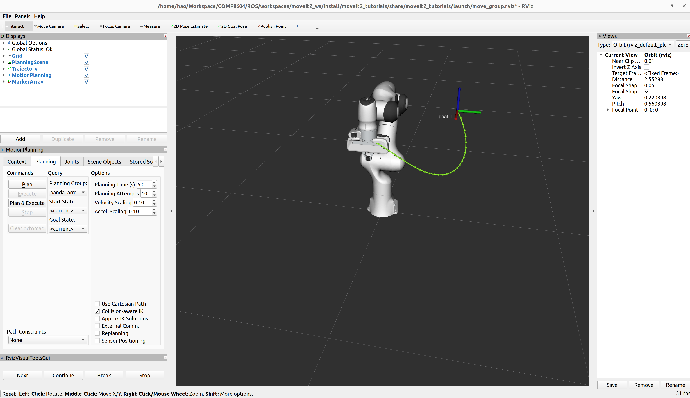
